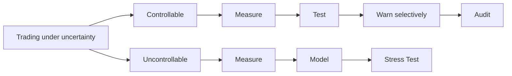
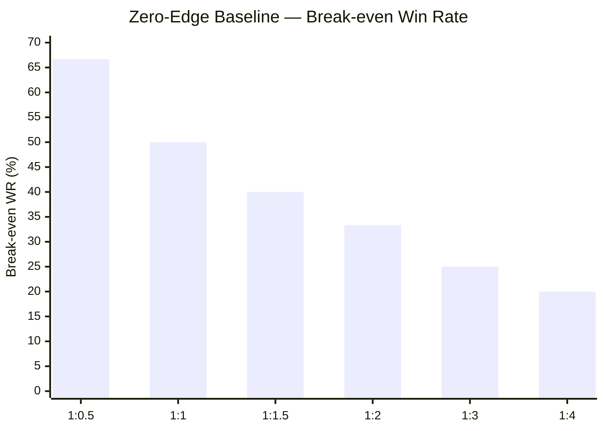
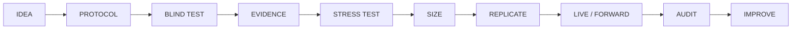
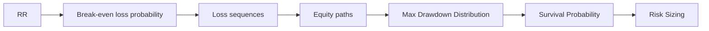
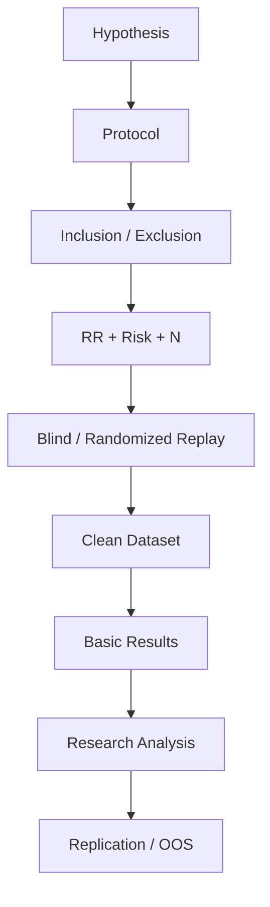
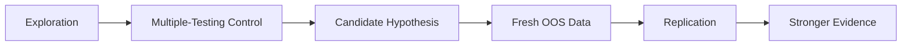
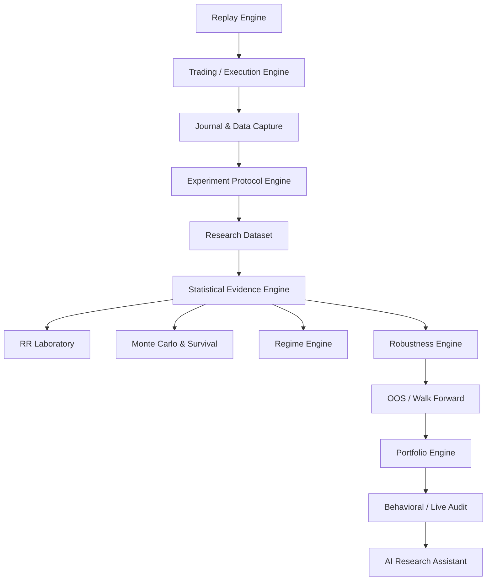
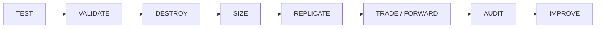

# Backtest Lab — Quantitative & Data-Driven Trading Research Thesis

> **Status:** Working research thesis / scientific foundation  
> **Purpose:** Menjadi dokumen induk untuk tesis riset, metodologi, dan alasan ilmiah di balik Backtest Lab. Dokumen ini tidak menggantikan `docs/ROADMAP.md` sebagai authority roadmap/phase.

## Abstrak

Backtest Lab memandang trading sebagai proses pengambilan keputusan di bawah ketidakpastian. Tujuannya bukan memprediksi trade berikutnya, melainkan mengukur statistical edge, sampling noise, execution friction, drawdown, robustness, dan perbedaan antara strategi yang diuji dengan perilaku saat dieksekusi. Fondasi penelitian dimulai dari zero-edge benchmark untuk berbagai risk–reward ratio (RR), exact binomial distribution untuk observed win rate, Monte Carlo fixed-fractional, survival-based risk sizing, blind backtesting, reproducible experiment protocol, objective market-regime definitions, robustness testing, multiple-testing control, dan behavioral audit.

Produk yang diturunkan dari tesis ini bukan signal generator atau holy-grail engine. Backtest Lab adalah infrastruktur untuk mengubah ide trading menjadi eksperimen yang dapat diuji, dicatat, diulang, dibandingkan, di-stress-test, dan diaudit.

---

# BAB I — Pendahuluan

## 1.1 Masalah utama

Trader tidak mengontrol outcome individual, urutan win/loss, regime transition, volatilitas, liquidity, gaps, atau unexpected market shocks. Trader relatif dapat mengontrol strategy definition, RR, risk, sizing, execution rules, inclusion/exclusion criteria, testing discipline, dan perilaku eksekusi.



Prinsip inti:

> **Trader tidak mengontrol outcome; trader mengontrol exposure terhadap outcome.**

> **Risk management tidak menciptakan edge. Risk management mengontrol konsekuensi ketidakpastian dan memberi edge kesempatan untuk muncul dalam sampel yang cukup.**

## 1.2 Backtest-to-Live Gap

```text
Statistical + Market + Strategy + Execution + Data + Behavioral
                              ↓
                     BACKTEST-TO-LIVE GAP
```

Backtest-to-Live Gap adalah perbedaan antara performa yang diharapkan dari model/backtest dan performa yang terealisasi setelah market, execution, data, dan behavioral frictions.

---

# BAB II — Landasan Matematis

## 2.1 Expected Value

Untuk loss = 1R, reward = R, probabilitas menang = p, dan biaya rata-rata = C dalam unit R:

```text
EV = pR - (1-p) - C
```

Tanpa biaya:

```text
p_BE = 1 / (1 + R)
```

Dengan friction:

```text
p_BE = (1 + C) / (1 + R)
```

**RR tidak menentukan actual win rate.** RR menentukan break-even win-rate threshold di bawah payoff model yang didefinisikan.

| RR | Break-even WR sebelum biaya |
|---|---:|
| 1:0.5 | 66.67% |
| 1:1 | 50.00% |
| 1:1.5 | 40.00% |
| 1:2 | 33.33% |
| 1:3 | 25.00% |
| 1:4 | 20.00% |

## 2.2 Zero-Edge Benchmark

Zero-edge benchmark adalah **null model**, bukan prediksi market:

```text
p = p_BE
N = 1,000 trades
X ~ Binomial(N,p)
Observed WR = X/N
```

### Distribusi observed win rate



Untuk N=1.000, sampling noise tetap menghasilkan observed WR di atas maupun di bawah baseline meskipun true edge = 0.

Approximate central 95% observed-WR ranges:

| RR | Baseline p | Approx. central 95% observed WR |
|---|---:|---:|
| 1:0.5 | 66.67% | ~63.7–69.6% |
| 1:1 | 50.00% | ~46.9–53.1% |
| 1:1.5 | 40.00% | ~37.0–43.0% |
| 1:2 | 33.33% | ~30.4–36.3% |
| 1:3 | 25.00% | ~22.3–27.7% |
| 1:4 | 20.00% | ~17.5–22.5% |

Pada RR 1:1, probabilitas tepat 500 wins dari 1.000 trade sekitar 2.52%. Ini **bukan** berarti hasil dekat 50% jarang; probability mass tersebar di banyak integer outcome di sekitar 500.

## 2.3 Sample Size

Tidak ada hukum universal bahwa “100 trades cukup”.

Untuk estimasi proporsi sederhana pada 95% confidence dan margin ±5 percentage points:

```text
n ≈ z² p(1-p) / E²
```

Approximate N:

| RR | N |
|---|---:|
| 1:0.5 | 342 |
| 1:1 | 385 |
| 1:1.5 | 369 |
| 1:2 | 342 |
| 1:3 | 289 |
| 1:4 | 246 |

Ini hanya menjawab **precision of proportion estimation**, bukan membuktikan profitability atau edge.

## 2.4 Statistical Edge

Shorthand konseptual:

```text
Edge ≈ Observed Performance - Break-even Baseline - Friction
```

Namun edge harus dibaca bersama uncertainty, dependence, non-stationarity, sample size, multiple testing, dan out-of-sample evidence.

---

# BAB III — Metodologi Eksperimen

## 3.1 Research Pipeline



## 3.2 Lab Protocol

Sebelum experiment:

1. Hypothesis.
2. Entry rule.
3. Exit rule.
4. RR.
5. Risk.
6. Timeframe.
7. Session.
8. Inclusion criteria.
9. Exclusion criteria.
10. Planned sample size atau stopping rule.
11. Market-regime definition.
12. Execution assumptions.

Jika protocol berubah, perubahan tidak diam-diam dicampur ke dataset lama. Sistem membuat protocol/experiment version baru.

## 3.3 Blind Replay

Pada waktu t, user hanya boleh melihat information set yang tersedia sampai t. Future candles tidak boleh memengaruhi decision.

## 3.4 Randomized Episodes

Randomization dilakukan pada **eligible market episodes/windows**, bukan mengacak candle di dalam sequence.

```text
Dataset + Protocol + Random Seed + Engine Version
                    ↓
           Reproducible Experiment
```

Untuk strategy yang sangat sequence-dependent, chronological/OOS design dapat lebih tepat daripada random episode sampling. Randomization adalah alat, bukan hukum universal.

## 3.5 Opportunity Accountability

Setiap candidate opportunity dapat dicatat sebagai:

```text
TAKE
atau
EXCLUDE → Protocol Reason
        → Unplanned Exclusion
```

User tetap bebas. Sistem membuat kebebasan tersebut terlihat di data.

---

# BAB IV — Zero Edge, Drawdown, dan Survival

## 4.1 Fixed-Fractional Monte Carlo

Baseline simulasi penelitian:

- 1.000 trade/path.
- p = break-even probability.
- binary +R / -1R payoff.
- fixed-fractional sizing.
- baseline risk = 1%.
- multiple Monte Carlo paths.

Arithmetic EV = 0 tidak berarti geometric/median wealth tetap datar:

```text
(1+r)(1-r) = 1-r² < 1
```

Ini adalah multiplicative volatility drag.

## 4.2 Drawdown



Higher RR pada zero-edge benchmark memiliki lower break-even WR dan higher loss probability. Hal ini mengubah losing-streak dan drawdown distributions. Ini **bukan** klaim bahwa higher RR selalu menghasilkan MaxDD lebih besar pada semua strategy nyata.

## 4.3 Survival-Based Risk Sizing

Daripada hard-code “risk 1% adalah benar”:

```text
r_max = max { r : P(MaxDD ≥ D*) ≤ alpha }
```

User menentukan:
- maximum tolerable drawdown D*;
- acceptable probability alpha.

Backtest Lab menunjukkan risk levels dan konsekuensinya. User mengambil keputusan.

---

# BAB V — Execution Reality & Market Uncertainty

## 5.1 Execution Reality Engine

Analisis meliputi:

- spread;
- commission;
- slippage;
- bid/ask;
- gaps;
- intrabar ambiguity;
- order type/fill assumptions;
- resolution sensitivity.

Candidate metrics:

```text
StopVolatilityRatio = SL / ATR

FrictionRatio = (Spread + Commission-equivalent + ExpectedSlippage) / SL
```

Threshold bukan hukum universal.

## 5.2 Objective Market Regime

Backtest Lab tidak perlu memaksakan satu definisi trend/range universal.

Contoh protocol:

```text
Trend = ADX14 > X AND EMA50 > EMA200
Range = ADX14 < Y AND RangeWidth/ATR < K
```

Yang penting:

> **Same data + same regime definition + same version = same classification.**

---

# BAB VI — Product Solution

## 6.1 Dua Mode

### Free Backtest

**Explore anything.**

User bebas mengubah RR, decision, entry/exit, atau discretionary process. Sistem mencatat tanpa menjadi trading police.

### Lab Protocol / Research Mode

**Test it properly.**



## 6.2 UX Principle

```text
Freedom First → Evidence Second → Guardrails Optional
```

dan:

```text
Observe quietly → Analyze deeply → Warn selectively → Never force
```

Saat backtest, warning terutama untuk integrity problems:
- data gap;
- intrabar ambiguity;
- insufficient execution resolution;
- extreme friction relative to stop.

## 6.3 Basic Results — Free

- total trades;
- win/loss;
- win rate;
- total P/L;
- total R;
- average R;
- average win/loss;
- profit factor;
- historical MaxDD;
- longest winning/losing streak;
- equity curve;
- trade journal.

Free Backtest dan Lab Protocol tetap dapat digunakan gratis dengan historical window maksimum **1 bulan per experiment**.

## 6.4 Paid Research Layer

Paid layer menjawab bukan hanya “apa yang terjadi?”, tetapi “seberapa kuat evidence-nya?”

- RR Laboratory;
- Statistical Evidence;
- Monte Carlo;
- Survival-Based Risk;
- Friction / Execution Analysis;
- Market Regime Analysis;
- Robustness;
- OOS / Walk-Forward;
- Multi-market / Strategy Correlation;
- Portfolio Analysis;
- Behavioral / Live Audit;
- Full Research Report.

---

# BAB VII — Research Engines

## 7.1 RR Laboratory

RR Laboratory dilakukan **setelah** backtest.

Counterfactual RR tidak boleh dihitung hanya dengan mengalikan reward. Engine harus menggunakan historical price path / MAE-MFE / candle atau tick data untuk mengetahui apakah alternative TP/SL benar-benar tersentuh.

Post-hoc RR results diberi label **exploratory**, bukan hasil original protocol.

## 7.2 Strategy Destruction Lab

Tujuan:

> **Mencoba membunuh strategi sebelum market yang melakukannya.**

Stress dimensions:

```text
Spread ↑
Slippage ↑
Entry ± delta
SL ± delta
Parameters ± delta
Regime change
Execution assumptions
Sequence / resampling
```

Tujuannya bukan mencari equity curve tercantik, tetapi mengukur fragility.

## 7.3 Multiple-Testing Correction & Research Integrity

Semakin banyak hypothesis, parameter, RR, filter, dan subgroup yang dicoba pada dataset yang sama, semakin tinggi kemungkinan menemukan apparent edge hanya karena chance.

Jika m independent tests dilakukan dengan alpha = 0.05 dan seluruh null hypothesis benar, expected false positives secara kasar:

```text
Expected false positives ≈ m × alpha
```

Backtest Lab membutuhkan **Multiple-Testing / Research Integrity Layer**.

Setiap hypothesis family menyimpan:
- number of tests;
- raw p-value;
- adjusted p-value / q-value;
- correction method;
- protocol version;
- pre-registered vs post-hoc status.

Candidate methods:
- **Bonferroni** — conservative family-wise error control.
- **Benjamini–Hochberg FDR** — useful for exploratory families with many candidate discoveries.

Metode tidak boleh diganti setelah melihat hasil hanya untuk mendapatkan significance.



Multiple-testing correction **tidak menggantikan OOS validation**.

Strategy Destruction Lab juga tidak otomatis membutuhkan p-value correction: banyak stress tests adalah sensitivity analyses. Correction relevan ketika banyak inferential comparisons dilakukan dan hasil dipilih berdasarkan statistical significance.

> **The more hypotheses Backtest Lab allows a researcher to test, the more strongly it must protect the researcher from mistaking search for evidence.**

## 7.4 Experiment Passport

Setiap experiment idealnya menyimpan:

```text
Experiment ID
Dataset + version
Period + timeframe
Protocol version
RR + risk
Planned N / stopping rule
Randomization seed
Inclusion criteria
Exclusion criteria
Regime algorithm/version
Execution assumptions
Engine version
Experiment hash
```

## 7.5 Portfolio / Correlation

Correlation tidak mengganggu user yang baru melakukan satu backtest. Fitur muncul setelah tersedia cukup data pada beberapa pair/strategy.

Analisis:
- strategy-return correlation;
- simultaneous-loss behavior;
- concurrent exposure;
- portfolio drawdown;
- portfolio Monte Carlo.

Position limit tidak dipaksakan. Sistem menunjukkan konsekuensi statistik dari exposure yang dipilih user.

---

# BAB VIII — Behavioral Audit

Setelah forward/live data tersedia:

```text
Tested Behavior ↔ Actual Behavior
```

Candidate dimensions:
- planned vs realized risk;
- planned vs realized RR;
- moving SL;
- early TP;
- skipped opportunities;
- overtrading/frequency;
- post-loss entry timing;
- risk escalation.

Sistem tidak mendiagnosis psikologi user.

Lebih baik:

> “Median risk setelah losing trade meningkat dari 0.5% menjadi 0.8%.”

daripada:

> “Revenge trading detected.”

Candidate **Execution Drift Score (EDS)**:

```text
EDS = f(ΔRisk, ΔEntry, ΔSL, ΔTP, ΔHoldingTime, RuleViolations)
```

Weights tidak boleh ditentukan arbitrarily tanpa calibration/validation.

---

# BAB IX — Product Architecture



AI Research Assistant membantu membaca evidence, menemukan anomaly, merangkum research, dan menghasilkan hypothesis. Ia tidak memperoleh live-money trading authority dari thesis ini.

---

# BAB X — Product Journey & Monetization



### Free

**Test the idea.**

Free Backtest + Lab Protocol + 1-month historical window + basic descriptive results.

### Paid

**Understand how strong the evidence really is.**

Extended data + advanced statistical/research analysis.

Monetization principle:

> **Do not sell freedom. Sell more data and deeper evidence.**

---

# BAB XI — Research Principles

1. Never promise certainty where only probability exists.
2. Never confuse backtest performance with proof of future performance.
3. Never hide important model assumptions.
4. Preserve user freedom wherever research integrity does not require structure.
5. Warn rather than block whenever possible.
6. Separate exploratory research from confirmatory testing.
7. Make experiments reproducible.
8. Make uncertainty visible.
9. Analyze decisions, not personalities.
10. Data first, interpretation second.
11. Correct for multiple testing when inferential search creates a false-discovery problem.
12. Use fresh out-of-sample evidence and replication rather than treating optimization as validation.

---

# BAB XII — Limitations

Zero-edge binomial and basic Monte Carlo models simplify reality. Real strategies can exhibit autocorrelation, non-stationarity, variable payoff distributions, volatility clustering, changing friction, gaps, liquidity effects, adaptive behavior, and regime transitions. Effective sample size can therefore be lower than raw trade count.

Subgroup analysis, RR search, parameter optimization, and repeated hypothesis testing can produce false discoveries. Multiple-testing corrections reduce specific statistical error rates but do not eliminate overfitting. Fresh OOS data, walk-forward design, robustness analysis, and replication remain essential.

---

# Kesimpulan

Backtest Lab tidak dibuat untuk meramal pasar. Backtest Lab dibuat untuk membantu trader:

```text
Measure edge
→ Understand uncertainty
→ Stress assumptions
→ Size risk
→ Replicate evidence
→ Audit execution
```

Core product thesis:

> **Backtest Lab does not tell traders how they must trade. It shows the statistical consequences of how they choose to trade.**

Dan identitas risetnya:

> **Don't trust the claim. Test it.**

---

## Relationship to repository planning

Dokumen ini adalah **research/product thesis**, bukan implementation authorization dan bukan pengganti roadmap. Urutan phase, status implementasi, dan Definition of Done tetap mengikuti authority files repository, terutama `docs/ROADMAP.md` dan `AI_CONTEXT/*`.
