# Backtest Lab — Product & System Architecture Blueprint

> **Status:** Strategic architecture blueprint / living design document  
> **Scope:** Product architecture, system boundaries, data architecture, research architecture, deployment direction, and evolution from local v1 to research SaaS.  
> **Authority boundary:** This document describes intended architecture. It does **not** authorize implementation, change current phase status, or replace `docs/ROADMAP.md`, `AI_CONTEXT/04_CURRENT_PHASE.md`, completed history, or workflow/Definition of Done.

Related documents:
- [Research Thesis](BACKTEST_LAB_RESEARCH_THESIS.md)
- [Master Roadmap](ROADMAP.md)

---

# 1. Product North Star

Backtest Lab is a **research environment for evidence-based trading decisions**, not a signal seller and not an autonomous trading system.

```text
IDEA → TEST → VALIDATE → STRESS → SIZE → REPLICATE → FORWARD/LIVE → AUDIT → IMPROVE
```

Design principles:

1. Chart-first interaction.
2. Freedom First → Evidence Second → Guardrails Optional.
3. Observe quietly → Analyze deeply → Warn selectively → Never force.
4. Reproducibility over cosmetic complexity.
5. Raw market data is immutable; derived research objects are versioned.
6. Exploratory and confirmatory research must remain distinguishable.
7. Heavy analytics must not block replay UX.
8. Every result must be traceable to data, protocol, engine version, and assumptions.
9. Architecture evolves incrementally; do not prematurely distribute a system that works correctly as a modular monolith.

---

# 2. Architecture at a Glance

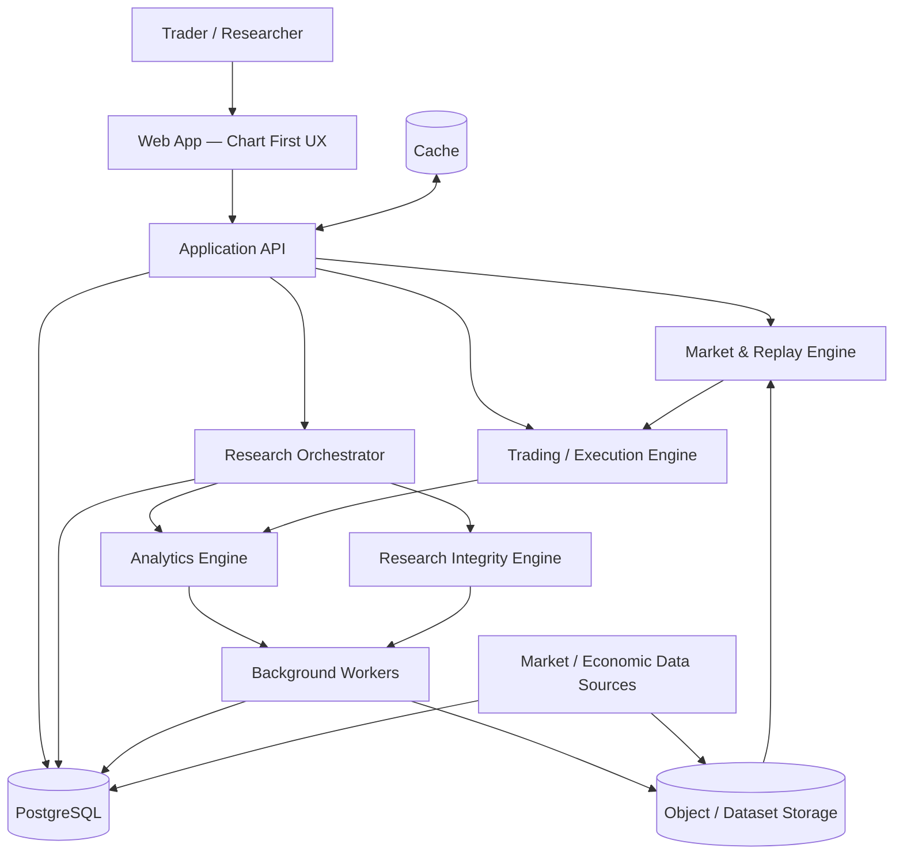

**Initial production direction:** Next.js frontend + FastAPI backend + PostgreSQL. Redis/object storage/workers are introduced only when workloads justify them.

---

# 3. Layered System Design

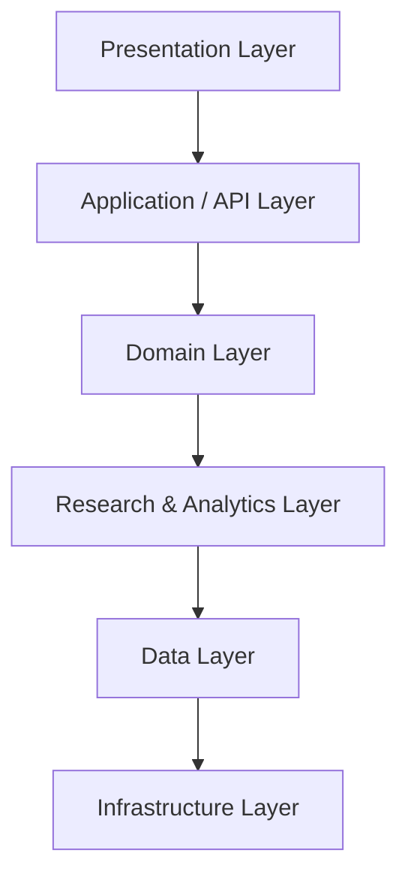

## 3.1 Presentation Layer

Responsibilities:
- chart rendering;
- drawings;
- indicators;
- replay controls;
- order interaction;
- journal;
- Analysis;
- Research/Lab Protocol UI;
- research reports;
- dashboard/workspace later.

The UI should not become the source of truth for trading/research rules.

## 3.2 Application/API Layer

Responsibilities:
- request validation;
- authentication/authorization later;
- use-case orchestration;
- idempotency;
- pagination/query limits;
- job submission;
- API contracts;
- response serialization.

## 3.3 Domain Layer

Pure business/research rules:
- replay state;
- orders/trades/positions;
- risk/reward;
- account/equity;
- strategy protocol;
- experiment lifecycle;
- inclusion/exclusion;
- market regime definitions;
- execution assumptions.

Domain logic should remain testable without browser/database/network dependencies.

## 3.4 Research & Analytics Layer

Contains:
- descriptive statistics;
- statistical evidence;
- RR Laboratory;
- MAE/MFE;
- Monte Carlo;
- survival analysis;
- regime analysis;
- robustness;
- multiple-testing correction;
- OOS/walk-forward;
- portfolio/correlation;
- behavioral/live audit.

## 3.5 Data Layer

Responsible for:
- canonical market data;
- economic events;
- user/workspace data;
- strategies;
- experiment protocols;
- sessions;
- trades;
- research results;
- audit/version history.

## 3.6 Infrastructure Layer

Deployment, observability, backups, queues/workers, caching, CI/CD, security controls, secrets, rate limiting and external integrations.

---

# 4. Frontend Blueprint

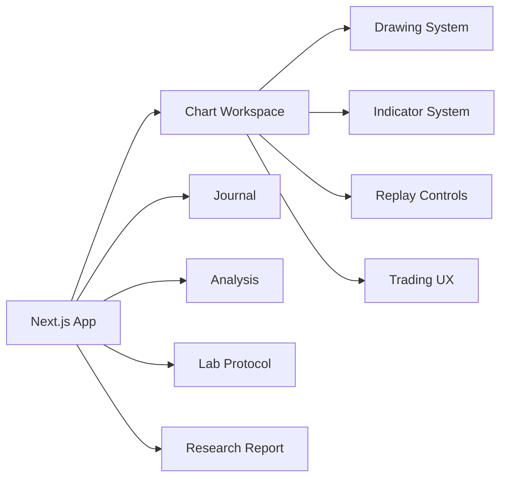

### Frontend state separation

**Ephemeral UI state**
- open panels;
- hover/selection;
- dialogs;
- temporary drawing interaction.

**Session state**
- replay cursor;
- visible range;
- active instrument/timeframe;
- open simulated positions.

**Persisted research state**
- protocol;
- experiment metadata;
- trades;
- exclusions;
- journal;
- result snapshots.

Do not persist everything merely because it can be persisted.

---

# 5. Market Data Architecture

## 5.1 Canonical pipeline

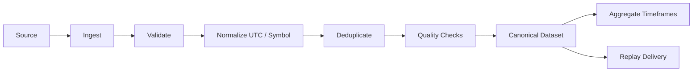

### Canonical candle

```text
instrument_id
timestamp_utc
timeframe
open
high
low
close
volume?
source
dataset_version
quality_flags
```

Raw imported/source data should not be silently mutated. Corrections create a new dataset/version or auditable transformation.

## 5.2 Candle Mode

Primary mode for fast manual research:
- OHLC replay;
- timeframe aggregation;
- deterministic reveal;
- no look-ahead;
- explicit same-candle SL/TP ambiguity.

## 5.3 Tick / Intrabar Mode

Later high-fidelity layer:
- tick/bid/ask data;
- spread;
- execution ordering;
- intrabar path;
- slippage;
- more defensible SL/TP resolution.

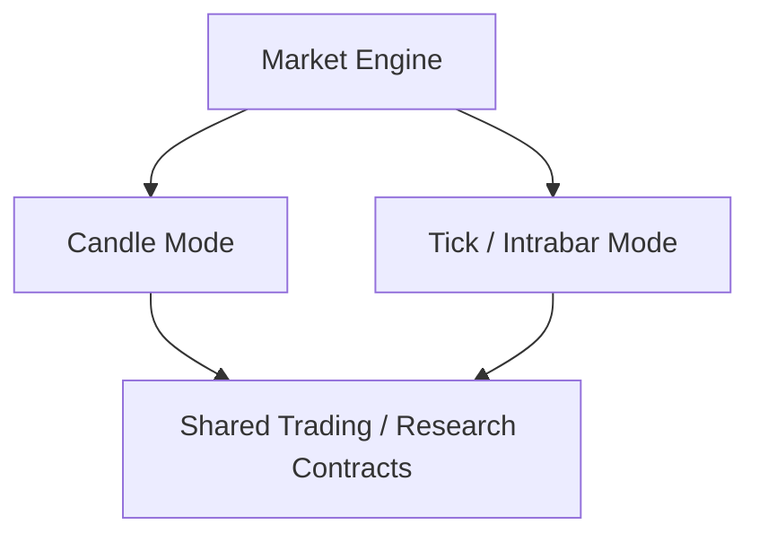

The research layer must know which market/execution mode produced a result.

---

# 6. Replay Engine Blueprint

Core invariant:

> **At replay time t, no component may expose information from t+1 onward.**

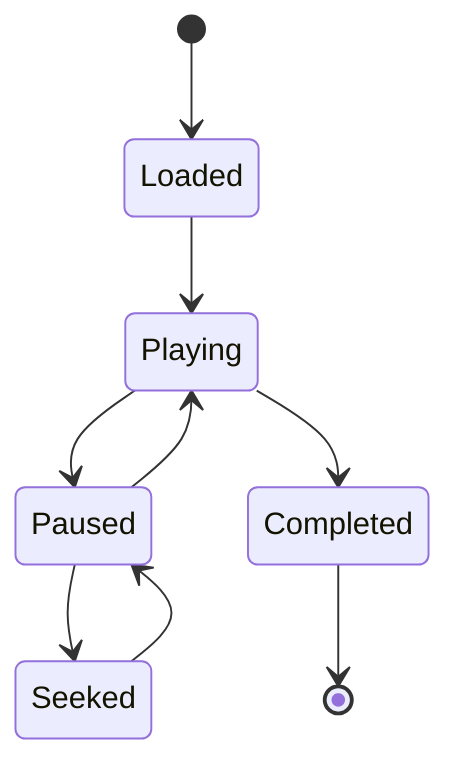

Replay responsibilities:
- deterministic revealed range;
- play/pause/step;
- playback speed;
- high-water/no-look-ahead state;
- event/news synchronization;
- incremental chart updates;
- replay-safe indicator calculation;
- deterministic seed/context where applicable.

Replay does **not** calculate research conclusions.

---

# 6A. Temporal View, Replay State & Canonical Research Log

Temporal correctness should be enforced structurally where practical.

```text
Versioned Dataset
      ↓
TimeBoundedView(t)
      ↓
Replay / Indicators / News / Execution
      ↓
Canonical Event + Trade Log
      ↓
Research Compute
```

A temporal consumer should not receive unrestricted future observations merely because an index is available. Relevant features should support truncation-invariance tests: state/output at `t` remains unchanged when data after `t` is physically absent.

Replay/backtest lifecycle should converge on an explicit state/revision model so chart, replay cursor, trading settlement, journal/event log and later cloud resume cannot silently represent different committed moments. Exact state names are implementation decisions; the invariant is that a committed replay revision has an unambiguous canonical trading/research state.

Research analytics consume canonical logs/results rather than being embedded into the candle loop.

# 7. Trading & Execution Engine

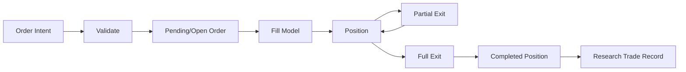

Canonical concerns:
- direction;
- entry;
- SL;
- TP;
- risk;
- quantity;
- fill price;
- commission;
- spread;
- slippage;
- partial exits;
- realized R;
- realized P/L;
- timestamps;
- execution assumptions.

The engine must distinguish **order intent**, **market simulation**, and **research record**.

---

# 8. Experiment Protocol Architecture

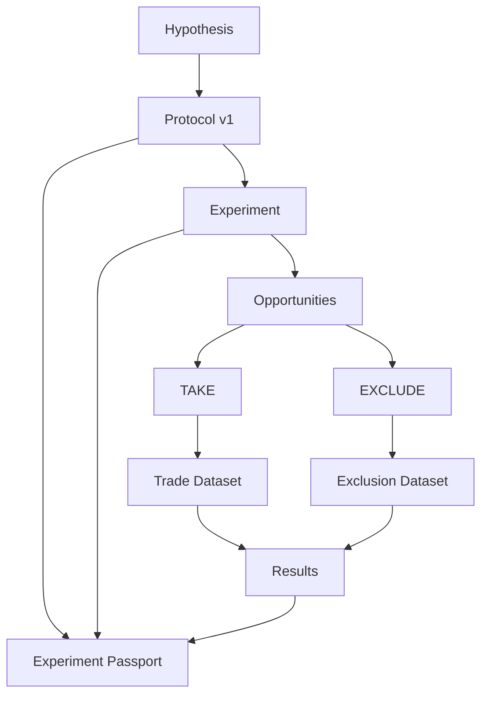

### Protocol object

```text
protocol_id
strategy_id
version
hypothesis
entry_rules
exit_rules
rr_policy
risk_policy
instrument_scope
timeframe
session_scope
inclusion_criteria
exclusion_criteria
planned_sample
stopping_rule
regime_definition_id
execution_assumption_id
created_at
locked_at?
```

Changing a material locked protocol field creates a new version/experiment rather than rewriting history.

---

# 9. Experiment Passport & Reproducibility

Every serious Lab Protocol result should be reconstructible from canonical identity/provenance such as:

```text
Dataset ID + Version + Content Hash
+ Strategy ID + Version + Definition Hash
+ Protocol ID + Version + Content Hash
+ RNG Algorithm + Seed
+ Engine / Research Calculator Version
+ Execution Assumption Version
+ Regime Definition Version
+ Trial / Strategy Lineage
= Experiment Identity
```

Hardware identity is not required by default. Prefer defined numeric semantics and versioned calculators; record additional environment metadata only where it materially affects reproducibility.

Candidate passport fields:
- experiment ID/hash;
- dataset content hash;
- strategy definition hash;
- protocol content hash;
- RNG algorithm/seed;
- trial/strategy lineage and experiment-family reference;
- user/workspace;
- strategy/version;
- instrument/timeframe;
- period;
- dataset/version;
- protocol/version;
- seed;
- engine build;
- execution model;
- regime algorithm;
- planned vs actual N;
- exclusion summary;
- result version.

A result without provenance is descriptive output, not a reproducible research artifact.

---

# 10. Research Engine Architecture

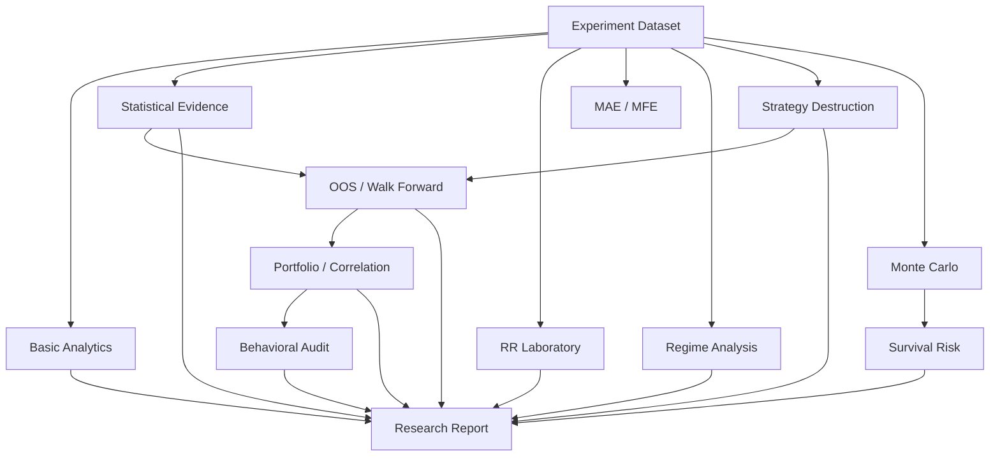

## 10.1 Basic Analytics

Free/descriptive:
- trade count;
- wins/losses;
- WR;
- total P/L;
- total/average R;
- average win/loss;
- profit factor;
- equity;
- historical MaxDD;
- streaks;
- journal.

## 10.2 Statistical Evidence Engine

Candidate outputs:
- break-even baseline;
- uncertainty/confidence intervals;
- expectancy uncertainty;
- sample/effective sample diagnostics;
- power where meaningful;
- pre-registered vs exploratory status.

Never reduce evidence to a universal binary “good/bad strategy”.

---

# 11. RR Laboratory Architecture

RR Laboratory is **post-experiment counterfactual research**.

Wrong design:

```text
Original R × new RR = simulated result
```

Correct direction:

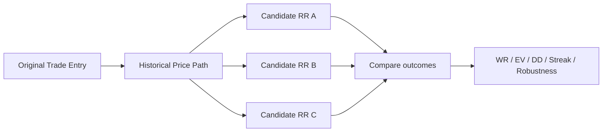

Alternative SL/TP must be evaluated against available historical path at appropriate resolution. Ambiguous paths must be marked rather than invented.

RR Lab output is exploratory unless independently validated.

---

# 12. Strategy Destruction Lab

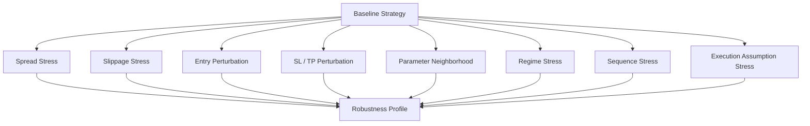

Store baseline, perturbation specification, result, and engine/data version.

---

# 13. Research Integrity Engine

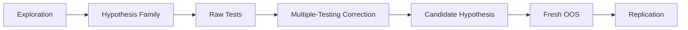

Capabilities:
- append-only trial/strategy lineage;
- hypothesis-family registry;
- number of relevant tests;
- raw p-values;
- Bonferroni;
- Benjamini-Hochberg FDR/q-values;
- exploratory vs pre-registered labels;
- immutable audit trail;
- fresh OOS linkage.

Multiple-testing correction is **not** automatically applied to every stress test or merely because a trial counter increased. Trial history is provenance; the inferential question and hypothesis family determine whether/how Bonferroni, BH-FDR, DSR or another method is appropriate. Sensitivity analysis and inferential hypothesis testing remain distinct concepts.

---

# 14. Monte Carlo & Survival Engine

Inputs:
- empirical R distribution or explicit model;
- sequence/resampling method;
- risk model;
- number of trades;
- number of paths;
- seed;
- constraints/assumptions.

Outputs:
- terminal equity distribution;
- MaxDD distribution;
- losing streak distribution;
- recovery characteristics;
- threshold exceedance probabilities.

Inverse risk design:

```text
r_max = max { r : P(MaxDD >= D*) <= alpha }
```

Long-running simulations belong in background jobs rather than the interactive request path.

---

# 15. Market Regime Engine

Regime definition is a **versioned research object**.

```text
regime_definition_id
name
version
features
thresholds
lookback
warmup
classification_rules
engine_version
```

Examples:
- trend/range;
- low/normal/high volatility;
- session;
- economic-event windows.

No hidden subjective classification in Lab Protocol.

---

# 16. Economic News Architecture

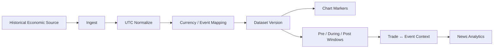

Canonical event candidate:

```text
event_id
timestamp_utc
currency
event_name
category
impact
previous
forecast
actual
source
dataset_version
revision_metadata?
```

News is a research subsystem, not decorative chart icons.

---

# 17. Portfolio & Correlation Architecture

Only activate meaningful portfolio analysis when enough multi-strategy/multi-market data exists.

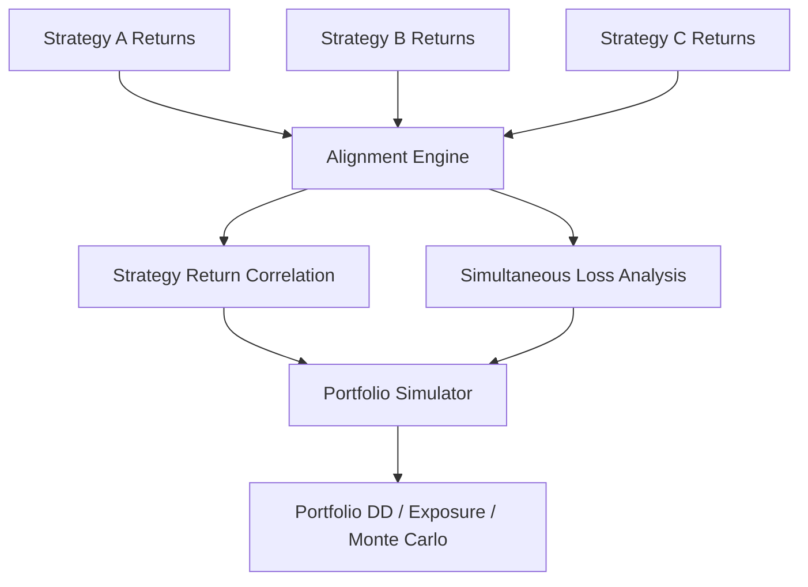

Price correlation alone is insufficient. Strategy-return and concurrent-loss behavior matter.

---

# 18. Behavioral / Live Audit Architecture

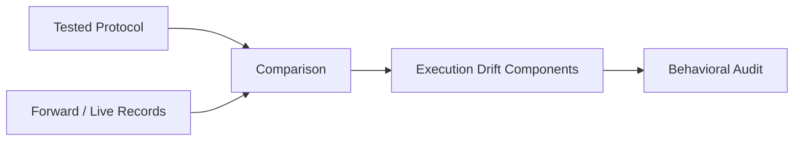

Candidate components:
- ΔRisk;
- ΔEntry;
- ΔSL;
- ΔTP;
- ΔHoldingTime;
- rule violations;
- skipped opportunities;
- frequency changes.

Do not infer psychology. Report measurable behavior.

---

# 19. Data Model Blueprint

Conceptual relationships—not a locked production schema:

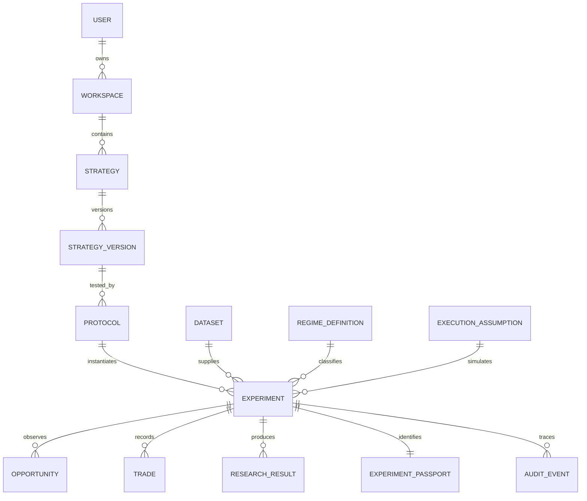

### Core tables/objects later

**Identity**
- users
- workspaces
- memberships

**Trading research**
- strategies
- strategy_versions
- protocols
- experiments
- opportunities
- trades
- trade_events
- journal_entries
- research_results

**Market**
- instruments
- datasets
- candles
- ticks later
- economic_events
- regime_definitions

**Reproducibility**
- experiment_passports
- execution_assumptions
- engine_versions
- audit_events

**Commercial**
- subscriptions
- entitlements
- usage_records

---

# 20. Storage Strategy

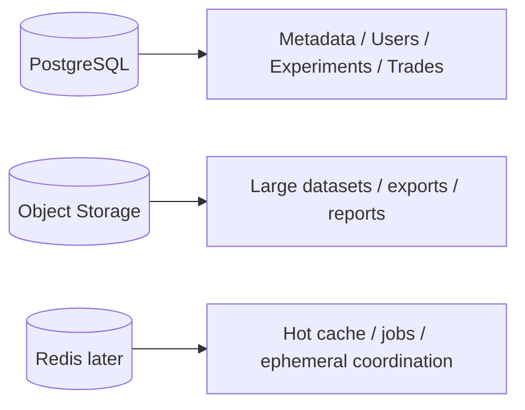

### PostgreSQL
Use for relational/queryable product state.

### Object storage
Use later for large immutable datasets, exports, reports, artifacts and high-volume tick chunks where appropriate.

### Redis
Not mandatory at MVP. Introduce for:
- job queue coordination;
- rate limiting;
- short-lived cache;
- distributed locks where genuinely needed.

Avoid storing canonical research truth only in cache.

---

# 21. API Blueprint

Suggested API namespaces:

```text
/api/v1/auth
/api/v1/workspaces
/api/v1/instruments
/api/v1/datasets
/api/v1/replay
/api/v1/orders
/api/v1/trades
/api/v1/strategies
/api/v1/protocols
/api/v1/experiments
/api/v1/research
/api/v1/reports
/api/v1/jobs
```

Example experiment flow:

```text
POST /protocols
POST /experiments
POST /experiments/{id}/opportunities
POST /experiments/{id}/trades
POST /experiments/{id}/complete
POST /experiments/{id}/research-jobs
GET  /jobs/{id}
GET  /experiments/{id}/report
```

Contracts should be versioned and domain-oriented, not mirror database tables blindly.

---

# 22. Async Job Architecture

Heavy research must not freeze the chart.

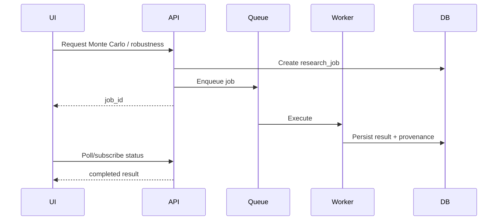

Candidate heavy jobs:
- Monte Carlo;
- RR grid;
- robustness grids;
- walk-forward;
- portfolio simulation;
- report generation;
- large imports.

---

# 23. Free vs Paid Entitlement Architecture

Entitlements must be server-authoritative in SaaS mode.

```text
FREE
├─ Free Backtest
├─ Lab Protocol
├─ ≤ 1 month market window / experiment
└─ Basic Results

PAID
├─ Extended historical data
├─ Statistical Evidence
├─ RR Lab
├─ Monte Carlo / Survival
├─ Robustness / Destruction Lab
├─ OOS / Walk Forward
├─ Regime research
├─ Portfolio / Correlation
├─ Behavioral Audit
└─ Full Research Report
```

Do not fork the scientific protocol into an intentionally invalid “free methodology”. Monetize data depth and analysis depth.

---

# 24. Security & Multi-Tenancy

When cloud/multi-user arrives:

- every user-owned resource has explicit workspace ownership;
- authorization occurs server-side;
- tenant ID/workspace ID is never trusted solely from client input;
- rate limits;
- secure session/token lifecycle;
- CSRF/XSS/SQL injection protections as applicable;
- secrets outside source control;
- encrypted transport;
- backup/restore testing;
- audit events for sensitive mutations;
- signed/expiring URLs for private object storage;
- least-privilege service credentials.

Research data isolation is a product requirement, not an optional hardening task.

---

# 25. Performance Blueprint

Priority model:

1. Security and correctness are hard constraints.
2. Determinism/reproducibility where promised.
3. Lightweight by default: avoid unnecessary work.
4. Measure relevant render/CPU/memory/query/I/O behavior.
5. Optimize demonstrated bottlenecks.
6. Scale through preserved boundaries when evidence requires it.

Techniques:
- incremental chart updates;
- chunked candle loading;
- timeframe aggregation/cache;
- indexed time-series queries;
- bounded API responses;
- lazy research panels;
- background heavy computation;
- memoized/pure indicator calculations where appropriate;
- compression for bulk datasets;
- pagination;
- load tests before infrastructure guessing.

Do not move to microservices merely because the product may someday have many users. Do not replace official chart-library behavior with custom canvas/virtualization without measured evidence that rendering is the bottleneck.

---

# 26. Deployment Blueprint

## Stage A — Local v1

```text
Browser
  ↓
Local app / local service
  ↓
Imported market data
```

Goal: research correctness and professional manual backtesting.

## Stage B — First hosted deployment

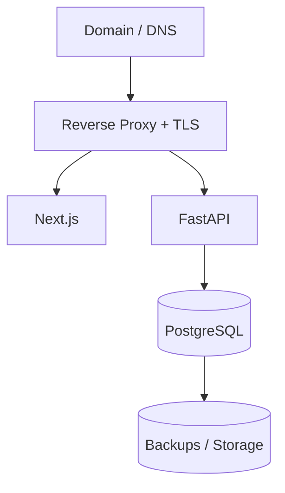

A single VPS can host the early system while usage is modest.

## Stage C — Scaled SaaS

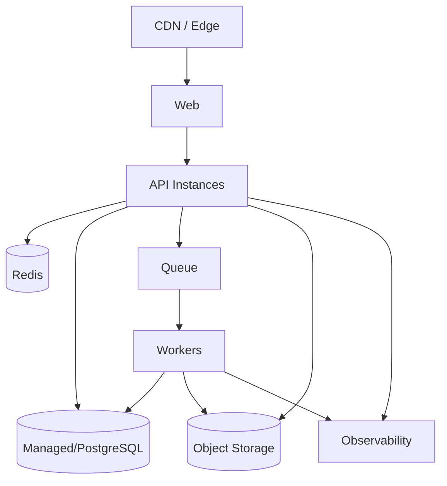

Scale based on measured bottlenecks, not imagined traffic.

---

# 27. CI/CD Blueprint

```mermaid
flowchart LR
    DEV[Change] --> GIT[Git Commit]
    GIT --> CI[CI]
    CI --> TEST[Test + Lint + Build]
    TEST --> GATE{Pass?}
    GATE -- No --> STOP[Stop]
    GATE -- Yes --> MAIN[Validated Main]
    MAIN --> DEPLOY[Deploy]
    DEPLOY --> SMOKE[Smoke / Health Check]
```

Production deployment later should support:
- reproducible builds;
- environment-specific configuration;
- migrations;
- rollback;
- health checks;
- deployment logs.

---

# 28. Observability

Minimum production signals:

**Application**
- request rate;
- error rate;
- latency;
- job failures;
- queue depth.

**Data**
- import failures;
- missing intervals;
- duplicate timestamps;
- dataset/version lineage.

**Research**
- engine version;
- job duration;
- failed simulations;
- result provenance.

**Infrastructure**
- CPU;
- memory;
- disk;
- DB connections;
- backup status.

Observability must not leak private strategy data into logs.

---

# 29. Versioning Rules

Version independently where appropriate:

```text
App Version
Engine Version
Dataset Version
Protocol Version
Strategy Version
Regime Definition Version
Execution Assumption Version
Research Result Version
```

A historical result must remain interpretable even after future engine upgrades.

---

# 30. AI Architecture Boundary

AI is a **research assistant**, not the canonical calculator.

AI may:
- summarize results;
- explain statistical concepts;
- surface anomalies;
- propose hypotheses;
- compare experiment reports;
- help construct protocol drafts.

AI must not silently:
- rewrite canonical trade history;
- fabricate market data;
- alter experiment parameters after results;
- replace deterministic calculations;
- claim a strategy will be profitable;
- receive autonomous real-money execution authority from this architecture.

```mermaid
flowchart LR
    DATA[Verified Research Results] --> AI[AI Research Assistant]
    AI --> INSIGHT[Explanation / Hypothesis]
    INSIGHT --> HUMAN[Human Decision]
    HUMAN --> NEW[New Protocol / Experiment]
```

---

# 31. Failure & Recovery Principles

Design for:
- browser refresh;
- interrupted replay;
- failed import;
- failed analytics job;
- worker restart;
- DB migration failure;
- partial network outage;
- stale client state.

Rules:
- writes should be idempotent where feasible;
- incomplete jobs have explicit state;
- canonical data is never inferred from a failed partial result;
- backups are useful only after restore has been tested;
- experiment provenance survives recovery.

---

# 32. Evolution by Product Version

| Version | Architectural identity |
|---|---|
| v1.0 | Local/manual research platform; validated replay/trading/analysis |
| v2.0 | Cloud multi-user foundation: API, PostgreSQL, auth, workspaces, cloud market data |
| v3.0 | Professional research: strategies, journal, analytics, regime, portfolio, Monte Carlo |
| v4.0 | High-fidelity execution: tick, bid/ask, spread, costs, slippage, intrabar |
| v5.0 | SaaS operations: subscriptions, teams, RBAC, collaboration, audit, admin |
| v6.0 | Quant research: datasets, experiments, parameter research, walk-forward, robustness, AI research assistant |
| v7.0 | External/live/paper/forward-testing infrastructure and algorithmic-readiness validation |

This table summarizes the existing roadmap. It does not authorize any future phase.

---

# 33. Architectural Non-Negotiables

1. No look-ahead.
2. Deterministic replay where deterministic behavior is promised.
3. Canonical trade/execution records.
4. Versioned research assumptions.
5. Reproducible Lab Protocol experiments.
6. Explicit ambiguity instead of invented certainty.
7. Exploration ≠ validation.
8. Multiple-testing awareness.
9. Fresh OOS/replication for stronger evidence.
10. Heavy analytics outside latency-sensitive chart interaction.
11. Server-authoritative ownership/entitlements in SaaS mode.
12. AI interprets verified results; deterministic engines calculate them.
13. No autonomous real-money execution within the current roadmap boundary.
14. Do not replace a working modular architecture with microservices without measured need.

---

# 34. Target Repository Structure

Conceptual target; existing validated paths must not be moved merely to match this diagram.

```text
apps/
  web/
  api/

engine/
  market/
  replay/
  execution/
  risk/
  indicators/
  statistics/
  monte_carlo/
  research_integrity/
  regime/
  robustness/
  portfolio/

research/
  protocols/
  experiments/
  reports/

data/
  import/
  validation/
  aggregation/

workers/
  research_jobs/

tests/
  unit/
  integration/
  regression/
  e2e/

docs/
  ROADMAP.md
  BACKTEST_LAB_RESEARCH_THESIS.md
  PRODUCT_SYSTEM_ARCHITECTURE_BLUEPRINT.md
```

Repository refactoring should happen only under an explicitly authorized implementation phase.

---

# 35. One-Page Blueprint

```mermaid
flowchart TB
    USER[Trader / Researcher]
    UX[Chart-First Backtest Lab]
    CORE[Replay + Trading + Journal]
    PROTOCOL[Lab Protocol + Experiment Passport]
    DATA[Versioned Market / News / Trade Data]
    RESEARCH[Evidence + RR Lab + Regime + Robustness]
    RISK[Monte Carlo + Survival]
    INTEGRITY[Multiple Testing + OOS + Replication]
    PORT[Portfolio / Correlation]
    AUDIT[Behavioral / Live Audit]
    AI[AI Research Assistant]
    CLOUD[API + PostgreSQL + Workers + Object Storage]

    USER --> UX
    UX --> CORE
    CORE --> PROTOCOL
    PROTOCOL --> DATA
    DATA --> RESEARCH
    RESEARCH --> RISK
    RESEARCH --> INTEGRITY
    INTEGRITY --> PORT
    PORT --> AUDIT
    AUDIT --> AI

    CORE <--> CLOUD
    PROTOCOL <--> CLOUD
    DATA <--> CLOUD
    RESEARCH <--> CLOUD
```

## Final architecture thesis

> **Backtest Lab should feel simple at the chart, strict in the data, transparent in the assumptions, and deep in the research.**

The chart is the workspace.  
The experiment is the unit of research.  
The dataset is evidence.  
The passport makes evidence reproducible.  
The research engines measure uncertainty.  
The human remains the decision-maker.
