# Backtest Lab — Product & System Architecture Blueprint

> **Domain precedence (Phase 18.4):** [Trading Method & Session specification](TRADING_METHOD_SESSION_SPEC.md) owns current Method/Session semantics. Older mode/version language below is historical design/research terminology where it conflicts: Session inherits its Method, Protocol is Planned-only, checklist OFF retains evidence, and cross-pair coverage is not a maturity requirement. Technical version/hash provenance remains useful; it is not a mandatory user-facing Method-version workflow. These blueprints preserve strategic knowledge and do not authorize runtime changes.

> **Status:** Strategic architecture blueprint / living design document  
> **Scope:** Product architecture, system boundaries, data architecture, research architecture, deployment direction, and evolution from local v1 to research SaaS.  
> **Authority boundary:** This document describes intended architecture. It does **not** authorize implementation, change current phase status, or replace `docs/ROADMAP.md`, `AI_CONTEXT/04_CURRENT_PHASE.md`, completed history, or workflow/Definition of Done.

Related documents:
- [Research Thesis](BACKTEST_LAB_RESEARCH_THESIS.md)
- [Master Roadmap](ROADMAP.md)

---

# 1. Product North Star

Backtest Lab is a **research environment for evidence-based trading decisions**, not a signal seller and not an autonomous trading system.

```text
IDEA → TEST → VALIDATE → STRESS → SIZE → REPLICATE → FORWARD/LIVE → AUDIT → IMPROVE
```

Design principles:

1. Chart-first interaction.
2. Freedom First → Evidence Second → Guardrails Optional.
3. Observe quietly → Analyze deeply → Warn selectively → Never force.
4. Reproducibility over cosmetic complexity.
5. Raw market data is immutable; derived research objects are versioned.
6. Exploratory and confirmatory research must remain distinguishable.
7. Heavy analytics must not block replay UX.
8. Every result must be traceable to data, protocol, engine version, and assumptions.
9. Architecture evolves incrementally; do not prematurely distribute a system that works correctly as a modular monolith.

---

# 2. Architecture at a Glance

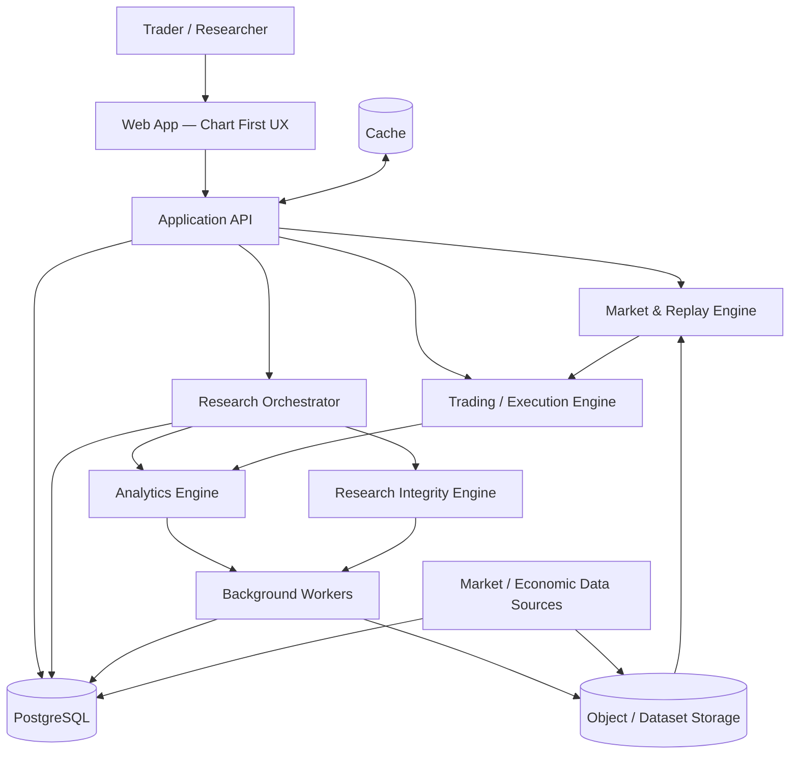

**Initial production direction:** Next.js frontend + FastAPI backend + PostgreSQL. Redis/object storage/workers are introduced only when workloads justify them.

---

# 3. Layered System Design

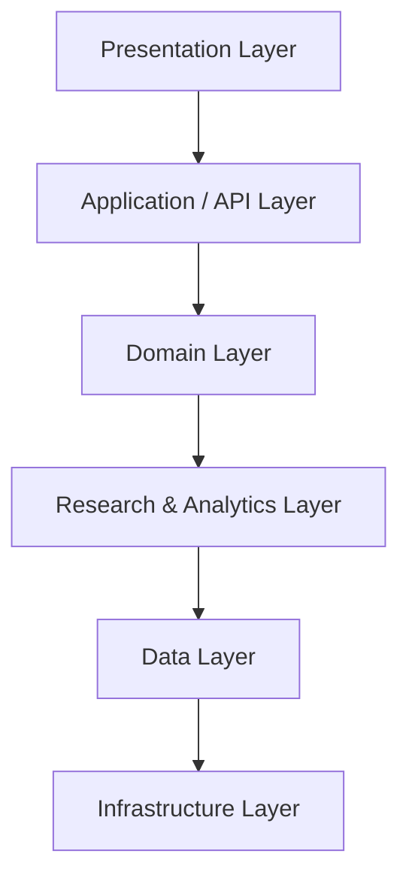

## 3.1 Presentation Layer

Responsibilities:
- chart rendering;
- drawings;
- indicators;
- replay controls;
- order interaction;
- journal;
- Analysis;
- Research/Lab Protocol UI;
- research reports;
- dashboard/workspace later.

The UI should not become the source of truth for trading/research rules.

## 3.2 Application/API Layer

Responsibilities:
- request validation;
- authentication/authorization later;
- use-case orchestration;
- idempotency;
- pagination/query limits;
- job submission;
- API contracts;
- response serialization.

## 3.3 Domain Layer

Pure business/research rules:
- replay state;
- orders/trades/positions;
- risk/reward;
- account/equity;
- strategy protocol;
- experiment lifecycle;
- inclusion/exclusion;
- market regime definitions;
- execution assumptions.

Domain logic should remain testable without browser/database/network dependencies.

## 3.4 Research & Analytics Layer

Contains:
- descriptive statistics;
- statistical evidence;
- RR Laboratory;
- MAE/MFE;
- Monte Carlo;
- survival analysis;
- regime analysis;
- robustness;
- multiple-testing correction;
- OOS/walk-forward;
- portfolio/correlation;
- behavioral/live audit.

## 3.5 Data Layer

Responsible for:
- canonical market data;
- economic events;
- user/workspace data;
- strategies;
- experiment protocols;
- sessions;
- trades;
- research results;
- audit/version history.

## 3.6 Infrastructure Layer

Deployment, observability, backups, queues/workers, caching, CI/CD, security controls, secrets, rate limiting and external integrations.

---

# 4. Frontend Blueprint

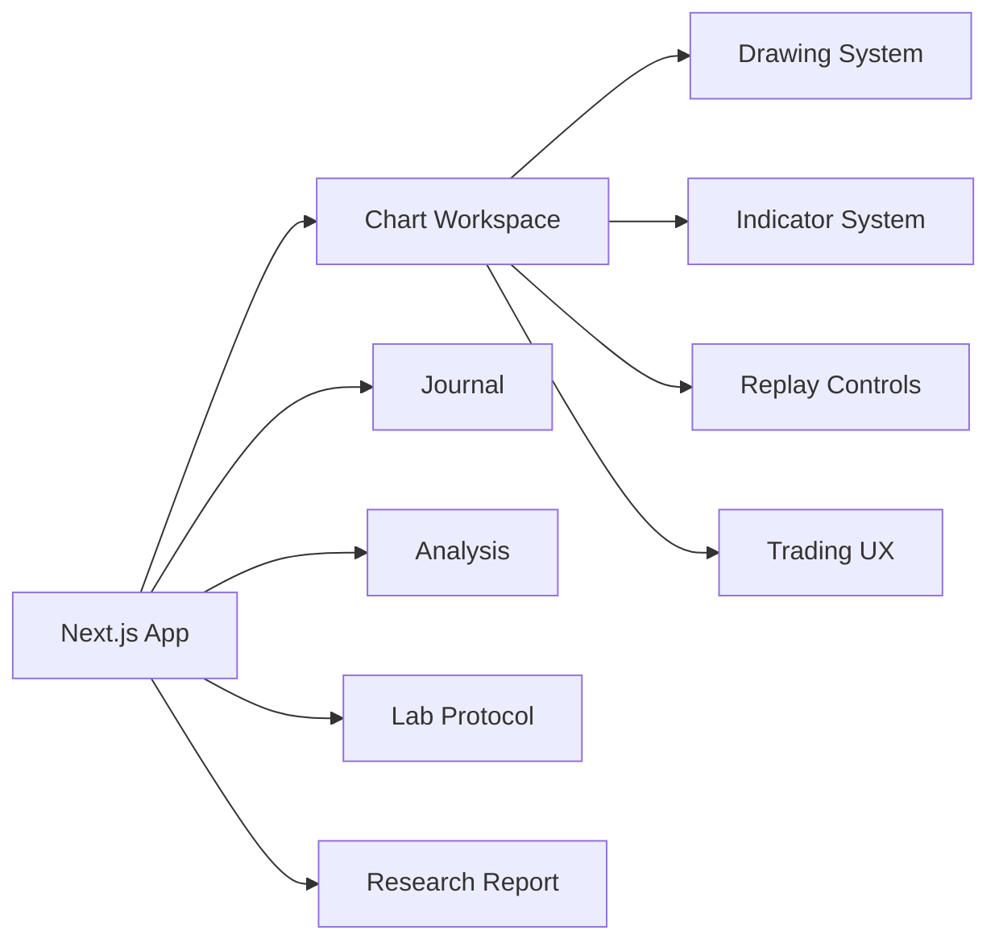

### Frontend state separation

**Ephemeral UI state**
- open panels;
- hover/selection;
- dialogs;
- temporary drawing interaction.

**Session state**
- replay cursor;
- visible range;
- active instrument/timeframe;
- open simulated positions.

**Persisted research state**
- protocol;
- experiment metadata;
- trades;
- exclusions;
- journal;
- result snapshots.

Do not persist everything merely because it can be persisted.

---

# 5. Market Data Architecture

## 5.1 Canonical pipeline

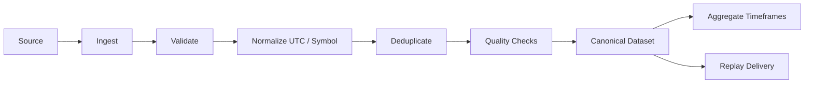

### Canonical candle

```text
instrument_id
timestamp_utc
timeframe
open
high
low
close
volume?
source
dataset_version
quality_flags
```

Raw imported/source data should not be silently mutated. Corrections create a new dataset/version or auditable transformation.

## 5.2 Candle Mode

Primary mode for fast manual research:
- OHLC replay;
- timeframe aggregation;
- deterministic reveal;
- no look-ahead;
- explicit same-candle SL/TP ambiguity.

## 5.3 Tick / Intrabar Mode

Later high-fidelity layer:
- tick/bid/ask data;
- spread;
- execution ordering;
- intrabar path;
- slippage;
- more defensible SL/TP resolution.

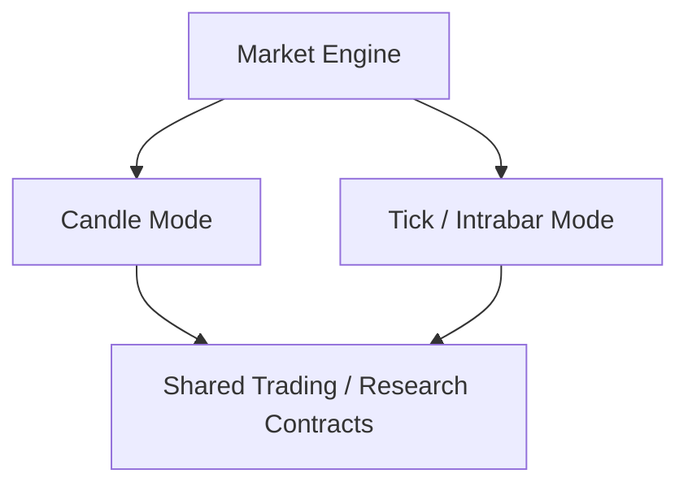

The research layer must know which market/execution mode produced a result.

---

# 6. Replay Engine Blueprint

Core invariant:

> **At replay time t, no component may expose information from t+1 onward.**

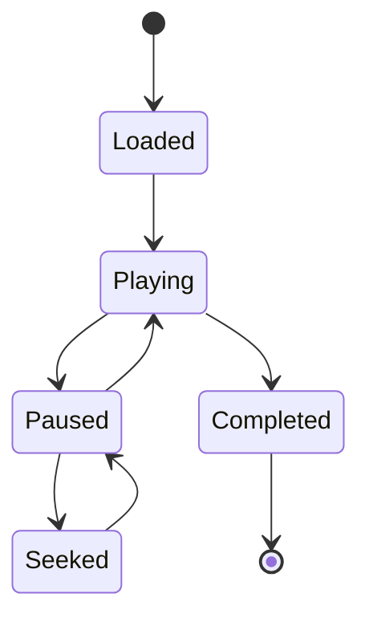

Replay responsibilities:
- deterministic revealed range;
- play/pause/step;
- playback speed;
- high-water/no-look-ahead state;
- event/news synchronization;
- incremental chart updates;
- replay-safe indicator calculation;
- deterministic seed/context where applicable.

Replay does **not** calculate research conclusions.

---

# 6A. Temporal View, Replay State & Canonical Research Log

Temporal correctness should be enforced structurally where practical.

```text
Versioned Dataset
      ↓
TimeBoundedView(t)
      ↓
Replay / Indicators / News / Execution
      ↓
Canonical Event + Trade Log
      ↓
Research Compute
```

A temporal consumer should not receive unrestricted future observations merely because an index is available. Relevant features should support truncation-invariance tests: state/output at `t` remains unchanged when data after `t` is physically absent.

Replay/backtest lifecycle should converge on an explicit state/revision model so chart, replay cursor, trading settlement, journal/event log and later cloud resume cannot silently represent different committed moments. Exact state names are implementation decisions; the invariant is that a committed replay revision has an unambiguous canonical trading/research state.

Research analytics consume canonical logs/results rather than being embedded into the candle loop.

# 7. Trading & Execution Engine

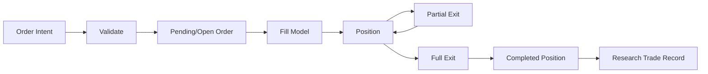

Canonical concerns:
- direction;
- entry;
- SL;
- TP;
- risk;
- quantity;
- fill price;
- commission;
- spread;
- slippage;
- partial exits;
- realized R;
- realized P/L;
- timestamps;
- execution assumptions.

The engine must distinguish **order intent**, **market simulation**, and **research record**.

---

# 8. Experiment Protocol Architecture

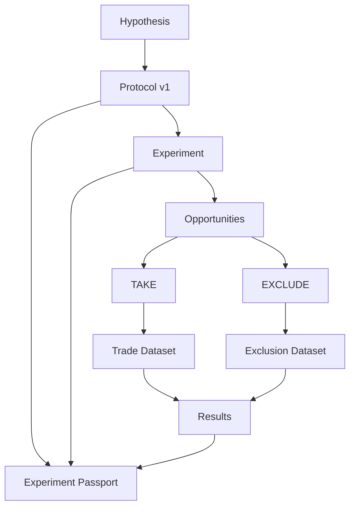

### Protocol object

```text
protocol_id
strategy_id
version
hypothesis
entry_rules
exit_rules
rr_policy
risk_policy
instrument_scope
timeframe
session_scope
inclusion_criteria
exclusion_criteria
planned_sample
stopping_rule
regime_definition_id
execution_assumption_id
created_at
locked_at?
```

Changing a material locked protocol field creates a new version/experiment rather than rewriting history.

---

# 9. Experiment Passport & Reproducibility

Every serious Lab Protocol result should be reconstructible from canonical identity/provenance such as:

```text
Dataset ID + Version + Content Hash
+ Strategy ID + Version + Definition Hash
+ Protocol ID + Version + Content Hash
+ RNG Algorithm + Seed
+ Engine / Research Calculator Version
+ Execution Assumption Version
+ Regime Definition Version
+ Trial / Strategy Lineage
= Experiment Identity
```

Hardware identity is not required by default. Prefer defined numeric semantics and versioned calculators; record additional environment metadata only where it materially affects reproducibility.

Candidate passport fields:
- experiment ID/hash;
- dataset content hash;
- strategy definition hash;
- protocol content hash;
- RNG algorithm/seed;
- trial/strategy lineage and experiment-family reference;
- user/workspace;
- strategy/version;
- instrument/timeframe;
- period;
- dataset/version;
- protocol/version;
- seed;
- engine build;
- execution model;
- regime algorithm;
- planned vs actual N;
- exclusion summary;
- result version.

A result without provenance is descriptive output, not a reproducible research artifact.

---

# 10. Research Engine Architecture

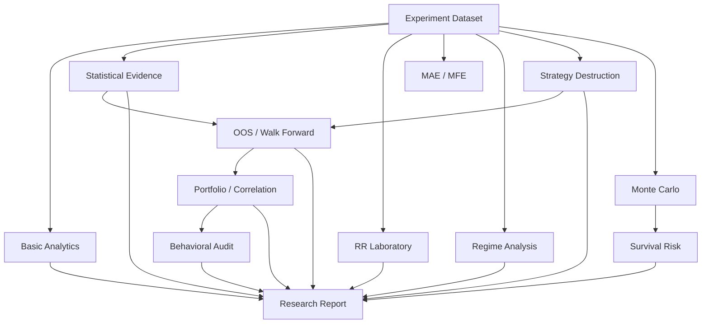

## 10.1 Basic Analytics

Free/descriptive:
- trade count;
- wins/losses;
- WR;
- total P/L;
- total/average R;
- average win/loss;
- profit factor;
- equity;
- historical MaxDD;
- streaks;
- journal.

## 10.2 Statistical Evidence Engine

Candidate outputs:
- break-even baseline;
- uncertainty/confidence intervals;
- expectancy uncertainty;
- sample/effective sample diagnostics;
- power where meaningful;
- pre-registered vs exploratory status.

Never reduce evidence to a universal binary “good/bad strategy”.

---

# 11. RR Laboratory Architecture

RR Laboratory is **post-experiment counterfactual research**.

Wrong design:

```text
Original R × new RR = simulated result
```

Correct direction:

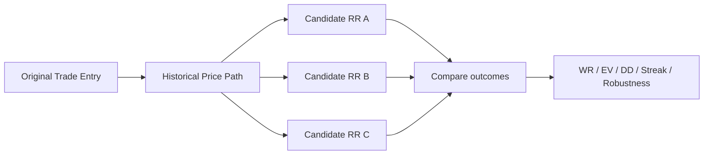

Alternative SL/TP must be evaluated against available historical path at appropriate resolution. Ambiguous paths must be marked rather than invented.

RR Lab output is exploratory unless independently validated.

---

# 12. Strategy Destruction Lab

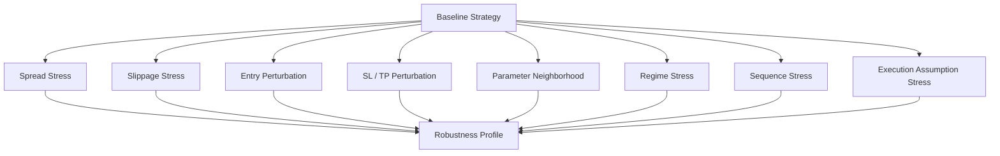

Store baseline, perturbation specification, result, and engine/data version.

---

# 13. Research Integrity Engine

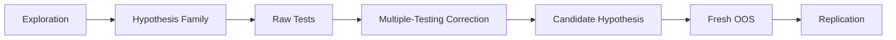

Capabilities:
- append-only trial/strategy lineage;
- hypothesis-family registry;
- number of relevant tests;
- raw p-values;
- Bonferroni;
- Benjamini-Hochberg FDR/q-values;
- exploratory vs pre-registered labels;
- immutable audit trail;
- fresh OOS linkage.

Multiple-testing correction is **not** automatically applied to every stress test or merely because a trial counter increased. Trial history is provenance; the inferential question and hypothesis family determine whether/how Bonferroni, BH-FDR, DSR or another method is appropriate. Sensitivity analysis and inferential hypothesis testing remain distinct concepts.

---

# 14. Monte Carlo & Survival Engine

Inputs:
- empirical R distribution or explicit model;
- sequence/resampling method;
- risk model;
- number of trades;
- number of paths;
- seed;
- constraints/assumptions.

Outputs:
- terminal equity distribution;
- MaxDD distribution;
- losing streak distribution;
- recovery characteristics;
- threshold exceedance probabilities.

Inverse risk design:

```text
r_max = max { r : P(MaxDD >= D*) <= alpha }
```

Long-running simulations belong in background jobs rather than the interactive request path.

---

# 15. Market Regime Engine

Regime definition is a **versioned research object**.

```text
regime_definition_id
name
version
features
thresholds
lookback
warmup
classification_rules
engine_version
```

Examples:
- trend/range;
- low/normal/high volatility;
- session;
- economic-event windows.

No hidden subjective classification in Lab Protocol.

---

# 16. Economic News Architecture

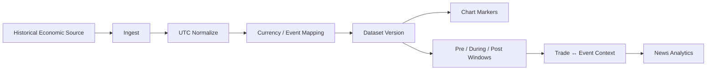

Canonical event candidate:

```text
event_id
timestamp_utc
currency
event_name
category
impact
previous
forecast
actual
source
dataset_version
revision_metadata?
```

News is a research subsystem, not decorative chart icons.

---

# 17. Portfolio & Correlation Architecture

Only activate meaningful portfolio analysis when enough multi-strategy/multi-market data exists.

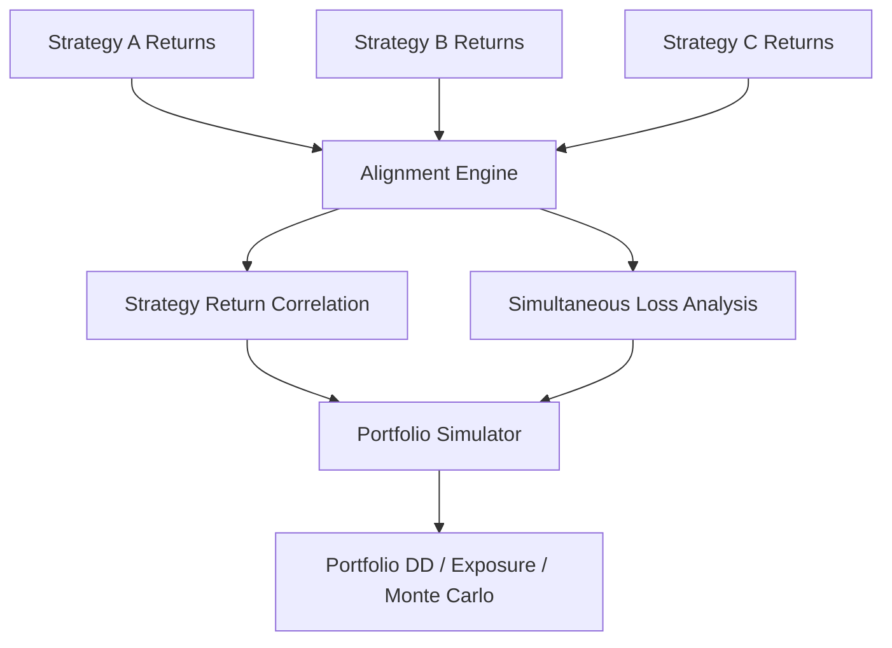

Price correlation alone is insufficient. Strategy-return and concurrent-loss behavior matter.

---

# 18. Behavioral / Live Audit Architecture

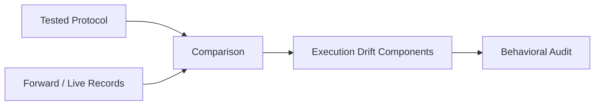

Candidate components:
- ΔRisk;
- ΔEntry;
- ΔSL;
- ΔTP;
- ΔHoldingTime;
- rule violations;
- skipped opportunities;
- frequency changes.

Do not infer psychology. Report measurable behavior.

---

# 19. Data Model Blueprint

Conceptual relationships—not a locked production schema:

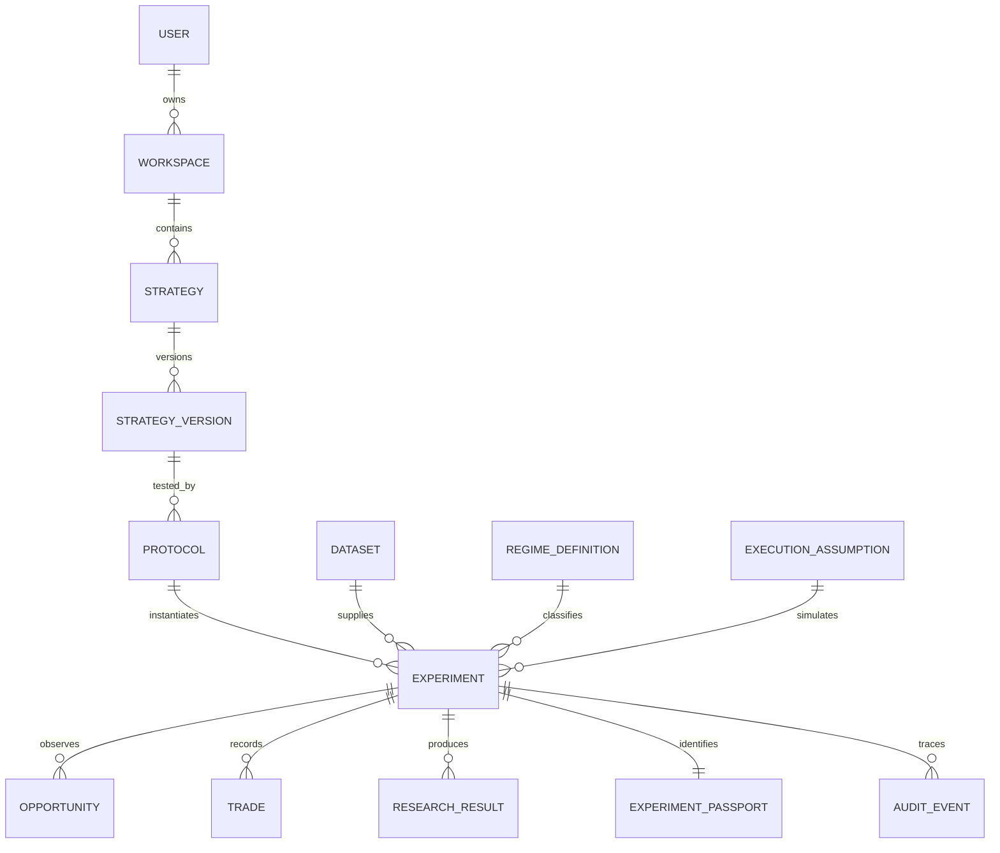

### Core tables/objects later

**Identity**
- users
- workspaces
- memberships

**Trading research**
- strategies
- strategy_versions
- protocols
- experiments
- opportunities
- trades
- trade_events
- journal_entries
- research_results

**Market**
- instruments
- datasets
- candles
- ticks later
- economic_events
- regime_definitions

**Reproducibility**
- experiment_passports
- execution_assumptions
- engine_versions
- audit_events

**Commercial**
- subscriptions
- entitlements
- usage_records

---

# 20. Storage Strategy

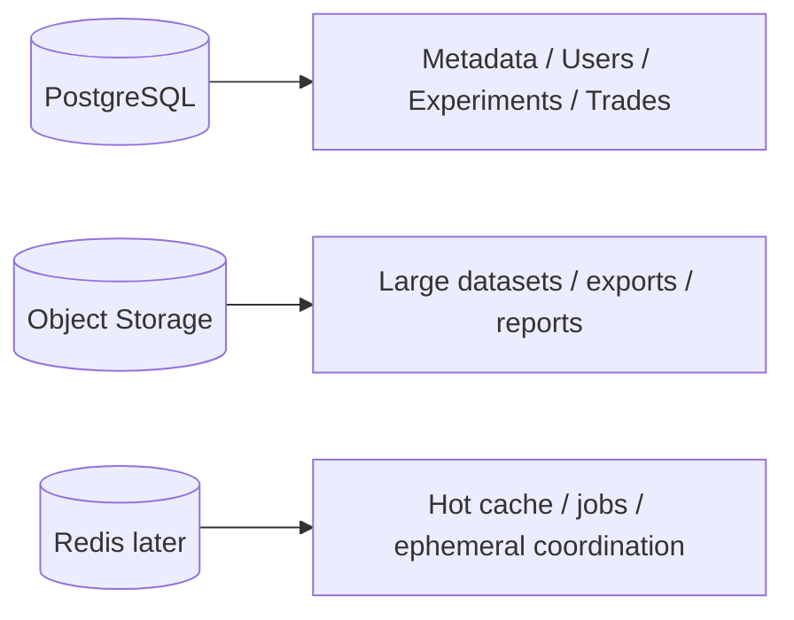

### PostgreSQL
Use for relational/queryable product state.

### Object storage
Use later for large immutable datasets, exports, reports, artifacts and high-volume tick chunks where appropriate.

### Redis
Not mandatory at MVP. Introduce for:
- job queue coordination;
- rate limiting;
- short-lived cache;
- distributed locks where genuinely needed.

Avoid storing canonical research truth only in cache.

---

# 21. API Blueprint

Suggested API namespaces:

```text
/api/v1/auth
/api/v1/workspaces
/api/v1/instruments
/api/v1/datasets
/api/v1/replay
/api/v1/orders
/api/v1/trades
/api/v1/strategies
/api/v1/protocols
/api/v1/experiments
/api/v1/research
/api/v1/reports
/api/v1/jobs
```

Example experiment flow:

```text
POST /protocols
POST /experiments
POST /experiments/{id}/opportunities
POST /experiments/{id}/trades
POST /experiments/{id}/complete
POST /experiments/{id}/research-jobs
GET  /jobs/{id}
GET  /experiments/{id}/report
```

Contracts should be versioned and domain-oriented, not mirror database tables blindly.

---

# 22. Async Job Architecture

Heavy research must not freeze the chart.

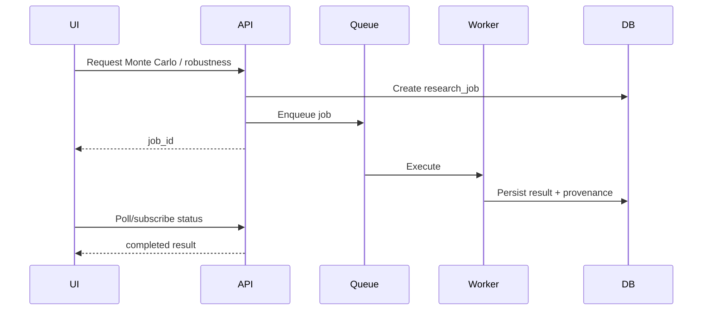

Candidate heavy jobs:
- Monte Carlo;
- RR grid;
- robustness grids;
- walk-forward;
- portfolio simulation;
- report generation;
- large imports.

---

# 23. Free vs Paid Entitlement Architecture

Entitlements must be server-authoritative in SaaS mode.

```text
FREE
├─ Free Backtest
├─ Lab Protocol
├─ ≤ 1 month market window / experiment
└─ Basic Results

PAID
├─ Extended historical data
├─ Statistical Evidence
├─ RR Lab
├─ Monte Carlo / Survival
├─ Robustness / Destruction Lab
├─ OOS / Walk Forward
├─ Regime research
├─ Portfolio / Correlation
├─ Behavioral Audit
└─ Full Research Report
```

Do not fork the scientific protocol into an intentionally invalid “free methodology”. Monetize data depth and analysis depth.

---

# 24. Security & Multi-Tenancy

When cloud/multi-user arrives:

- every user-owned resource has explicit workspace ownership;
- authorization occurs server-side;
- tenant ID/workspace ID is never trusted solely from client input;
- rate limits;
- secure session/token lifecycle;
- CSRF/XSS/SQL injection protections as applicable;
- secrets outside source control;
- encrypted transport;
- backup/restore testing;
- audit events for sensitive mutations;
- signed/expiring URLs for private object storage;
- least-privilege service credentials.

Research data isolation is a product requirement, not an optional hardening task.

---

# 25. Performance Blueprint

Priority model:

1. Security and correctness are hard constraints.
2. Determinism/reproducibility where promised.
3. Lightweight by default: avoid unnecessary work.
4. Measure relevant render/CPU/memory/query/I/O behavior.
5. Optimize demonstrated bottlenecks.
6. Scale through preserved boundaries when evidence requires it.

Techniques:
- incremental chart updates;
- chunked candle loading;
- timeframe aggregation/cache;
- indexed time-series queries;
- bounded API responses;
- lazy research panels;
- background heavy computation;
- memoized/pure indicator calculations where appropriate;
- compression for bulk datasets;
- pagination;
- load tests before infrastructure guessing.

Do not move to microservices merely because the product may someday have many users. Do not replace official chart-library behavior with custom canvas/virtualization without measured evidence that rendering is the bottleneck.

---

# 26. Deployment Blueprint

## Stage A — Local v1

```text
Browser
  ↓
Local app / local service
  ↓
Imported market data
```

Goal: research correctness and professional manual backtesting.

## Stage B — First hosted deployment

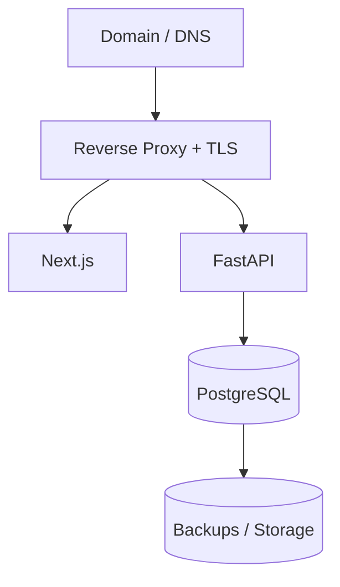

A single VPS can host the early system while usage is modest.

## Stage C — Scaled SaaS

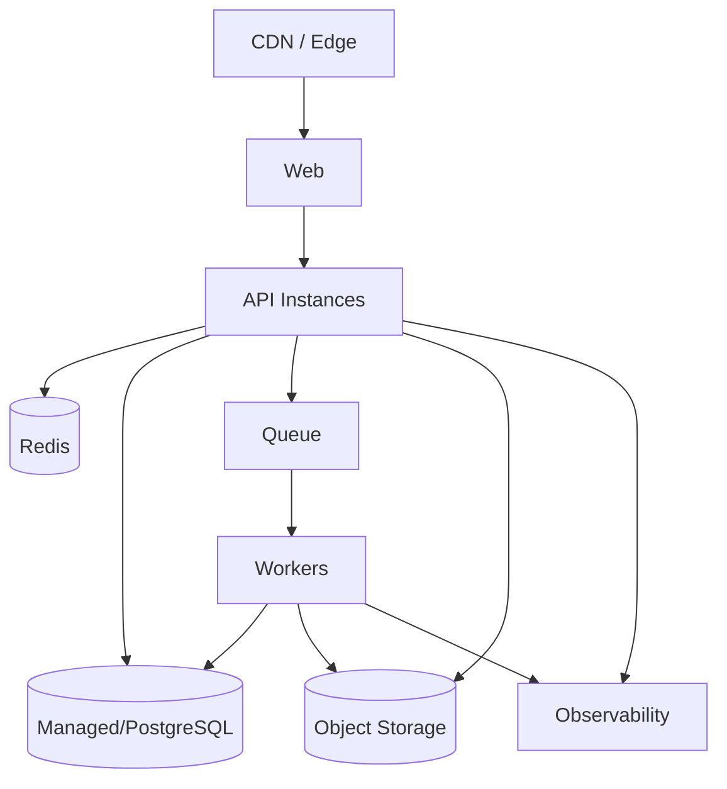

Scale based on measured bottlenecks, not imagined traffic.

---

# 27. CI/CD Blueprint

```mermaid
flowchart LR
    DEV[Change] --> GIT[Git Commit]
    GIT --> CI[CI]
    CI --> TEST[Test + Lint + Build]
    TEST --> GATE{Pass?}
    GATE -- No --> STOP[Stop]
    GATE -- Yes --> MAIN[Validated Main]
    MAIN --> DEPLOY[Deploy]
    DEPLOY --> SMOKE[Smoke / Health Check]
```

Production deployment later should support:
- reproducible builds;
- environment-specific configuration;
- migrations;
- rollback;
- health checks;
- deployment logs.

---

# 28. Observability

Minimum production signals:

**Application**
- request rate;
- error rate;
- latency;
- job failures;
- queue depth.

**Data**
- import failures;
- missing intervals;
- duplicate timestamps;
- dataset/version lineage.

**Research**
- engine version;
- job duration;
- failed simulations;
- result provenance.

**Infrastructure**
- CPU;
- memory;
- disk;
- DB connections;
- backup status.

Observability must not leak private strategy data into logs.

---

# 29. Versioning Rules

Version independently where appropriate:

```text
App Version
Engine Version
Dataset Version
Protocol Version
Strategy Version
Regime Definition Version
Execution Assumption Version
Research Result Version
```

A historical result must remain interpretable even after future engine upgrades.

---

# 30. AI Architecture Boundary

AI is a **research assistant**, not the canonical calculator.

AI may:
- summarize results;
- explain statistical concepts;
- surface anomalies;
- propose hypotheses;
- compare experiment reports;
- help construct protocol drafts.

AI must not silently:
- rewrite canonical trade history;
- fabricate market data;
- alter experiment parameters after results;
- replace deterministic calculations;
- claim a strategy will be profitable;
- receive autonomous real-money execution authority from this architecture.

```mermaid
flowchart LR
    DATA[Verified Research Results] --> AI[AI Research Assistant]
    AI --> INSIGHT[Explanation / Hypothesis]
    INSIGHT --> HUMAN[Human Decision]
    HUMAN --> NEW[New Protocol / Experiment]
```

---

# 31. Failure & Recovery Principles

Design for:
- browser refresh;
- interrupted replay;
- failed import;
- failed analytics job;
- worker restart;
- DB migration failure;
- partial network outage;
- stale client state.

Rules:
- writes should be idempotent where feasible;
- incomplete jobs have explicit state;
- canonical data is never inferred from a failed partial result;
- backups are useful only after restore has been tested;
- experiment provenance survives recovery.

---

# 32. Evolution by Product Version

| Version | Architectural identity |
|---|---|
| v1.0 | Local/manual research platform; validated replay/trading/analysis |
| v2.0 | Cloud multi-user foundation: API, PostgreSQL, auth, workspaces, cloud market data |
| v3.0 | Professional research: strategies, journal, analytics, regime, portfolio, Monte Carlo |
| v4.0 | High-fidelity execution: tick, bid/ask, spread, costs, slippage, intrabar |
| v5.0 | SaaS operations: subscriptions, teams, RBAC, collaboration, audit, admin |
| v6.0 | Quant research: datasets, experiments, parameter research, walk-forward, robustness, AI research assistant |
| v7.0 | External/live/paper/forward-testing infrastructure and algorithmic-readiness validation |

This table summarizes the existing roadmap. It does not authorize any future phase.

---

# 33. Architectural Non-Negotiables

1. No look-ahead.
2. Deterministic replay where deterministic behavior is promised.
3. Canonical trade/execution records.
4. Versioned research assumptions.
5. Reproducible Lab Protocol experiments.
6. Explicit ambiguity instead of invented certainty.
7. Exploration ≠ validation.
8. Multiple-testing awareness.
9. Fresh OOS/replication for stronger evidence.
10. Heavy analytics outside latency-sensitive chart interaction.
11. Server-authoritative ownership/entitlements in SaaS mode.
12. AI interprets verified results; deterministic engines calculate them.
13. No autonomous real-money execution within the current roadmap boundary.
14. Do not replace a working modular architecture with microservices without measured need.

---

# 34. Target Repository Structure

Conceptual target; existing validated paths must not be moved merely to match this diagram.

```text
apps/
  web/
  api/

engine/
  market/
  replay/
  execution/
  risk/
  indicators/
  statistics/
  monte_carlo/
  research_integrity/
  regime/
  robustness/
  portfolio/

research/
  protocols/
  experiments/
  reports/

data/
  import/
  validation/
  aggregation/

workers/
  research_jobs/

tests/
  unit/
  integration/
  regression/
  e2e/

docs/
  ROADMAP.md
  BACKTEST_LAB_RESEARCH_THESIS.md
  PRODUCT_SYSTEM_ARCHITECTURE_BLUEPRINT.md
```

Repository refactoring should happen only under an explicitly authorized implementation phase.

---

# 35. One-Page Blueprint

```mermaid
flowchart TB
    USER[Trader / Researcher]
    UX[Chart-First Backtest Lab]
    CORE[Replay + Trading + Journal]
    PROTOCOL[Lab Protocol + Experiment Passport]
    DATA[Versioned Market / News / Trade Data]
    RESEARCH[Evidence + RR Lab + Regime + Robustness]
    RISK[Monte Carlo + Survival]
    INTEGRITY[Multiple Testing + OOS + Replication]
    PORT[Portfolio / Correlation]
    AUDIT[Behavioral / Live Audit]
    AI[AI Research Assistant]
    CLOUD[API + PostgreSQL + Workers + Object Storage]

    USER --> UX
    UX --> CORE
    CORE --> PROTOCOL
    PROTOCOL --> DATA
    DATA --> RESEARCH
    RESEARCH --> RISK
    RESEARCH --> INTEGRITY
    INTEGRITY --> PORT
    PORT --> AUDIT
    AUDIT --> AI

    CORE <--> CLOUD
    PROTOCOL <--> CLOUD
    DATA <--> CLOUD
    RESEARCH <--> CLOUD
```

## Final architecture thesis

> **Backtest Lab should feel simple at the chart, strict in the data, transparent in the assumptions, and deep in the research.**

The chart is the workspace.  
The experiment is the unit of research.  
The dataset is evidence.  
The passport makes evidence reproducible.  
The research engines measure uncertainty.  
The human remains the decision-maker.


---

# 36. Extensible Market Data & Indicator Import Boundary

> **Status:** Architecture direction, not current implementation authorization.

Backtest Lab must not be permanently coupled to Twelve Data, one broker feed, one file format, or only the indicators bundled with the application.

## Market Data Source Adapters

Canonical flow:

```text
Twelve Data / Broker / CSV / Parquet / Future Provider
                     ↓
              Provider Adapter
                     ↓
          Normalize + Validate
                     ↓
        Canonical Market Dataset
                     ↓
     Dataset Version + Content Hash
                     ↓
 Replay / OOS / Forward / Research
```

Initial development candidate:
- Twelve Data may be used as a low-cost/free trial source for forward-engine development where the selected symbol and account tier permit it.
- It is not a permanent provider dependency.
- Commercial display/redistribution rights must be re-verified before public use.

A provider adapter should describe source/provider identity, instrument mapping, price type where known, timestamp/timezone semantics, interval, latency/completeness metadata, and licensing/usage metadata where relevant.

New providers should be addable without rewriting Replay, Execution, Experiment Passport, or Research Compute.

## User Market-Data Import

Backtest Lab should support user-supplied market datasets through a validated import boundary.

Candidate formats:
- CSV first;
- additional structured formats such as Parquet later when justified;
- provider/API adapters separately.

Import must validate schema, timestamps, ordering, duplicates, gaps, numeric values, OHLC invariants, timezone semantics, instrument metadata, and file/resource limits. Imported datasets receive immutable version identity/content hash before research use.

Never silently merge incompatible providers or price semantics into one canonical experiment dataset.

## Indicator Extensibility

Built-in indicators remain deterministic/versioned research components, but the architecture should allow additional indicators to be imported or installed later.

Conceptual boundary:

```text
Built-in Indicator
Imported Indicator Definition
Future Approved Plugin
          ↓
   Indicator Contract
          ↓
TimeBounded Market View
          ↓
Deterministic Output Series
          ↓
Chart Pane / Overlay + Research
```

Minimum indicator contract should eventually define:
- stable indicator ID and version;
- name/metadata;
- parameters and validation schema;
- required input series;
- warm-up requirement;
- output series/panes;
- deterministic calculation semantics;
- no-look-ahead/time-bounded input;
- compatibility/version metadata.

## Safety Boundary for External Indicators

“Import indicator” must **not** mean executing arbitrary untrusted Python/JavaScript in the main application process.

Preferred progression:
1. import safe declarative indicator definitions/configuration where possible;
2. support approved/versioned plugin packages only after a plugin security model exists;
3. arbitrary user code, if ever supported, requires a separately designed sandbox with CPU/memory/time/network/filesystem limits and is not authorized by this blueprint.

External indicators must not gain implicit access to secrets, other users' data, billing, filesystem, network, or future replay observations.

## Reproducibility

An experiment using imported data or an external indicator must record enough identity to reproduce the claim, including applicable:
- Dataset ID/version/content hash;
- data provider/source;
- Indicator ID/version/definition hash;
- indicator parameters;
- engine/calculator version;
- execution model version.

Changing an imported indicator definition after an experiment must create a new version rather than silently changing historical results.

## Design Principle

**Import at the boundary; normalize into canonical contracts; keep the research core provider-neutral.**

This lets Backtest Lab start cheaply while preserving the ability to add better data feeds and a larger indicator ecosystem later.


---

# 37. Open-Source Dependency Adoption Plan

> Status: planning direction only; no installation or implementation is authorized here.

Backtest Lab should use open source for commodity infrastructure while keeping replay/execution semantics, Lab Protocol, Experiment Passport, research integrity, and evidence methodology product-owned.

## Adoption rule

Adopt a dependency only when there is a demonstrated need and the project has checked commercial licensing/attribution, maintenance, security, performance cost, architectural fit, and replacement boundaries. A planned candidate is not automatically an installed dependency.

## Candidate map

| Capability | Candidate | Planning status |
|---|---|---|
| Financial market chart | TradingView Lightweight Charts | Existing foundation |
| Browser end-to-end QA | Playwright | Evaluate, likely useful for v1 hardening |
| Backend API | FastAPI | Planned candidate for Phase 19 |
| Relational product state | PostgreSQL | Planned candidate for Phase 20 |
| Research visualization | Apache ECharts | Evaluate for advanced research UI |
| Columnar/dataframe transforms | Polars | Evaluate when measured workload justifies |
| Embedded analytical SQL and CSV/Parquet analysis | DuckDB | Evaluate when dataset/research workload justifies |
| Scientific/statistical primitives | SciPy | Evaluate for advanced research engines |
| Statistical inference/models | statsmodels | Evaluate for advanced research engines |
| Object storage | S3-compatible boundary | Defer implementation/provider choice |
| Background jobs | Lightweight worker/job abstraction | Defer library choice until heavy jobs exist |
| Authentication | Mature OIDC/session solution | Defer exact choice to cloud auth phase |
| Observability | OpenTelemetry-compatible instrumentation | Evaluate for production hardening |
| Dependency/security checks | Ecosystem-native CI tooling | Evaluate before public production |

## Visualization boundary

Keep Lightweight Charts for market/replay. Evaluate ECharts for research-specific views such as Monte Carlo distributions, drawdown/recovery distributions, regime heatmaps, parameter surfaces, robustness views, and portfolio/correlation visualizations.

## Data and research compute boundary

Potential future flow:

```text
Versioned Dataset / CSV / Parquet
              ↓
       DuckDB / Polars
              ↓
Deterministic Backtest Lab Research Logic
              ↓
     SciPy / statsmodels primitives
              ↓
 Canonical Research Result + Provenance
              ↓
       ECharts / Reports
```

DuckDB/Polars are analytical candidates, not replacements for PostgreSQL application state.

Libraries may provide primitives and execution machinery, but Backtest Lab remains authoritative for Lab Protocol, Experiment Passport, no-look-ahead, execution assumptions, canonical Event/Trade Log, hypothesis-family definition, multiple-testing policy, Monte Carlo experiment definition, survival/risk-sizing, Strategy Destruction, and evidence interpretation.

## QA priority

Playwright is a strong E2E candidate for replay/navigation, drawings/indicators, order lifecycle, Fixed-RR restrictions, checklist ON/OFF, timeframe switching without temporal leakage, reset/recovery, entitlements, and Free affiliate versus paid ad-free UI.

E2E tests complement deterministic unit/domain tests; they do not replace them.

## Infrastructure restraint

Do not introduce ClickHouse, Redis, Kafka/RabbitMQ, Kubernetes, vector databases, microservices, arbitrary user-code execution, or a custom chart renderer by default. Adopt heavier infrastructure only after a measured workload or concrete requirement proves the simpler architecture insufficient.

## Dependency gate

Before adoption, verify the exact package and license, attribution/NOTICE obligations, current maintenance, security posture, version-lock strategy, material transitive dependencies, and the replacement boundary for critical components.

## Rollout principle

**Do not install an OSS dependency because it appears on this plan. Install it at the phase where it eliminates a real problem.**

Quality order remains:

**Security + Correctness → Lightweight → Efficient → Measured → Scalable.**

# 38. Phase 19 — Backend architecture planning handoff

This section extends the existing architecture owner. It is a planning deliverable, not a production API, schema, deployment or implementation authorization. Baseline audited: `15102e55ab31bc6ec5b7e98067af45d58126dc83`, clean main equal to origin and actual GitHub. Operational authorization remains only in [04_CURRENT_PHASE](../AI_CONTEXT/04_CURRENT_PHASE.md). Product semantics remain in the [frozen Method/Session handoff](TRADING_METHOD_SESSION_SPEC.md#frozen-trading-ux-specification-v1); security in [SECURITY_ARCHITECTURE](SECURITY_ARCHITECTURE.md), engineering in [AI_ENGINEERING_GUARDRAILS](AI_ENGINEERING_GUARDRAILS.md), infrastructure/commercial/provider decisions in [SCALING_DATA_AI_DECISIONS](SCALING_DATA_AI_DECISIONS.md). This is not another roadmap or Definition of Done.

## 38.1 Observed baseline and direction

React/Vite + Lightweight Charts is the active workspace; local account, drawing and news repositories own their existing independent storage. The explicit trading UX prototype is memory-only. `backend/api/main.py` exposes a standalone FastAPI 0.4.0 prototype with a module-level ReplayService and in-memory datasets/sessions. Its replay/trading engines have standalone tests; frontend production does not depend on these endpoints. Current handlers use coarse validation/error mapping and development CORS (including null origin), with no production identity, membership, durable idempotency or transactional persistence. These are observed integration gaps, not authorization to repair or deploy the prototype.

Retain React/Vite and chart/engine behavior. Earlier Next.js language is strategic, not a frontend migration prerequisite. Plan FastAPI as the existing backend direction, with thin transport handlers and framework-independent use cases/domain contracts. No dependency is installed or endorsed as production-ready here; exact versions, compatibility, licenses and security must be verified at implementation. PostgreSQL remains the Phase 20 direction; schema/migrations, auth/token mechanics and ownership implementation belong to separately authorized phases. Do not silently promote the old Python engine to canonical execution or port the JS simulator: later integration needs differential fixtures and a human-approved execution-authority decision if parity fails.

## 38.2 Modular monolith and ownership

Initial deployment direction is one application with explicit modules and replaceable ports, not microservices. Domain imports must not depend on transport, SQL, vendor clients or UI. Handlers → application use cases → pure domain rules → repository/provider ports; composition supplies infrastructure adapters. Proposed module names are conceptual, not folders created by this task.

| Boundary | Owns / input-output | Must not own |
| --- | --- | --- |
| Presentation | TIME + PRICE planner, chart, draft, ticket/review, displayed errors and read projections | Canonical authorization, persisted financial outcomes or server credentials |
| Product application / Product DB port | Authorized Method/Session lifecycle, command sequencing, revisions, durable confirmation receipts, journal references | Research algorithms, provider-specific identifiers as product identity |
| Market / temporal view | Dataset manifests/rights, immutable feed identity, revealed revision and bounded candle/news access | Future observations in interactive consumers, trading outcomes |
| Execution domain port | Validated intent, deterministic replay settlement, pending/fill/partial/exit events and account reconciliation | Drawing state, HTTP handlers, AI decisions; no dual writer with v1 |
| Research Compute | Read-only canonical evidence snapshot, passport and versioned calculator → result artifact | Interactive replay loop, direct account mutation, unrestricted tenant data |
| Billing / Entitlement | Internal capability decision from auditable commercial state | Payment-provider status directly authorizing execution/research |
| AI Gateway | Authorized minimal context, bounded tool requests, provider abstraction | Financial truth, automatic orders, secrets in prompts |
| Integration / CRM | Allowlisted business projections and idempotent outbound integration | Canonical research ledger or blocking replay on CRM availability |

Only boundaries are planned for Billing, AI and CRM; no payment, subscription, AI or Odoo implementation. Product state cannot depend on their availability. Workers may later run separately using the same domain and contracts when measured workloads justify it. No Redis/queue/microservice requirement is introduced.

## 38.3 Request and API contract

Proposed versioned resources under `/api/v1` are contracts to implement later, not available routes. Workspace-scoped Methods/Sessions, Session command/confirmation receipts, bounded event/position projections, dataset manifest/temporal views, Experiment Passports/trial lineage and research-job status form the minimal seams. Avoid CRUD endpoints that let clients insert arbitrary canonical fills or P&L. Existing unversioned prototype routes stay unchanged and are not aliases for this contract.

Command envelope: schemaVersion, requestId/idempotencyKey, sessionId, method definition reference/hash, expectedSessionRevision, expectedQuoteRevision, instrument/feed/profile references, workflow/type/side, decimal levels/quantity/risk inputs, condition observations and planId/revision when Planned. The server resolves authoritative ownership/Method/Session/quote/profile; client values are assertions, not trusted policy. Store the reviewed request snapshot separately from resulting execution events. API contract names and wire DTOs require a reviewed schema before implementation.

Future flow: authenticated principal → membership/resource check → bounded runtime DTO validation → current Session/Method/profile/temporal-view resolution → independent domain validation (including Protocol ON/OFF) → explicit confirmed command → atomic revision/idempotency check plus execution/evidence write → committed receipt/projection. Drawing placement/draft/preview and ticket opening never execute a command. Cancellation before confirmation submits nothing; pending cancellation is a distinct recorded abandonment. Protocol OFF never bypasses fixed risk/RR or categorical restrictions. Unknown observations stay NOT_ASSESSED; no implicit PASS.

Confirmation dedup key is scoped to verified workspace + Session + operation + request identity, with a canonical payload digest. Same identity/payload returns the existing receipt even after later Session revisions; a conflicting payload refuses. New commands compare expected revision under the same transactional/serialization boundary as side effects. Concurrent confirmations cannot both execute; crash/retry cannot duplicate a fill. Reject stale commands before mutation. Receipts reference committed Session/event revisions; clients reconcile by receipt/state rather than retrying with new identities after uncertain delivery. Review expiry and dedup retention must be specified before implementation; receipt identity for financial actions must remain recoverable through retries/restore.

Use explicit domain errors (INVALID_INPUT, PROTOCOL_BLOCKED, STALE_REVISION, IDEMPOTENCY_CONFLICT, RESOURCE_UNAVAILABLE) and correlation IDs. Planned mapping: malformed input 400, failed numeric/domain validation 422, revision/idempotency conflicts 409, absent identity 401, denied access 403 or consistent non-disclosing 404; pending heavy work 202 with status reference. These are target conventions, not changes to current 400/404 prototype behavior. Bound pagination, upload sizes, query windows and concurrency; define measured limits before production, never unrestricted history by default.

## 38.4 Persistence-facing identity and evidence contracts

| Record | Required identity/content and invariants |
| --- | --- |
| Method definition | Stable methodId, workspace owner, Free Style/Protocol type, immutable definition reference/hash, conditions/enforcement/risk/RR policy. Technical snapshots do not create a mandatory user-facing version editor. Material changes preserve prior meaning. |
| Session / feed segment | Stable sessionId, inherited Method definition, instrument/feed/dataset version, starting balance and risk basis, costs/execution profile, committed revision and revealed boundary. Feed continuation creates an explicit linked segment rather than rewriting prior evidence. |
| Confirmed intent / receipt | Request identity, canonical digest, actual condition observations, reviewed quote/plan revisions, validation policy and committed outcome references. Client confirmation is not itself proof of fill. |
| Canonical event / trade log | Stable eventId, owner/session, monotonic per-Session sequence, event schema, engine/policy version, market time plus recorded UTC time, causal request/position/exit references, source, actual quantity/costs and resulting revision. Partial exit stays distinct from completed position. |
| Experiment Passport | Stable experimentId + immutable passport revision/content digest; dataset identity/version/hash, Method definition hash, protocol definition hash where applicable, engine/calculator version, execution assumptions/profile, instrument/feed/period, regime definition and RNG algorithm/seed when used, input snapshot/log boundary and trial/family references. Missing inputs prevent reproducibility certification. |
| Trial / strategy lineage | Append-only trialId, parent/family/experiment references, definition hashes, exploratory/confirmatory declaration and recorded reason/time; abandoned/failed/excluded attempts remain discoverable. Lineage does not automatically trigger multiple-testing correction. |
| Research result | Job/passport/input-snapshot identity, calculator/numeric policy/version, parameters/seed, artifact hash and diagnostics. A changed input/calculator produces a new result identity, not overwritten evidence. |

Append-only applies to canonical research/financial evidence: corrections append a linked superseding/correction event and projections retain prior meaning. Mutable notes/preferences remain separate. This does not forbid legally required erasure: implement privacy/retention policy and controlled auditable deletion/redaction at the appropriate phase; do not promise perpetual private-data retention. Event ledger is separate from sanitized operational logs. Projections must be rebuildable/reconciled; cache and RAM are not canonical truth. Atomic event/receipt/revision persistence is a Phase 20 design requirement, not an implemented transaction.

Hash contract proposal: SHA-256 over UTF-8 canonical JSON with schemaVersion; sorted object keys, preserved array order, explicit null vs absent semantics, UTC timestamps and normalized finite decimal strings (no NaN/Infinity or negative-zero ambiguity). Identity hash excludes mutable display labels, secrets and operational recorded times; evidence artifact digest may include recorded times. Cross-language golden vectors and exact decimal/rounding policies must be approved before any producer adopts this format. Content hash proves byte identity, not authenticity or compliance. Do not invent hashes, initial risk, cost metadata or timestamps for legacy records; preserve originals and label unavailable provenance.

## 38.5 Research job and temporal boundary

Proposed job input: verified owner, jobId/idempotency identity, passport/input artifact hashes, calculator version, parameters, optional RNG metadata and resource policy. State transitions: QUEUED → RUNNING → SUCCEEDED / FAILED / CANCELLED; CANCEL_REQUESTED is nonterminal, timeout is a classified failure. Progress is descriptive, never a research result. Durable status/result publication, bounded attempts, deadlines/concurrency/memory budgets and cooperative cancellation belong to the later adapter. At-least-once retries may recompute but cannot publish duplicate canonical results. Recheck ownership on submission/status/download and worker artifact resolution; results publish atomically only against matching snapshot identity.

Interactive replay, indicator, news and execution consumers receive only TimeBoundedView(revision, revealedTime), never an unrestricted dataset. Session settlement/event append and replay acknowledgement must describe the same committed revision. Research jobs may access a separately authorized completed evidence interval or retrospective price path; those results must remain labeled and cannot leak into a still-running strict replay view. Test physically truncated futures, not only UI-hidden fields. Heavy compute never runs in synchronous chart/order handling. No Monte Carlo/advanced analytics/worker runtime is built here.

## 38.6 Trust, adoption and acceptance gates

Browser storage and imported data are untrusted. Validate schema, numeric units, finite bounds, content size/hash and temporal availability at each boundary. Never accept principal, membership, entitlement or source claims from a hidden button/client-supplied workspace ID. Until production identity/membership exists, new private-resource paths must remain disabled or test-only with explicit injected principals, not publicly exposed without authorization. CORS is not authorization; development null-origin settings are not a deployment policy. Credentials belong to server secrets configuration, never frontend bundles, passports or logs. Token/session mechanics, CSRF policy and public launch checks remain with the security owner and later identity scope.

Implementation preparation order (within existing phase owners, no second roadmap): approve DTOs/golden fixtures and ports; separately authorize a narrow backend foundation; separately authorize Phase 20 persistence/migrations/restore; follow identity/workspace phases before private cloud exposure; then authorize one guarded production adapter with rollback and differential evidence. No automatic frontend rewrite, local storage upload/migration or Python engine switch. Existing `/` and prototype entry remain isolated until a reviewed cutover; never run two canonical execution writers. Exact limits, hash vectors, privacy retention, runtime engine parity and deployment/auth choices are implementation prerequisites, not hidden product decisions made by this document. Material contract conflicts require human resolution.

Future implementation acceptance matrix:

| Gate | Required proof before integration/release |
| --- | --- |
| Domain parity | Existing regression plus cross-runtime fixtures for risk/decimal rounding, order relations, pending/fill/partial/exit, costs and ambiguity; discrepancies block cutover |
| Confirmation/recovery | Same/different payload retries, concurrent confirmations, stale revisions, crash between commit/ack, restart/restore, receipt recovery; exactly one financial effect |
| Protocol/evidence | Quick/Market/locked fields/manual intervention refused even direct API; ON missing/FAIL blocks, OFF preserves observations; no fabricated compliance |
| Temporal integrity | Physical-future truncation invariance; quote/replay/settlement revisions consistent; research artifacts cannot reveal future data to strict replay |
| Ownership/security | Cross-tenant reads/writes/job artifacts/exports denied, bounded requests, sanitized errors/logs, no client secrets; existing security launch gate applies |
| Persistence/provenance | Append/correction lineage, immutable snapshots/hash vectors, missing legacy metadata retained, replayable projections and account reconciliation, backup/restore identity equality |
| Jobs/boundaries | Timeout/cancel/retry/resource limits and duplicate result publication tests; provider/CRM/AI outages cannot alter trading truth |
| Compatibility | Existing account/drawing/news storage untouched, full frontend regression/build/lint/release/bundle, future backend tests and actual browser cutover smoke |

Planning closure: only documentation/context and bundle allowlist change. Existing repository and AI-bundle controls validate authority/link inclusion; regenerate and verify the disposable bundle. Browser verification is exempt with reason: no runtime, UI, API, build entry, dependency, database or engine changes. This checkpoint closes Phase 19 planning only; Phase 19 implementation and Phase 20 remain unauthorized until explicitly requested by the human.

## 38.7 Authorized foundation checkpoint — implementation evidence

The human subsequently authorized only framework-independent contracts, pure validation, canonical serialization/hash fixtures and deterministic tests from clean verified `aa3b982728b3e7f36278bbbf8a5c6f24e6b410a6`. `backend/contracts/` now implements this narrow seam using Python standard library; no existing service/engine imports or integration. This is a completed foundation checkpoint, not all Phase 19/backend completion. Sections above retain their future integration meaning.

Frozen DTOs cover Method policy/condition observations, resolved Session/quote assertions, Command, ReviewedRequest, ConfirmedRequest, receipt comparison, event identity, Passport revision/identity, trial lineage, research-job input/state and temporal observations. Mutable lists are refused at tuple boundaries; exact IDs/categories/revisions/hash formats and aware timestamps are validated. Decimal inputs accept exact strings/ints/Decimal and refuse binary floats/bools, nonfinite values and unsupported forms. Pure command validation compares supplied context identity/revisions, market/pending relations, stop/target sides and Protocol Planned/pending/risk/RR/ON checks. OFF preserves FAIL/NOT_ASSESSED and still refuses categorical actions. RR comparison uses exact rational arithmetic independent of Decimal context. Context is an asserted future-server input, not authenticated principal evidence.

BTL-CJSON-1 is a project-local format, not RFC 8785. Root schemaVersion is exactly integer 1; keys sort by Unicode code point, arrays retain order, null remains explicit and absent remains absent. Strings are Unicode scalar sequences (no normalization); UTF-8 compact JSON escapes controls, quote and backslash. Integers are limited to safe 53-bit range; Decimal becomes a normalized exact string with no exponent/trailing fractional zero/negative zero; aware datetime becomes UTC ISO text with six fractional digits and Z. Ordinary strings retain their meaning: DTO schema distinguishes decimal/time fields, so generic numeric-looking strings are not coerced. Float, unsupported object types, naive time, excessive depth/collections/text/decimal exponent and unsupported root versions refuse. Identity builders include only defined DTO identity content; reviewed/recorded wall time is separate from command/passport identity. SHA-256 is content identity, never authorization, signature or invented compliance.

Six committed golden fixtures in `backend/tests/fixtures/contract_hash_vectors.json` cover decimal/time/Unicode, exponent expansion, absent field, Unicode-key sorting, integer-looking-key sorting and microseconds. Python tests compare exact expected bytes/digests across repeated runs. `backend/tests/verify_contract_vectors.mjs` independently renders the fixture subset with Node standard library and explicit sorted-key serialization, avoiding JS integer-key enumeration differences. Python contract tests also cover field-order invariance, array sensitivity, null vs absent, malformed numeric/category/ID/schema, immutability, stale revisions, Protocol bypass/refusal, confirmed-time ordering, receipt scope/conflict, Passport/RNG/job identity/deadlines/state and event revealed-time checks. Temporal view equals a physically truncated prefix and ignores changed future values; this proves only the new availability-view primitive, not a new engine or strict-delivery integration.

Validation: all 63 backend tests (53 retained + 10 new test methods with parameterized assertions) pass using existing venv; bundled Python independently passes the 10 foundation tests. Six Node golden vectors pass three repeated runs. Full registered frontend regression, lint/build/release pass. Final repository/bundle regeneration/verification and diff/Git gates close the checkpoint. No tests weakened, dependencies added, files deleted, routes/frontend/engine/storage/data changed. Browser exempt per this checkpoint's explicit authorization: contracts are unwired and no browser/product path changes. This is not a docs-only code change; no browser integration exists to exercise.

Limitations: immutable evidence DTOs do not implement append-only persistence, ancestry graph enforcement, durable receipts/concurrency/crash recovery, server identity/membership, numeric tick/lot/budget profiles, fill/settlement/P&L, SQL migrations, hash authenticity or workers. Protocol quantity-derived budget validation needs a separately authorized full instrument/risk-basis adapter; positive quantity alone is not proof of risk compliance. Job transitions describe policy only, not scheduled work; structural input bounds are not measured production quotas. New DTO schema/hash adoption remains isolated; external producers must pass these vectors and reviewed wire-boundary rules before integration. Further Phase 19 application/API scope must be defined and explicitly authorized; no Phase 20/persistence/auth/frontend cutover follows automatically.

Bundle boundary: the existing repository gate excludes backend source/fixtures from the frontend-focused disposable bundle. Attempted narrow inclusion was rejected and reverted; no test/allowlist boundary was weakened. The regenerated bundle includes this authoritative evidence and context; run backend validation in master. A future backend-specific bundle responsibility requires separately reviewed scope, not bypassing the existing gate here.

## 38.8 Application/API layer preparation — planning only

Hard baseline gate passed at `163558e07e034fabf43ae62c51c2947e6aa0fd3a`: local/origin/actual GitHub main equal, working tree clean, ahead/behind 0/0. This human-authorized task changes existing documentation/context only. The following is exactly one proposed implementation checkpoint, not implementation authorization or completion of Phase 19. Operational status remains in [04_CURRENT_PHASE](../AI_CONTEXT/04_CURRENT_PHASE.md).

### Audit and bounded objective

Foundation audit: frozen Command/ReviewedRequest/ConfirmedRequest, SessionContext, Observation, Receipt and EvidenceEvent can support an intent intake seam; pure validation/hash/retry helpers are already available. They do not resolve trusted ownership, store server-issued review, serialize concurrent confirmation, enforce durable dedup or write an event log. Passport/Lineage/ResearchJob primitives are independently testable and need no coupling to order intake. Existing FastAPI handlers call module-global ReplayService; its memory maps and Python engines perform actual standalone replay/trading simulation. Reusing those handlers/service for confirmation would violate the execution protection. Do not import or wrap them. Historical trading separation report is evidence of planning-object/executed-position independence, not a new runtime integration requirement.

Proposed objective: prove **Transport function → Application intent review/confirmation orchestration → immutable foundation validation → abstract atomic workflow port**, using test-only memory doubles. A confirmed result means **nonexecuting intent intake recorded in a disposable test scope**, never order submitted, pending order, position, fill, account mutation, P&L or production evidence. No execution port is needed for this checkpoint; introducing one adds no proof and remains deferred. No live HTTP endpoint, ASGI application, FastAPI router or browser client is needed.

### Responsibility and minimal ports

| Layer / category | Decision for next checkpoint |
| --- | --- |
| Foundation contracts/domain | Reuse unchanged DTO validation, canonical command hash, exact Protocol/revision rules and retry comparison. Do not copy business rules into handlers or orchestration. Profile/tick/lot/budget limitations stay explicit. |
| Application | Resolve test-injected trusted scope, access authoritative SessionContext through a scoped port, create/store reviewed immutable snapshot, enforce review identity, revalidate a new confirmation, build nonexecuting receipt/event and coordinate atomic publication/dedup. Never settle trades. |
| Transport/API | Two unmounted pure handler functions for strict JSON-to-DTO and safe response/error projection. Does not authenticate, resolve Method policy from payload, implement domain rules or expose a network route. |
| WorkflowScopePort — MUST | `run(scope, session_id, operation)` invokes operation with a scoped unit; SessionContext read, `find_review(request_id)`, `put_review(reviewed)`, `find_receipt(request_id)`, `commit_intake(confirmed, receipt, event)` share one serialization/atomic boundary. The conceptual unit also exposes next evidence sequence. Commit checks expected current context identity/revisions and succeeds all-or-none. No storage adapter ships outside tests. |
| ClockPort — MUST | `now_utc()` returns aware UTC time; fixed fake drives tests. Wall time is not replay time. Confirm-time ordering uses foundation validation. |
| IdSourcePort — MUST | `next_id(kind, scope, session_id, request_id)` yields validated receipt/event IDs; deterministic fake supplies reproducible sequences. Production randomness/collision/durability policy is deferred. |
| Separate Session/read repository | Evaluated but not a separate interface: scoped unit supplies SessionContext so read and commit cannot race across unrelated ports. Session lifecycle/creation/advancement remain out of scope. |
| Separate request/dedup/evidence stores | Evaluated and combined in WorkflowScopePort to avoid independent writes that publish receipt without event or vice versa. Port contract describes atomicity; memory fake demonstrates only in-process behavior, not durable guarantees. |
| Passport/lineage store and research-job dispatcher | DEFER. Intake must not create an experiment/trial, mutate lineage, submit research or schedule a worker. Existing pure job/passport validation remains unchanged. |
| Persistence / execution | DEFER all implementations. Future persistence adapter must honor the port contract under concurrency/crash/restart; future execution adapter requires distinct authorization and parity evidence. |

TrustedScope is a small immutable application input containing verified workspace identifier and server-side actor reference. It can be supplied only by explicit composition/test fixture, never deserialized from JSON/header/path into trusted identity. Constructor validation does not prove authorization; future identity/membership layer must verify it before injection. Request workspace assertion must match scope; Session resolution is scoped and returns RESOURCE_UNAVAILABLE for absent/wrong-scope records. Missing scope refuses before accessing state. Tests try cross-workspace request/review/receipt access. No default/demo principal, trust-on-first-request, membership provider or login implementation is proposed. Such handlers cannot be publicly mounted until future auth/authorization gates are met.

### Use cases, revisions and confirmation semantics

1. `review_command(scope, command)`: check scope/request identity; inside WorkflowScopePort obtain current SessionContext, call foundation `validate_command`, compute canonical command digest, create ReviewedRequest using injected clock. Store once by verified workspace + Session + requestId. Same identity/snapshot while current revisions remain valid returns original review including original reviewedAt; changed context makes an unconfirmed review retry stale, and different payload under the same identity refuses IDEMPOTENCY_CONFLICT. No receipt/event/execution yet. Read/validation failure stores nothing. Editing uses a new requestId and fresh review; prior intent is not overwritten.
2. `confirm_review(scope, session_id, request_id, payload_hash, expected_session_revision, expected_quote_revision)`: the caller supplies identifiers/assertions, not a full replacement command, Method, clock, checklist or outcome. Fetch the stored server-issued review inside the scoped unit; require hash/assertions match it. Find existing receipt before current-state freshness check: same identity/hash returns exact prior receipt, even if Session/quote later advances; different hash conflicts. New confirmation requires current Session/quote/profile/Method identity equal to reviewed snapshot and foundation `validate_confirmation`/`validate_command` success. Explicit command/revision identity is mandatory; unknown review refuses without creating one. Build one receipt and one CONFIRMED intent event; atomic commit prevents double logical publication. API repeat may report duplicate=true outside receipt identity; it must not generate new IDs/time/evidence.
3. Receipt/event fields are foundation DTOs wrapped in an application response labeled `INTENT_RECORDED_NOT_EXECUTED`, `source=PROTOTYPE`, `executionPerformed=false`, `durable=false`. Receipt committed_revision and event session_revision reference the resolved input Session revision; **do not increment or write Session/replay/account revisions**. Event sequence belongs only to the fake scoped intake evidence stream. `engine_version=NO_EXECUTION` is an explicit nonexecution marker, not a claim to invoke/version a trading engine. market_time is the revealed boundary; recorded_at comes from clock. Event payload_hash references the stored confirmed command; reviewed/confirmed snapshots and condition evidence remain linked in the unit. Do not emit FILL/EXIT/PENDING, fabricate compliance or claim canonical production execution source.

Clock/ID failures and commit failure must leave no partial receipt/event. The unit stages changes and publishes atomically only on success; concurrency tests use a serialized fake to prove one logical receipt/event in that fake scope. ID counters may consume a value on aborted attempts but never publish partial evidence; deterministic replay of a successful fixed-fixture run yields identical outputs. Process restart loses fake state; no durable or exactly-once financial effect claim is permitted. A future transactional implementation must test crash-after-commit-before-ack separately.

Review invalidation here is revision/identity-based. No arbitrary expiry, TTL, quota or order execution policy is introduced; production review expiry/dedup retention remains a separately reviewed prerequisite. Under Protocol, OFF skips checklist blocking only; missing observations remain NOT_ASSESSED, never added PASS. Quantity positivity is the current foundation check, not complete risk-sizing certification. These limitations must appear in responses/documentation so acceptance of intent cannot be confused with executable trade readiness.

### Minimum transport/API surface (unmounted)

Only `handle_review(json_bytes, trusted_scope, application)` and `handle_confirm(json_bytes, trusted_scope, application)` are proposed for the next checkpoint. Return frozen `ApiResponse(status, body_json_bytes)` with immutable UTF-8 JSON response bytes; no route registration/server launch. Future route names, if subsequently authorized, could be `POST /api/v1/sessions/{id}/command-reviews` and `POST /api/v1/sessions/{id}/command-confirmations`; they are unavailable and not part of the implementation checkpoint. No GET/catalog/job/export/CRUD API is proposed.

Review body: schemaVersion=1 and explicit Command wire fields mapped to the existing snake_case DTO (workspaceId, sessionId, requestId, methodId/methodHash, instrumentId/feedId/profileHash, sessionRevision/quoteRevision, workflow/side/orderType, entry/quantity/riskPercent, sl/tp, planId/planRevision, observations array of conditionId/outcome). Decimal values use exact strings; nullable optional fields map to explicit null defaults per Command identity_payload; missing required fields refuse. Review identity bytes always use the existing Command builder, not raw JSON. Confirm body: schemaVersion=1, sessionId, requestId, payloadHash, sessionRevision, quoteRevision, confirm=true (strict boolean). Reject missing/false confirm and supplied replacement levels/policies/scope/receipt/evidence. No user clock or actor fields accepted.

Strict transport decoder rejects duplicate object keys, unexpected fields, malformed UTF-8/JSON, wrong root/container types, nonfinite numeric constants, binary-float decimal values and bool-as-revision. Explicit bounded fixture limit: 64 KiB JSON body and at most 32 nested containers before DTO construction; these are seam safety bounds, not measured production quotas. Observation DTO validation and domain rules remain in foundation. Successful review returns 200 with normalized requestId, command hash, immutable snapshot, reviewedAt and REVIEWED_NOT_EXECUTED/executionPerformed=false/durable=false labels; successful confirmation/retry returns 200 with original receipt, event references and duplicate flag plus mandatory nonexecution labels. Neither returns 201/202 suggesting a created trade or scheduled work.

Planned safe error mapping: malformed wire input/unsupported schema/missing explicit confirmation → 400; invalid domain numeric/geometry/Protocol → 422; STALE_REVISION/IDEMPOTENCY_CONFLICT → 409; absent or mismatched trusted scope → 403; inaccessible/missing Session/review → consistent 404; unexpected port failure → sanitized 503, no internal exception/secret payload. Domain codes and field references are preserved where safe; never expose another workspace's identity. This mapping does not change current FastAPI prototype handlers. No authentication endpoint/token code is included.

### Exact proposed implementation boundary and MUST / MUST NOT

Add only `backend/application/__init__.py`, `ports.py`, `models.py`, `service.py`, `transport.py`; add `backend/tests/test_application.py`, `test_application_transport.py`, `application_fakes.py`. Test doubles (scoped units, fixed clock, deterministic IDs) exist only under backend/tests. Use standard library + existing contracts, no dependency changes. Existing docs/PRODUCT_SYSTEM_ARCHITECTURE_BLUEPRINT.md and relevant AI_CONTEXT owners may record evidence/status; existing ROADMAP may link the checkpoint. These filenames are the reviewed proposed allowlist, not permission to create them now.

MUST: reuse unchanged contracts; explicit trusted-scope injection; two described use cases; strict wire projection; scoped atomic review/receipt/evidence seam; exactly one nonexecuting logical outcome in serialized fake scope; same-payload repeat/changed-payload conflict semantics; new-command revision/Protocol validation; deterministic clock/ID fixtures and honest response labels; no live app composition. Prefer no additional ports/classes beyond what these tests require.

MUST NOT touch backend/api, backend/services, backend/engine, backend/contracts, existing backend tests/fixtures, frontend (source/tests/scripts/manifests/lock), historical datasets/data, drawings/indicators/news/account/replay, requirements/dependencies, database/schema/migrations, infrastructure/auth/providers/queue/workers, execution adapters or Phase 20+. No repository-wide refactor, production in-memory adapter, alternative trading engine or reinterpretation of frozen Method semantics. If existing contract changes are genuinely required, STOP and report the exact gap; this allowlist does not authorize them. Persistence is only an abstract future port responsibility; no SQL/ORM/SQLite/Redis/file store or durable queue.

### Acceptance test plan and stop gates

| Required case | Proof in the proposed checkpoint |
| --- | --- |
| Valid / malformed intake | Free Quick and Planned plus Protocol pending all-PASS review; direct malformed DTO/wire input refuses with no receipt/event. Wrong/unknown fields, duplicate JSON keys, bounds and confirm=false refuse. |
| Identity / trust | Missing scope, forged workspace/Method/profile, cross-scope Session/review/receipt refuse before mutation; JSON cannot inject TrustedScope. |
| Revisions / confirmation | Stale Session or quote at review/first confirmation, altered expected revision/hash, absent review and Method/profile change refuse; receipt retry after context advancement still returns original. |
| Protocol non-bypass | Direct transport/application Quick/Market/risk/RR/checklist violations fail. ON missing/FAIL blocks; OFF preserves FAIL/NOT_ASSESSED and categorical limits. |
| Duplicate / atomicity | Repeated and concurrent same-snapshot confirmations yield one logical receipt/event; changed payload conflicts; injected commit/clock/ID faults publish neither receipt nor event. Review idempotence retains original timestamp. |
| Deterministic evidence | Fixed-fixture repeated runs yield identical IDs/hash/snapshot/time/receipt/event; replay Session revision never advances; event time <= revealed bound; no fill/position/P&L created. |
| Temporal protection | Full vs physically truncated future fixtures resolve the same Session/review/confirmation result; changing future values cannot alter intake. No raw dataset/engine imports enter the application. |
| No execution/persistence | Import/dependency boundary tests reject engine/service/API/frontend/DB/provider imports; fake spy/fixtures confirm zero execution calls; all tests run without storage/server/network/auth/worker. |
| Regressions | All existing/new backend tests, full registered frontend regression/lint/build/release, unchanged Python/Node golden fixtures and repository/bundle gates pass. No weakened assertions or altered legacy behavior. |

This planning checkpoint uses applicable repository/AI-bundle controls and regenerated/verified bundle. Browser exemption: documentation/context only, no runtime/product path changed. Next implementation would also need a separately recorded exemption only while handlers remain unmounted and no browser path changes. Backend code stays excluded from the existing frontend-focused bundle; this owner carries handoff knowledge, not a second architecture system.

STOP after the current planning commit/push/equality checkpoint. Proposed implementation requires new explicit human authorization of this allowlist/MUST/test scope. Stop its future execution if a foundation modification, real execution, authenticated/public endpoint, persistence or material product decision is needed. Phase 19 as a whole remains incomplete; no Phase 20 start or automatic continuation.

## 38.9 Application/API intake — implementation evidence

Human authorization to complete remaining Phase 19 from verified clean `dc7b4512a1f5fd2931770efd4aeeec373de7d6ac` supersedes the implementation-not-authorized and intermediate STOP statements in historical Section 38.8. Its exact architectural allowlist/MUST/MUST NOT remains binding. The sole operational pointer is AI_CONTEXT/04_CURRENT_PHASE.md.

Implemented exactly five application files: `backend/application/{__init__,models,ports,service,transport}.py`; three new test files: `backend/tests/{application_fakes,test_application,test_application_transport}.py`. Existing foundation/contracts, API/services/engines, frontend, dependencies, data and existing tests remain unchanged. No files deleted.

IntakeApplication composes WorkflowScopePort, ClockPort and IdSourcePort. Its immutable TrustedScope must be injected by trusted composition; validating its constructor does not authenticate a user. Scoped review preserves the original server-issued immutable snapshot/hash/time. Confirmation accepts only stored-review identifiers/hash/revisions. New confirmation revalidates Protocol and context; same confirmed identity returns the original receipt/event/time even after context advances, without new IDs or events. Changed hash/revisions refuse. The scoped unit combines context/read/review/dedup/evidence publication in one atomic contract. find_receipt returns the original immutable IntakeResult bundle so replay cannot manufacture event details.

Two pure schemaVersion=1 handlers perform strict bounded UTF-8/JSON/DTO mapping and safe typed errors. Duplicate keys, unknown fields, float decimals, nonfinite numbers, bool revisions, invalid Unicode scalars, oversized/deep input and replacement confirmation commands refuse. Errors distinguish malformed/domain/stale/conflict/scope/missing/unavailable without exposing private exception payloads. These functions are **unmounted**: no FastAPI routes, server, frontend binding or live adapter.

Successful responses explicitly state NOT_EXECUTED, executionPerformed=false, durable=false, PROTOTYPE and no instrument-budget certification. Receipt/event refer to input Session revision, never increment it. CONFIRMED intent event uses NO_EXECUTION, revealed market boundary and injected wall time. No trade, fill, position, account mutation, Passport, trial or research job is created.

### Validation and limits

- Existing backend full discovery: **77 tests PASS** (53 legacy, 10 foundation, 14 new application/transport methods with multiple cases).
- Independent Node golden canonical bytes/hash: **6 vectors PASS across 3 repeated runs**; Python golden fixtures unchanged.
- New tests cover fixed-fixture repeatability, Protocol ON/OFF and bypass refusals, stale identity/revisions, forged scope/profile/Method, immutable review retry, malformed wire, exact prior outcome retry after advancement, 32 concurrent confirmations plus conflicting confirmations, clock/ID/staged-commit failures, commit-context race rollback, full/truncated/changed-future equivalence and import firewall.
- Full registered frontend regression, lint, production build and release distribution audit: **PASS**. Existing browser product paths/build output remain unchanged.
- Repository/context and AI bundle generation/verification are mandatory checkpoint gates. Existing frontend-focused bundle intentionally excludes backend source; these authority files preserve the backend handoff. No bundle allowlist broadened.
- Browser validation **exempt**, per explicit human instruction: all new code is unmounted and no browser-reachable path changed. No browser validation is claimed for backend functions.

Test-only serialized memory doubles demonstrate in-process atomic publication and one logical outcome in that fake. They do not establish durable transactions, restart recovery, financial exactly-once behavior or production workspace authorization. Only abstract ports ship in application; adapters exist solely in tests. Durable schema/store/migrations/crash/restore belong to Phase 20; identity/membership to Phase 21/22; production mounting requires those security prerequisites. No new dependency or infrastructure. Quantity positivity is not complete instrument risk sizing. Production tracing, quotas, review expiry/dedup retention and deployed load guarantees require later adapter/security review.

Continue automatically to the authorized Phase 19 completion audit after normal checkpoint Git equality/clean-tree verification. Do not start Phase 20.

## 38.10 Phase 19 completion audit

Scope comes from the existing ROADMAP Phase 19, frozen Method/Session handoff, Sections 38.1–38.8 and the human's whole-Phase-19 execution authorization. Starting gate: `dc7b4512a1f5fd2931770efd4aeeec373de7d6ac`, clean main, local/origin/actual GitHub equal, 0/0. Intake checkpoint `71c2abffc7e77060b49ebd68c66187d55ae78e47` was committed/pushed and independently verified equal/clean 0/0 before this audit. The historical planning-only statements earlier in Section 38 describe those earlier checkpoints; they do not negate subsequent implementation evidence.

The roadmap asks for production-oriented **architecture and persistence-facing contracts**. It does not authorize a deployed production trading backend. The implemented seam is framework-independent, validated and disconnected. The production product still uses the unchanged frontend v1; neither the existing standalone FastAPI prototype nor the new handlers is certified for public deployment. No remaining Phase 19 MUST requires a persistence/auth/worker adapter under this authority.

### Requirements disposition

| Phase 19 requirement / authority | Classification | Evidence and exact boundary |
| --- | --- | --- |
| Modular-monolith-first backend/service/API ownership — ROADMAP 19; 38.2 | IMPLEMENTED | contracts → application → abstract ports, separate transport; application import firewall tested. No microservices or extra dependency. |
| Product DB, Research Compute, Billing/Entitlement, AI Gateway, Integration/CRM separability — 38.2 | VERIFIED | Existing ownership table specifies inputs/outputs/firewalls; Product port is scoped, compute input is immutable. Billing/AI/CRM intentionally architectural boundaries only, as explicitly stated in 38.2. |
| Runtime validation and exact numeric/revision/identity rules — 38.3, 38.7, 38.8 | IMPLEMENTED | Existing immutable DTOs/validators and strict decoder; no duplicate Protocol business rules in transport. |
| Review Request and Confirmation Intake — 38.8 | IMPLEMENTED | IntakeApplication validates resolved context, stores immutable review and records nonexecuting intent; 14 new methods cover direct/application and transport journeys. |
| WorkflowScopePort / ClockPort / IdSourcePort — 38.8 | IMPLEMENTED | Three abstract composition ports; WorkflowUnit combines review/context/receipt/event transaction contract; deterministic test-only doubles. |
| Trusted identity and resource boundary — 38.6, 38.8 | IMPLEMENTED | TrustedScope must be composition-injected; missing scope fails before state access, payload workspace must match, wrong-scope Session/review refuses. Constructor is not authentication. |
| Versioned API DTO surface and error taxonomy — 38.3, 38.8 | IMPLEMENTED | schemaVersion=1 pure unmounted handlers; safe 400/422/409/403/404/503 projection. No routes/201/202/execution claim. |
| Bounded hostile wire input — 38.6, 38.8 | VERIFIED | Duplicate/unknown keys, UTF-8/Unicode errors, depth/size/types/float/nonfinite/bool revision/replacement confirmation refuse; error tests expose no private failure payload. |
| Protocol ON/OFF, categorical and locked risk/RR boundaries — frozen handoff; 38.8 | VERIFIED | Existing pure validators enforce rules; ON missing/FAIL blocks; OFF retains FAIL/NOT_ASSESSED and cannot bypass Quick/Market/risk/RR restrictions. No fabricated compliance. |
| Stale Session/quote and Method/profile identity — 38.3, 38.8 | VERIFIED | Review and first confirmation validate current context; altered identity/assertions refuse; fake commit-time race rolls back. |
| Retry/dedup, concurrent outcome and atomic intent — 38.8 | VERIFIED | Exact prior outcome after advancement; conflicting hash refuses; 32 concurrent calls yield one outcome in serialized fake; clock/IDs/staged-commit failures publish neither receipt nor event. This is not financial exactly-once or crash durability. |
| Deterministic evidence/nonexecution labels — 38.8 | IMPLEMENTED | Immutable Receipt/EvidenceEvent, linked canonical digest, fixed-clock/ID equality, revealed market time, PROTOTYPE/CONFIRMED/NO_EXECUTION. Input Session/replay/account revision unchanged. |
| Canonical event/trade-log architecture — ROADMAP 19; 38.4 | VERIFIED | Existing schema table formalizes event identity, causal references, source, quantity/costs, append/corrections and partial-exit distinction. DTO demonstrates intent identity only; it does not pretend to be a complete fill/position ledger. Existing v1 ledger unchanged. |
| Passport identity/provenance and immutable content hashes — ROADMAP 19; 38.4, 38.7 | IMPLEMENTED | Existing Passport DTO/versioned identity builder carries dataset/Method/profile/input/period/calculator/engine/trial plus optional protocol/regime/RNG; validation and canonical fixtures tested. Missing provenance is not invented or certified. |
| Trial/strategy lineage and exploratory vs confirmatory semantics — ROADMAP 19; 38.4, 38.7 | VERIFIED | Immutable LineageEntry and existing append-only/correction contract define parent/family/disposition/reason/time meaning; abandoned/failed/excluded records retained by future store. No automatic multiple-testing correction claim. |
| Canonical serialization / cross-language identity — 38.4, 38.7 | VERIFIED | BTL-CJSON-1/SHA-256: six immutable Python/Node golden vectors, three independent repeated Node runs. Exact decimal/time/Unicode/null/absent/sorted-key semantics; hash is neither authenticity nor authorization. |
| Research-job input/state/identity/deadline boundary — ROADMAP 19; 38.5, 38.7 | IMPLEMENTED | ResearchJobInput/ResearchJobState, job_transition and validate_job_input; strict states, matching workspace/passport/input/calculator/RNG and deadline. No job submission or result fabrication. |
| Heavy-compute separation — 38.2, 38.5, 38.8 | VERIFIED | No research/calculator/worker call on intake path. Research snapshot contracts are distinct from interactive replay. |
| No look-ahead — 38.5, 38.8 | VERIFIED | Foundation and application tests compare full vs physically truncated and altered futures; event time bounded by revealed context. Existing frontend market/news/replay causality regression retained. This proves current tested seam, not a future worker. |
| Execution firewall and canonical authority — 38.1, 38.6, 38.8 | VERIFIED | No legacy API/service/engine imports; no frontend wiring, account mutation, fill path, execution adapter or dual writer. Existing regression and source diff verify preservation. |
| Existing app/storage/news/drawing/indicator compatibility — 38.6 | VERIFIED | Full registered frontend regression/lint/build/release; no frontend/data/dependency/source modifications in this journey. |
| Single authority, context/handoff and Git workflow — AI_CONTEXT; 38.6 | VERIFIED | Existing owners updated, no new roadmap or documentation authority; repository negative drift tests and bundle controls pass. Backend intentionally remains outside frontend-focused AI bundle; evidence owner is included. |
| Browser verification policy — human authorization Section 10 | VERIFIED | Explicit exemption: new backend code is unmounted and no browser-reachable path changes; completion audit is docs-only. No claimed browser validation of handlers. |
| Durable persistence/schema/migrations/indexing/backup/restore — ROADMAP 20; 38.4, 38.6, 38.8 | DEFERRED BY DESIGN | Phase 20 explicitly persists Phase 19 provenance/transactions. Abstract port guarantees and test fake are prepared, not production storage. Crash-after-commit/ack, restart dedup, receipt recovery, durable append-only lineage and projection reconciliation require that adapter. |
| Auth/token/session lifecycle, membership and public private-resource endpoints — ROADMAP 21/22; 38.6, 38.8 | DEFERRED BY DESIGN | No auth product, default principal or public mount. Future identity/membership must verify scope; development prototype CORS remains unsuitable for deployment. |
| Production API catalog/CRUD/export/pagination, expiry/dedup-retention, correlation/observability and measured service limits — 38.3 future conventions; 38.8 minimum surface | DEFERRED BY DESIGN | Exact intake scope ships only two pure handlers. Before mounting, future composition must define operational correlation, measured quotas, retention/expiry and full security gates; this seam does not claim those services. |
| Durable job dispatcher/status/result publication/worker cancellation/retry budgets — 38.5; explicit DEFER in 38.8 | DEFERRED BY DESIGN | Pure state/input validation exists; later adapter must enforce resource policies and atomic result publication. No queue/Redis introduced without measured need. |
| Runtime Billing/AI/CRM/payment/provider integration — 38.2; later roadmap owners | OUT OF PHASE 19 | Only architectural isolation is required here. No secret/provider dependency, AI financial truth, subscription or CRM product implemented. |
| Advanced research/OOS/replication/statistical correction/Monte Carlo — ROADMAP 19 exclusion; later research phases | OUT OF PHASE 19 | Provenance/exploration labels prepare future work; no scientific validation or research calculator added, no fabricated certainty. |
| Production financial execution migration/broker/live money — 38.1, 38.6; later execution roadmap | OUT OF PHASE 19 | Requires separate parity/security/authority decision. Intent confirmation never equals a fill. No reinterpretation of frozen Method semantics. |

Every Phase 19 architectural MUST is covered above. DEFERRED BY DESIGN refers to explicit later adapters/phases in existing authority, not newly invented deferral. No material unresolved product decision or unexplained Phase 19 omission was found. Readable/recoverable canonical trade records remain a future integration prerequisite; current intent evidence is not presented as production financial evidence.

### Final acceptance gates

Final closure PASS: existing backend full discovery (77 tests, including foundation/application), independent Python/Node canonical fixtures (6 golden vectors, 3 repeated Node runs), all registered frontend regression commands, lint, production build (107 modules) and release distribution audit. Repository authority controls, AI-bundle determinism/safety tests and regenerated bundle verification also PASS (134 files); bundle freshness is rechecked after recording this evidence. Completion checkpoint diff is documentation/status only; implementation checkpoint contains exactly eight allowed new Python files plus six existing authority/evidence files. No deletion, dependency/market-data/protected-runtime/foundation modification or weakening of existing tests.

Browser exemption is justified above for both checkpoints. This is architecture/intake completion, **not production deployment readiness**. Final Git commit/push must independently establish local HEAD = origin/main = actual GitHub main, clean tree and 0/0 before success is reported; no self-referential final SHA is embedded in its own commit. Phase 20 remains unauthorized and unstarted. Validation commands live only in AI_CONTEXT/07_TEST_COMMANDS.md; operational phase fields only in 04_CURRENT_PHASE.md; future scope only in ROADMAP.


# 39. Phase 20 — Production persistence implementation scope

The human authorized the bounded 20→21→22 journey after verified Phase 19 closure. Extend this existing owner; no parallel roadmap/specification. Minimum Phase 20: PostgreSQL + Psycopg adapter for WorkflowScopePort, version/checksum-checked transactional migrations, row-locked Session scope, atomic immutable review/intake/evidence publication, restart/retry recovery, append-only Passport revision and lineage records, bounded scoped reads, CAS context advancement, least-privilege runtime role guidance and real pg_dump/pg_restore recovery drill. Canonical bytes/hashes remain BTL-CJSON-1. No implicit old account upload, execution adapter, broker, worker, chart/UI path, or Phase 23 data pipeline.

Acceptance requires a real isolated PostgreSQL database, not a SQLite substitute or mock-only claim: concurrent/retry/conflict/stale and rollback cases; fresh adapter restart returns original outcome; DB denies immutable updates/deletes; migration re-run/checksum mismatch; Passport/lineage scope/hash/version preservation; backup restored to a distinct empty DB with byte-identity comparison. Narrow indexes derive from actual scoped key/evidence queries, not speculative features. Public mounting waits for tested auth/workspace integration. Binary/driver setup is local QA infrastructure, not a repository dataset or deployed production service. Production credentials, encrypted storage/backups, retention, isolated infrastructure and external launch-security review remain deployment gates in SECURITY_ARCHITECTURE, not fabricated by localhost tests.

## 39.1 Implemented persistence and acceptance evidence

`backend/infrastructure/` implements a replaceable Psycopg 3.3.6 PostgreSQL adapter over unchanged Phase 19 contracts/application. Five code files and one versioned SQL migration own canonical DTO storage, WorkflowScopePort transaction units, Passport/lineage storage and explicit lifecycle CLI. `backend/tests/test_postgres.py` adds nine methods (eight real DB cases, one codec case). Existing backend requirements pin the sole new driver dependency; .env.example is placeholders only. No frontend/runtime/engine/data/old API change or file deletion.

Session row FOR UPDATE serializes same-scope review/context/confirmation. Canonical bytes and SHA-256 are stored together and checked on read; separate receipt/event rows have deferred reciprocal foreign keys. DB rollback covers staged writes and evidence sequence; new adapter/connection recovers the original confirmed result after later context advancement. Session CAS refuses stale revisions or changing inherited Method/feed/profile. Explicit admin lifecycle creates/advances context; confirmation never advances replay/financial state. Scoped parameterized lookups remain application-aware: TrustedScope still requires later verified membership injection, not merely constructor validation.

PostgreSQL triggers refuse UPDATE/DELETE/TRUNCATE of reviewed intents, receipts/events, Passport revisions and lineage declarations. A Passport revision change creates a new record; the same revision with different content conflicts. Each trial declaration is immutable; a correction/new declaration uses a new trial identity and explicit parent link rather than erasing evidence. No research worker/result or statistical certification. Composite primary/unique/FK indexes support actual scoped identities and sequence queries only; no speculative full-history index.

Migration runner holds a transaction advisory lock, records version/checksum and refuses missing/changed history. Checksum normalizes checkout LF/CRLF only; SQL changes still drift. Startup does not auto-migrate. A separate existing non-owner runtime role is granted only schema USAGE, scoped-table SELECT/INSERT and Session-context UPDATE; no role creation/password invention or DDL grants. Tests prove runtime cannot DROP/CREATE or DELETE evidence. Multi-tenant membership enforcement comes in Phase 22; a DB service role is not an end-user identity.

Real local PostgreSQL **18.6** was fetched through the official PostgreSQL-linked EDB binary source, extracted under OS temporary QA storage, bound only to 127.0.0.1:55432 with generated SCRAM credentials. It is not a deployed database or repository binary. All nine persistence tests PASS; full backend **86 tests PASS, no skips**. Twenty-four concurrent confirmations produce one logical nonexecuting result; failure after staged writes rolls back receipt/event/sequence. Real PostgreSQL stop/start preserves every canonical byte/hash. Native custom-format pg_dump → fresh distinct DB pg_restore preserves all review/intake/evidence/Passport/lineage bytes and recovers the same receipt. Tampered archive hash and nonempty restore target refuse. No existing DB is overwritten/dropped by the drill.

Full frontend regression/lint/build/release and six independent Node vectors × three runs PASS. Browser exemption: adapter is unmounted, no browser-reachable path changed; browser tests are not claimed for database code. Repository/bundle controls and final regenerated/verified bundle are checkpoint gates. Official transaction/lifecycle references: [Psycopg transactions](https://www.psycopg.org/psycopg3/docs/basic/transactions.html), [PostgreSQL pg_dump](https://www.postgresql.org/docs/current/app-pgdump.html), [official Windows binary direction](https://www.postgresql.org/download/windows/).

### Operator recovery procedure

From backend, configure BTL_DATABASE_URL through secrets/environment. Run `python -m infrastructure.database migrate --runtime-role EXISTING_NON_OWNER_ROLE` with migration-owner connection, then compose adapters with runtime connection. Do not run schema lifecycle using the runtime role. Production must configure trusted CA/TLS, connection budgets and nonpublic database networking.

Backup: `python -m infrastructure.database backup --file NEW_ARCHIVE` using a backup-authorized connection and BTL_PG_BIN/PATH. Store returned SHA-256 separately with controlled integrity/access policy. Restore only into a separately provisioned empty DB: set target BTL_DATABASE_URL, then `python -m infrastructure.database restore --file ARCHIVE --hash EXPECTED_SHA256`. Restore refuses a nonempty target and uses one transaction. Verify receipts and canonical bytes before any cutover. No automatic destructive rollback/down migration; rollback via tested restore to a distinct DB and reviewed cutover. Credentials stay out of subprocess command lines. pg_dump/restore archive is not encrypted by this code: encrypted/access-controlled backups, retention, off-host failure separation, operator role ownership and TLS remain deployment gates, per SECURITY_ARCHITECTURE.

Phase 20 persistence scope is implemented and validated, subject to checkpoint commit/push/equality. Continue only to authorized Phase 21 after that gate. Default v1 remains local; no account upload/migration or public deployment is implied.

# 40. Phase 21 — Authentication and identity scope

Following verified Phase 20 checkpoint, implement email/password identity through mature FastAPI Users (security-maintained project) and its default Argon2 password helper, PostgreSQL adapters for users and revocable opaque database sessions, verified-email login, bounded expiry/logout/logout-all, library verification/reset flows, token hashes at rest, rate/size protections and sanitized errors. No OAuth provider or MFA claimed; neither is mandatory for initial supported login method under ROADMAP 21. Delivery is injected through a real TLS SMTP adapter; QA uses only a recording test sink, no real user email is sent. Missing secret/delivery configuration refuses composition rather than supplying a demo/default principal.

A new explicitly composed backend factory owns versioned auth routes only; old unversioned FastAPI prototype and browser product remain untouched. Bearer transport avoids cookie CSRF state; no token stored by v1 frontend. Explicit auth/me and revocation use library active/verified identity. Before private resource mounting, Phase 22 must resolve persisted membership and resource scope. Public deployment still requires SECURITY_ARCHITECTURE launch gate, HTTPS, production secret/SMTP/DB configuration and review; this is tested backend functionality, not a cloud launch. Acceptance: real DB registration, verification, correct/wrong/unverified login, expiry/logout/all-session revocation, disabled identity, password validation, recovery invalid/reused tokens and password change invalidating sessions, hostile identity injection, shared rate bound and no plaintext password/token in DB/output/logs.

## 40.1 Implemented identity and validation

FastAPI Users **15.0.5** owns registration/authentication, Argon2 via pwdlib, signed verification/reset token validation and opaque token generation. It is security-maintained but in maintenance mode; no promise of new upstream features. We implement its database protocols rather than replacing cryptography. PostgreSQL migration 002 adds users, hashed opaque sessions, rate buckets and append-only security events. `identity/` owns adapters/policy/TLS SMTP/HTTP safety; `cloud/` owns an explicit new versioned factory/runner, isolated from old development API. Direct dependencies are pinned and backend/requirements.lock records all tested transitive versions; install with `python -m pip install -r requirements.lock`. No frontend dependency/data/engine/foundation changes.

Initial login method is **email/password**, the stated minimum assumption after no optional preference reply. Passwords require 15–128 Unicode scalar characters; raw passwords never persist. Registration cannot set ID, verified/active/admin flags or workspace identity. Login requires an active verified account. Library random opaque Bearer sessions expire after 1800 seconds (bounded configured lifetime), hash at rest, and revoke on logout/logout-all. No refresh token/browser localStorage implementation. Verification expires after 3600 seconds and cannot be replayed after verification; recovery after 1800 seconds is bound by the library to old password hash/audience. CAS permits only one concurrent reset; password change revokes all sessions atomically. Session publication re-locks the user row and compares authenticated password hash/active/verified flags, preventing stale login publication racing a password reset. No independent crypto/token format introduced.

HTTP composition requires database, explicit high-entropy secret and delivery; no demo principal/fallback. HTTPS-only boundary refuses plain HTTP (426), sets no-store/HSTS, caps streamed body at 16 KiB, and enforces shared DB rate windows: default 30 auth requests/IP/minute and 10 login/recovery/verify requests/account/operation/minute. Raw account/IP/password/token is not stored in rate buckets or audit. User-supplied forwarding headers do not set identity/rate keys. Server-generated correlation IDs and exception-class-only failure logs expose no private payload. Request validation errors never echo Pydantic secret inputs. Forgot-password known/unknown responses have the same status/body; this is response-shape evidence, **not a constant-time claim**. SMTP delivery timing, production load/IP topology, quotas and recovery UX require deployment review.

TLS SMTP adapter sends verification/recovery codes using SSL certificate validation and bounded network timeout. QA injects RecordingDelivery and sends **no external email**. Actual production SMTP credentials/service, CA/TLS configuration and high-entropy environment secret are not fabricated or activated in this task. OAuth/OIDC, MFA, frontend login/recovery screens and cloud/session cutover are not implemented; supported initial method is email/password backend API. All public-release security gates remain in SECURITY_ARCHITECTURE.

Nine new identity test methods cover registration/verification, hostile flags/identity injection, wrong/unverified/disabled login, token hash/Argon2 persistence, expiry and new-composition recovery, logout/all-session revocation, recovery replay/expiry/audience/concurrency, stale password snapshot, cross-client account rate bound, size/TLS/no-store/redacted errors, actual least-privilege role and fail-closed unavailable DB. Full backend **95 tests PASS, no skips**, including all nine identity methods and real PostgreSQL gates. Full frontend regression/lint/build/release and independent Node vectors PASS. Repository/AI-bundle tests and regenerated/verified bundle also PASS. Nonblocking existing-version compatibility note: Starlette 1.7 emits an HTTPX test-client deprecation warning; requests/tests pass, no warning is hidden or production browser issue claimed.

Browser exemption: no current browser-reachable product path changes. New factory routes are exercised with HTTPS ASGI requests against real PostgreSQL, not falsely described as browser/cloud deployment. Existing v1 API/replay/trading and default website are untouched.

### Identity operator composition

Provision/migrate with owner credentials, then grant an existing non-owner auth role using `python -m infrastructure.database migrate --identity-role EXISTING_ROLE`. Configure BTL_DATABASE_URL with that runtime role; BTL_AUTH_SECRET must be generated externally (at least 48 random bytes, encoded at least 64 characters), plus BTL_SMTP_HOST/USER/PASSWORD/SENDER. .env.example contains empty placeholders only. Configure direct BTL_TLS_CERT/KEY or a controlled TLS reverse proxy and explicit BTL_TRUSTED_PROXY_IPS; wildcard trust is refused. Backend `python -m cloud.serve` defaults loopback 8001 and chooses a Windows selector loop required by Psycopg, without changing the frontend/global event policy. HTTP without established trusted HTTPS scope remains denied. Startup never auto-migrates or invents users. Secret rotation invalidates outstanding verification/recovery signatures; explicit logout-all/DB revocation manages opaque sessions. Retention/session cleanup, breached-password policy, production load, email deliverability and incident controls require pre-public-launch review, not a claim earned by unit tests.

References: [FastAPI Users maintenance/features](https://fastapi-users.github.io/fastapi-users/latest/), [database strategy and logout](https://fastapi-users.github.io/fastapi-users/latest/configuration/authentication/strategies/database/), [UserManager hooks](https://fastapi-users.github.io/fastapi-users/latest/configuration/user-manager/). Phase 21 backend identity is implemented; Phase 22 membership/resource authorization is the next required checkpoint before private-resource composition.

# 41. Phase 22 — User/workspace ownership scope

After verified Phase 21 checkpoint, implement persisted workspaces with server-derived owner, OWNER/MEMBER membership and a bounded resource ownership registry for Backtests, Strategies, Drawings, Indicators, Preferences and research metadata. Registry stores references/names/revisions, **not** a cloud drawing/backtest-sync implementation or imported local account. Deny by default: verified/active DB identity + persisted membership are checked on every operation; ownership cannot be asserted from JSON/header/path alone. Owners manage existing verified-account membership; members may read workspace resource metadata but write only their own, while owner administers workspace metadata. No custom RBAC/teams/invitation-email product or Phase 23 dataset services.

Use scoped DB locks so membership/identity removal cannot race a protected operation. Owner membership must survive, resource scope/creator stay immutable, metadata edits/archive use expected revision, lists are bounded. New secure adapter resolves TrustedScope only inside authenticated membership/resource transaction and then runs unchanged nonexecuting intake; authoritative Method/Session context is provisioned only internally, never deserialized from a client. Optional versioned private intake endpoints may bind this adapter without financial execution; persistence labels must be honest. Existing pre-ownership records are retained and inaccessible through this model until explicitly registered, never automatically assigned to a user.

Acceptance: unauthenticated/disabled/unverified refusal; user A cannot read/edit/archive user B resources by changing IDs; member cannot elevate/manage owner or edit another creator; removed member denies retry; concurrent removal/write is serialized; forged scope/creator/hash/stale revision refuses; authenticated review/confirmation remains one nonexecuting durable outcome with all Protocol/revision guards. Real DB/FK/least-privilege, backup/restore after all schemas and existing full regression remain gates. No frontend migration/login screens or public deployment claim; STOP after final Phase 22 audit.

## 41.1 Implemented ownership and final journey audit

`backend/workspace/{policy,store,intake}.py` owns pure minimal permissions, scoped metadata transactions and the durable intake adapter. `cloud/workspaces.py` installs private versioned routes into the explicit factory only. Migrations 003/004 add workspaces/memberships/resource identities and locking guards; historical 001/002 are unchanged. Owner comes solely from active verified server identity. OWNER controls membership for existing verified accounts; MEMBER reads shared metadata and creates/writes its own resources, OWNER may administer all workspace resources. There are no custom roles, invitation mail, teams, subscriptions or implicit superuser bypass. Each caller's workspace list contains only persisted memberships.

Eight resource kinds are BACKTEST, STRATEGY, DRAWING, INDICATOR, PREFERENCE, EXPERIMENT, REPORT and RESEARCH_JOB. Registry persists bounded names, server UUIDs, creator/scope/kind and metadata revision; it does not claim drawing geometry/cloud artifacts, indicators' calculator configuration, saved/resumable cloud sessions or research worker payloads. Those remain the explicit later ROADMAP scopes (25/26/28 and research phases). No browser data is uploaded/adopted. Pre-existing unregistered Session/provenance namespaces remain preserved and inaccessible through private routes. Passport reading requires registered scoped EXPERIMENT plus matching canonical bytes/hash; no scientific result is invented.

All scoped writes/read-intake hold DB user, workspace, membership and relevant resource locks in one transaction. In-flight membership use linearizes before removal; all later calls refuse. Owner membership cannot be deleted/elevated/reassigned; workspace owner and resource scope/creator/kind/hash are immutable under DB triggers. Resource rename/archive requires exact expected revision, increments metadata revision only, retains archived row/audit and excludes it from active lookup. Lists use 1–50 row keyset pagination and actual user-membership/active-workspace indexes. Caller owner/creator/role/hash fields are rejected, not trusted. Unknown/foreign resources return 404; unauthorized metadata writes return 403. Private intake maps unavailable write permission to non-disclosing 404, not an infrastructure-error claim.

`MembershipWorkflow` constructs the existing TrustedScope inside verified ownership composition and runs unchanged PostgresUnit/application on the same locked connection. Authoritative Session/Method context is provisioned internally only; clients cannot create an execution context or bypass frozen Protocol rules. Concurrent confirmation/retries recover one exact durable receipt/event, even after quote advancement; stale new requests refuse. Successful HTTP composition states durable=true/POSTGRESQL, retaining NOT_EXECUTED/PROTOTYPE, executionPerformed=false and instrument-risk limitations. No fill, position, P&L, replay revision, engine migration or second financial writer exists. Old API remains separate and unsuitable for public deployment.

Runtime composition adds `--workspace-role EXISTING_ROLE` to the existing migration CLI, combined with `--runtime-role` and `--identity-role` where all adapters are composed. Grants do not include DDL, resource DELETE, workspace owner/name UPDATE or membership-role UPDATE. PostgreSQL FOR SHARE requires UPDATE privilege on at least one column: only immutable workspace.id and membership.user_id receive column UPDATE; DB triggers prevent identity mutation. A real restricted LOGIN role exercises private read/create and full review/confirmation intake; unauthorized DDL/destructive/identity writes refuse. A service-role connection is not an end-user principal or claimed DB RLS implementation; application scope is checked independently on every transaction. No public runtime credentials are provisioned here.

The HTTPS/body/no-store/correlation boundary now covers all `/api/v1/` requests with shared default 30/IP/minute; auth account/operation cap remains 10/minute. No raw token/IP/account is added to operational audit. Security audit rows add optional workspace/resource IDs, never private payloads. Existing response/DB time and pagination bounds are retained. Production traffic tuning, pooling, session/record retention, audit privacy and external security review remain existing SECURITY_ARCHITECTURE deployment gates.

Final acceptance: eight new real-PostgreSQL/HTTPS-ASGI ownership methods cover all resource kinds, cross-user refusal, owner/member/creator/revocation, forged fields, CAS/archive/pagination, DB identity protection, unregistered legacy refusal, scoped Passport, concurrent durable intake/Protocol, actual runtime permissions and native backup/restore. Full backend **103 tests PASS without skips**; strengthened restricted-role intake/restore case passes separately after adding that assertion. Native restore retains exact users/token hashes/memberships/resources/security events and original canonical intake/provenance; restored factory accepts original opaque session for authorized scope and denies foreign user. Real PostgreSQL stop/start also preserves the byte snapshot of all twelve canonical/identity/ownership tables; verified listen address is 127.0.0.1 and QA port 55432. Initial restart invocation used the default port and inherited a Windows pipe; that invocation was stopped, explicit configuration restored and the controlled snapshot/restart comparison rerun successfully. No existing database is overwritten or dropped. Canonical hashes certify integrity, not provenance authenticity or production security.

Full registered frontend regression, lint, production build (107 modules), release/distribution and independent Node golden vectors (six, three repetitions) PASS. Existing website `127.0.0.1:5173` displays chart/replay/terminal; News opens/closes without data change and captured console warning/error list is empty. New APIs are tested with HTTPS ASGI against real DB; **no frontend auth/workspace UI exists**, so browser verification does not falsely claim new backend product integration. Repository/context and AI bundle tests plus regenerated hash verification PASS (134 bundle files); freshness is rechecked after this evidence update. Backend remains deliberately outside the frontend-focused bundle, whose included authorities carry evidence. No tests/allowlist are weakened, no protected source/data/frontend/dependency changed in Phase 22, no files deleted or new documentation authority created.

Journey audit: Phase 20 persistence checkpoint `420f638f6d36cf8ebd9070c1891fefcd7b4cedfb` and Phase 21 identity checkpoint `f7492c8a88eb74c0a8bbf27eb0bbfbd1a646dbe6` each reached clean local/origin/actual GitHub equality and 0/0 before the next phase. Phase 22 preserves those boundaries and requires its own normal commit/push/equality. Default local v1 remains intact. SMTP delivery, public TLS/hosting, production secrets/backup encryption and launch review are **not activated or certified**; actual cloud backtest/sync/data/RBAC/worker products remain their existing later phases. Complete this bounded journey and STOP before Phase 23; no second roadmap or automatic continuation.

# 42. Phase 23 — Market-data service preparation (planning only)

The human asked to continue after the proposed Phase 23 audit/planning step. Baseline verified from actual repository: clean main `ef658338d74b501c327cb3c2baf884647436760e`, equal to origin and actual GitHub, ahead/behind 0/0. This section extends the existing architecture owner; ROADMAP alone owns future scope and 04_CURRENT_PHASE alone owns authorization. This checkpoint prepares a reviewable scope; it does not authorize data purchases, provider contact, cloud deployment, source changes or Phase 24 ingestion. No second roadmap/specification is created.

## 42.1 Current source and integration audit

The actual `frontend/public/market/decade/manifest.json` declares HistData.com XAUUSD bid M1, fixed EST UTC−5 converted to UTC, 3,486,461 candles from 2016-10-02T23:01:00Z to 2026-09-25T00:58:00Z. There are 120 UTC-month M1 chunks, eleven timeframe entries and nineteen original archive SHA-256 values. The current M1 artifact total is 167,286,066 bytes; largest chunk 1,555,439 bytes/31,753 rows. These are file-size observations, not performance/SLA measurements. Individual served-chunk hashes, immutable dataset version and cloud usage-rights evidence are not declared in the manifest. The historical report remains [HISTORICAL_XAU](HISTORICAL_XAU.md).

`useReplayMarket.js` fetches local static manifest/month chunks, keeps prefetched future rows internal and sends only the revealed prefix to existing aggregate/indicator/trading consumers. Higher-timeframe current buckets derive from that prefix. `useGoldMarket.js` separately samples Gold API and loads history; `history.js` validates rows/converts timezone and prevents mixed-feed OHLC. `download-decade.mjs` is a manual download/build utility, not an authenticated cloud pipeline. Volume 0 is a legacy missing-volume placeholder, not measured trading volume. Existing v1 distribution contains these static assets, so deploying its dist unchanged would still ship history publicly even if a new API were authenticated. **Do not publish that build as a rights-approved cloud product.** No local files are removed or repackaged by this planning task.

Phase 20–22 supply durable Product metadata, identity and membership. They do not supply dataset publication/grants, licensed data provider, private artifact storage, server replay progression or a browser login/data adapter. Existing backend API/engines remain separate prototypes; they must not become a second canonical execution authority merely to serve candles.

## 42.2 Evidence ownership and two separate audiences

The preparation checkpoint evaluated HistData, Dukascopy, Twelve Data and LSEG; the expanded, human-authorized research below supersedes that preliminary shortlist and cost snapshot. Section 42.5 onward owns the current provider comparison/licensing/cost decision record. The existing [Market Data Standard](MARKET_DATA_STANDARD.md#phase-23-research-specification--no-runtime-authorization) owns canonical requirements, fidelity, quality acceptance and registry/Passport semantics. No competing data standard is created.

The human expressly requires personal/internal research and public/commercial SaaS as separate lanes. Individual noncommercial use is not company-internal commercial use. A personal-only dataset cannot enter public catalogs, caches, browser assets, download URLs, derived-data delivery or authenticated customer accounts. Separate audience grants and publication boundaries are required; shared physical bytes are allowed only if both applicable grants permit the actual use. Unknown/expired/revoked rights deny use outside the evidenced scope. Code open-source licenses do not license market data. Preserve existing local history without representing its presence in public Git as redistribution permission.

## 42.3 Proposed minimal implementation scope, awaiting decisions

Recommended first engineering checkpoint: **isolated authenticated historical-data delivery**, one explicitly approved XAUUSD M1 dataset version per permitted audience; existing chart and ten-year local replay stay unchanged. The human selected both personal/internal and public/SaaS paths above, with strict source separation. Synthetic authored fixtures can validate each adapter/policy before real-data rights are supplied, but cannot close real-data coverage/public-launch acceptance. Coverage target is the existing ten-year window only if the selected source supports/licences it; shorter history must be disclosed rather than fabricated. Provider/budget/storage-license decisions remain open; no runtime authorization is inferred from the two-path research decision.

Proposed MUST for later explicit implementation authorization:

1. Provider-neutral dataset descriptor and immutable verified artifact version: source/feed/instrument, bid/ask/mid semantics, base interval, timestamp convention, actual coverage/gaps, missing-volume meaning, normalization version, bytes/hash, rights reference and publication state. Keep original archive hashes separate from normalized chunk hashes. Metadata hashing may use existing BTL-CJSON-1; raw chunk hashes cover declared artifact bytes, **not** a direct BTL-CJSON hash over legacy floating-point arrays. No invented price precision or silent source repricing.
2. Separate metadata/storage/read ports with explicit operator-only publication from validated, rights-approved artifacts. One shared dataset copy plus verified workspace access policy, not a full market copy per user. Product DB stores small metadata/grants, bulk bytes remain behind portable private storage abstraction. No new Redis/queue/TimescaleDB/CDN or distributed service without measurements. Publication validates everything before activating a new version; old references retain their version. Never serve arbitrary caller file paths/URLs or public unrestricted blob links.
3. Thin versioned FastAPI read boundary reusing existing active/verified identity, membership, TLS/error/rate safeguards. Server validates dataset access and, for a strict Session read, registered BACKTEST scope plus authoritative SessionContext revision/revealed bound. Client IDs/revision/cutoff are assertions, not rights or replay authority. Unregistered/foreign/withdrawn datasets deny; missing identity cannot fall back to the old prototype or static history. Proposed surface is scoped catalog/descriptor and paginated M1 range; exact DTO/routes are reviewed before coding.
4. Preserve no-look-ahead: strict Session responses cannot exceed the server-resolved revealed prefix. No completed D/W/M OHLC may be exposed just because its start precedes the cursor. Initial base service returns M1; future display adapter derives higher frames using the existing revealed-prefix aggregations. Existing M1 reveal convention remains unchanged; claiming true intrabar tick availability would require separately approved semantics. Offline prefetch/browser history mode and strict Session delivery are distinct capabilities; no bulk future download is implied.
5. Bounds proposed for acceptance, not measured throughput: 1–10,000 M1 rows/request, 1 MiB serialized response, 16 KiB request via existing boundary, bounded UTC range/keyset cursor tied to dataset/version/revision, existing 5s connect/10s lock/15s statement bounds and 30/IP/minute ceiling. Include explicit row/byte rejection or truthful continuation, no silent truncation/fabricated bars. Final limits require cold/warm/concurrent workload measurement and provider/license ceilings; shared/private cache keys must not bypass current permission or temporal checks.
6. Verify artifact checksums and OHLC/order/time invariants before publication/read; preserve gaps/unknown volume, never interpolate missing prices. Source/normalization identity travels with response/research references. On corruption/outage/changed revision, fail safely without changing account/replay state or switching feeds. Keep all provider credentials and private artifact/audit contents out of frontend/Git/logs.
7. Recovery and deployment gates: restore metadata plus private artifacts into a distinct environment, verify identical versions/hashes/access and retry outputs. Backup design follows existing security owner. Launch requires proven usage rights, public TLS/secrets/storage access controls, dependency/secret review and explicit deployment authorization. Testing a local service is not a cloud deployment certificate.

SHOULD after minimum evidence: compressed transfer, measured bounded caching, range-query metrics and provider comparison. DEFER under existing roadmap: automated/live acquisition/normalization/refresh pipeline (24), server save/resume/progression (25), cross-device sync (26), dashboard/login UI (27 or separately scoped UI checkpoint), cloud drawing/object payloads (28), broad tenant/RBAC features (29/55), tick-resolution service (39), multi-provider merging, news ingestion, workers, research engines, billing and AI. No frontend rewrite, changes to current replay/execution, local data deletion or new roadmap.

Proposed file boundary, not creation permission: new isolated `backend/market_data/` policies/use cases/ports, narrowly reviewed infrastructure storage/metadata migration and cloud route adapter, plus focused backend tests. Extend existing composition only after the DTO/security review. Keep backend/contracts/application/old API/services/engines, existing frontend/data and historical migrations unchanged unless a genuinely required change is explicitly approved. Reuse existing Pydantic/FastAPI/Psycopg rather than invent auth, financial execution or a vendor-coupled engine.

## 42.4 Acceptance and decision handoff

| Gate for future implementation | Required evidence |
| --- | --- |
| Rights | Sanitized reviewed evidence for exact source and independently approved personal/internal vs public storage/display/API/commercial mode; unknown/expired/revoked grants deny. Personal-only dataset refused in public catalogs, caches, direct/private downloads, derived OHLC and static build assets; authenticated SaaS user is still an external audience. |
| Integrity/version | Malformed/duplicate/out-of-order/nonfinite/bad OHLC/timezone/gap/volume cases, source/byte hash mismatch, immutable replacement and pinned prior identity. |
| Isolation | Unauthenticated/unverified/disabled caller, swapped workspace/dataset/session IDs, removed membership and changed policy deny, including caches/artifact access. |
| Temporal | Identical strict output under physically truncated/altered future rows, forged cutoff/stale revision refusal, range boundaries, partial higher-timeframe prevention and frozen reveal semantics. |
| Bounds | Row/byte/range/cursor/body/rate limits, path traversal/SSRF refusal, concurrent clients, cold/warm IO/memory/latency measurement and safe provider/storage failure. |
| Recovery | Native Product DB backup + separately verified dataset artifacts, distinct-target restore, exact descriptor/hash/pinned output and access preservation. |
| Compatibility | Full actual PostgreSQL backend, Node golden vectors, frontend regression/lint/build/release and repository/bundle gates. Actual browser smoke required when a browser adapter is authorized; no backend-only test can claim that integration. |
| Git/launch | Reviewed diff/context, normal checkpoint push, actual local/origin/GitHub equality/clean 0/0; public deployment separately gated. |

The human resolved audience scope: **both**, separately governed. Remaining decisions to finalize implementation: (a) separate internal/public monthly data budgets and provider choice/actual usage-rights evidence, (b) XAUUSD-only/M1/actual licensed history coverage, (c) isolated service first vs separately scoped frontend cutover. Exact attribution/storage/API/derived-data permissions require the selected provider's applicable agreement, not inferred from price. No payment, vendor message or deployment is sent on the human's behalf. Missing rights do not prevent this documentation checkpoint or synthetic service planning; they prevent claiming real-data public launch. These decisions and explicit finalized implementation authorization precede code changes.

The preparation checkpoint passed repository/bundle controls, regeneration/hash verification and diff review before normal push/equality at 4876c03. Browser was exempt for docs only. Its status was preparation after completed engineering Phase 22. The later research authorization and completion handoff below supersede preparation-only operational status, without authorizing cloud implementation.

## 42.5 Phase 23 authorized research — provider comparison

**Scope reconciliation:** two supplied authorizations now define Phase 23 as market-data strategy/provider research/licensing/cost planning, not service implementation. The human approved checkpointing the six existing drafts first. Preparation checkpoint `4876c037da1970867b1a353ad4fb886f94eadaa3` was normally pushed and verified local = origin/main = actual GitHub main, clean tree and 0/0 before this expanded research. Section 42.3 is a historical proposed engineering handoff, not an implementation MUST for this research task. Roadmap's cloud-service capability remains unimplemented; research completion must not mark that capability shipped. No Phase 24, purchase, contract acceptance, provider contact, credential entry, dataset download or runtime change.

All official evidence below was reviewed **2026-10-05 Asia/Jakarta**. `VERIFIED` means the stated page/contract or repository artifact was read, not that vendor data quality was certified. `PROVIDER CLAIM` is an untested product assertion; `UNCLEAR`/`LICENSE_REVIEW_REQUIRED` means unresolved. Exact last ticks and uninterrupted coverage cannot be inferred from marketing history length. No account-gated archive/API was accessed. Nine provider candidates are compared across linked tables rather than one unreadable 33-column table; row identity is the join key.

### Technical capability, coverage and fit

| Provider/product and official evidence | Gold identity | Tick/order and price sides | Timestamp/timezone | Earliest/latest coverage and known gaps | M1/API/bulk; technical fit |
| --- | --- | --- | --- | --- | --- |
| HistData Generic ASCII ticks / existing M1 [H1], [H2] | XAU/USD listed; exact contributing feed unknown | ASCII ticks specify bid+ask; spread derived from paired quotes. Last absent, mid can be derived but is not raw. Full ordered chronology/ties untested | Tick format milliseconds, fixed EST UTC−5 without DST | Tick XAU exact first/last UNKNOWN. Only stored **M1** independently verified 2016-10-02T23:01Z–2026-09-25T00:58Z, 3,486,461 bars; no inference of equivalent tick coverage | M1 bid, web archives/optional FTP; no supported historical REST API established. Best existing compatibility baseline; fidelity 4 now, tick candidate only after quality/rights checks |
| Dukascopy Historical Export / JForex history [D1], [D2] | XAUUSD spot-gold candidate; confirm exact export instrument/feed | Historical API ITick exposes bid/ask and sizes. Last not established, mid/spread derived. Quote chronology and ties require sample | JForex time semantics must be verified for selected export; API/examples use epoch time; no promise every export has identical precision/DST | Official reviewed pages do not establish exact XAU first/last ticks; ≥10-year requirement UNVERIFIED. No full gap scan | CSV export/JForex history, M1 side candles; high-fidelity research candidate. Download wrappers are not licenses |
| Darwinex historical asset tick FTP [W1], [W2] | XAUUSD listed, broker-specific feed | Provider-owned downloader reads separate bid/ask streams and reconstructs spread; synchronization/staleness needs validation. Last/mid not raw claims | Exact asset-file precision/timezone/order contract UNKNOWN; do not borrow the unrelated DARWIN index quote format | Official asset table says **2017-10-01** start; exact last event/gaps UNKNOWN. Less than ten years on review date | Free FTP for eligible live-account clients; ticks can derive M1. Broker-path research comparison, not whole-ten-year solution |
| FXCM Basic HDD / FXCM Pro price feed [F1], [F2] | Commodities/CFDs supported; exact XAU historical tick product must be confirmed | Basic HDD bid/ask **bars**, not tick proof; Pro describes historical bid/ask tick FX. Last/mid and gold tick coverage not established | Basic M1 range granularity; Pro tick precision/timezone/sequence UNKNOWN for XAU | HDD claims up to ten years; Pro FX history since 2009, free FX bars up to five years. None proves exact XAU tick first/last/gaps | Demo/live account HDD; Pro APIs/custom delivery. Promising negotiated broker-source SaaS tick route, not a certified gold feed |
| TrueFX historical download / Integral market data [T1], [T2] | Historical product lists currency pairs; XAU archive not established | FX top-of-book bid/offer ticks, milliseconds claimed; exact XAU ordering/Last UNKNOWN | Millisecond FX claim; gold timezone/sequence unverified | Exact XAU first/last UNKNOWN; no qualified gold coverage found | Download/internal analysis route; reject as current XAU primary candidate, retain for future FX research |
| Twelve Data time_series / Business [V1], [V2], [V3] | XAU spot listing in forex product; feed mapping needed | Documented time_series is OHLC, not paired historical bid/ask ordered ticks. Level 1/2/3 listed unsupported; live stream does not prove historical sequence | Forex API UTC by default; [composite currency methodology][V9] is weighted mid pricing, not raw broker Bid/Ask; bar resolution does not imply tick precision | Exact XAU M1 first/last UNKNOWN; general varying historical depth is not ten-year tick evidence | REST/WS; [historical support][V8] documents a 5,000-record request ceiling; no one-off full-history purchase promised. Practical **candle/display** candidate; reject for fidelity-1 requirement |
| Tick Data LLC spot Forex quote history [K1], [K2], [K3] | XAU pair availability UNKNOWN: product pair-list retrieval failed; gold futures must stay separate | Forex spec has paired bid/ask with contributor/region/city, no guaranteed Last in this format. Duplicate timestamp samples show why order cannot be guessed | Milliseconds; FX US Eastern/New York, explicit DST conversion required | General Forex product begins **2008-05-01**; exact XAU first/last/gaps UNKNOWN | ASCII bulk/M1 bid/paid API/update products. Professional high-fidelity benchmark conditional on actual XAU inclusion and rights |
| LSEG Tick History Instrument/Venue + redistribution [L1], [L2] | OTC and exchange content; confirm precise XAU RIC/contributor, not a generic gold-future substitute | L1/L2 historical quote/trade products; actual paired bid/ask, event order, Last depend on selected feed | Product-dependent; PCAP nanosecond marketing cannot be transferred to OTC XAU | General history back to 1996 claimed; exact XAU first/last/gaps UNKNOWN | DataScope API/extract/venue files/S3; strongest enterprise procurement path, not independently certified XAU dataset |
| Databento GLBX.MDP3 GC [B1], [B2], [B3] | **COMEX gold futures GC, not spot XAUUSD** | Event/order-book schemas supply quotes/trades; select MBP-1/MBO with validated event ordering, not sparse TBBO alone for every quote change. Last trade distinct from bid/ask | ns encoding; CME pre-2015-11-20 limited to ms, pre-2017-05-21 lacks full MBO; preserve source flags | GC catalog says **2010-06-06 UTC** start. Page instrument snapshot updated 2026-09-16 is not dataset last tick. Actual latest/gaps UNKNOWN | API/bulk/derived bars. High-fidelity **separate futures** research and licensing benchmark; rejected as direct spot-gold replacement |

No provider passes independently verified complete ten-year XAU ordered Bid/Ask + applicable legal storage rights in this desk research. That is a procurement/sample gate, not an excuse to invent a winner. Unknown Last/mid is not a negative assertion about all vendor products. [Market Data Standard](MARKET_DATA_STANDARD.md#quality-acceptance-and-procurement-sample-plan) owns the complete missing/duplicate/out-of-order/DST/session/spread/spike/scaling/revision/reliability checklist; no numeric provider quality scores were manufactured.

### Licensing matrix — each permission is independent

Flags describe **evidenced scope for this exact Backtest Lab use**, not grants Backtest Lab has acquired. Classifications can co-exist: PERSONAL_RESEARCH_ALLOWED, INTERNAL_COMMERCIAL_ALLOWED, PUBLIC_DISPLAY_ALLOWED, PUBLIC_COMMERCIAL_ALLOWED, REDISTRIBUTION_ALLOWED, DERIVED_DATA_ALLOWED; unresolved flags are LICENSE_REVIEW_REQUIRED, unsuitable products NOT_SUITABLE. Personal-only restriction is retained as PERSONAL_RESEARCH_ONLY where applicable. An allowed product offering is not an executed agreement.

| Provider | Personal / internal-business rights | Public display / commercial SaaS | Raw/API/export redistribution / derived candles | Current decision class |
| --- | --- | --- | --- | --- |
| HistData | Intended application downloads documented; precise research/business license not established [H1] | No explicit grant found | Neither public raw nor derived grant verified | LICENSE_REVIEW_REQUIRED; keep existing history, no public promotion |
| Dukascopy | Personal noncommercial download terms; organizational research and database/automated storage need specific permission [D3] | No blanket SaaS grant under website terms | Written permission/appropriate agreement required | PERSONAL_RESEARCH_ONLY within terms; DB/public LICENSE_REVIEW_REQUIRED |
| Darwinex | Live-client strategy R&D purpose offered [W1]; independent company-research rights unknown | Not established | Public/API/derived grant not established | Personal R&D product candidate; LICENSE_REVIEW_REQUIRED for exact retention and SaaS |
| FXCM | Basic app marketed for backtesting; business rights require actual account/feed terms | Pro explicitly offers internal business/redistribution use [F2], through applicable agreement | Negotiated scope; app access does not grant external historical API/export | LICENSE_REVIEW_REQUIRED; realistic negotiated route |
| TrueFX | Internal viewing/analysis licensed [T1]; commercial internal scope requires applicability review | Historical content dissemination disallowed by these terms | Widget exception does not license historical-content export; derivative permission not established | PERSONAL/internal scope only; NOT_SUITABLE for unlicensed SaaS/XAU archive |
| Twelve Data | Individual tiers personal/internal noncommercial [V4]; free tier non-display; commercial internal needs suitable agreement | Business display/distribution tiers exist, actual coverage/add-on agreement required | Raw delivery is distinct from display; reconstructible aggregates do not automatically escape source rights [V5] | LICENSE_REVIEW_REQUIRED until tier, source and application grant confirmed; candle route only |
| Tick Data LLC | Research product offered; license schedule required | No automatic customer SaaS grant established | Request negotiated onward/raw/derived permissions | LICENSE_REVIEW_REQUIRED; confirm XAU before purchasing |
| LSEG | Contracted research content | Explicit commercial redistribution offering [L2] | Negotiated raw/historical/derived scope and source/exchange permissions | LICENSE_REVIEW_REQUIRED for actual signed product schedule; scale candidate |
| Databento | Dataset-specific research license manager [B2] | Publisher rules flow through; generic delayed-data statements are not exact CME permission | Require exact GC/CME historical/derived/export terms; provider distribution license is not customer's sublicense | LICENSE_REVIEW_REQUIRED; separate futures only |

| Provider | Storage / cache / archive / API limits | Attribution | User, geography, sublicensing and termination |
| --- | --- | --- | --- |
| HistData | Long-term cache/backup rights UNKNOWN; FTP one IP/three connections/access term [H3] | Required data notices UNKNOWN; preserve provenance without inventing obligations | End-user/geographic/termination rights UNKNOWN; clarification required |
| Dukascopy | Website terms restrict database construction and automated access; exact historical feed agreement needed [D3] | Retain copyright/proprietary notices | Personal grant is not customer sublicensing; negotiated regions/users/retention UNKNOWN |
| Darwinex | Account-gated FTP; allowed mirrors/cache/reuse and acquisition limits UNKNOWN | UNKNOWN | Eligibility live account; tester/customer sharing, region and termination/deletion UNKNOWN |
| FXCM | HDD downloads/API product-specific retention/rates UNKNOWN | Contract-specific UNKNOWN | Institutional/professional Pro offering; tester counts/regions/termination UNKNOWN |
| TrueFX | Single-instance/internal purpose; no general hosted archive permission [T1] | Preserve source/proprietary identity; exact attribution UNKNOWN | Nontransferable/nonsublicensable; fees may change with notice; termination retention must be clarified |
| Twelve Data | Permitted retention/caching periods depend on subscription/docs/source; credential sharing/rate circumvention restricted [V5] | Applicable attribution/white-label agreement | Export restrictions apply. Terms require deleting data on termination: §12.5 access/use ends immediately, §16.2 deletion within 30 days; obtain written reconciliation, no permanent retention assumption |
| Tick Data LLC | Bulk/archive/API/update rights and limits require license schedule | Contract-specific UNKNOWN | Per-user/region/sublicense/termination/deletion UNKNOWN |
| LSEG | Contracted extraction/storage/backup/retention schedule, not unrestricted mirror | Source/contract-specific UNKNOWN | Content/user/region and end-product restrictions; termination/deletion UNKNOWN pending schedule |
| Databento | Publisher-specific storage/retention; API metered by binary uncompressed size [B4] | Publisher-specific UNKNOWN | Historical vs live fees/entitlements differ; user/region/termination require exact license |

UNKNOWN is not permission and not proof of an absolute prohibition. A private beta with unrelated testers is external use, even if free/invitation-only. Business-internal commercial use and individual personal use must not be conflated. Keep license evidence private with sanitized references in public Git; do not upload contracts/secrets or publish source artifacts to satisfy reproducibility. No legal permission is inferred from open-source downloaders, paid subscriptions or public URLs.

### Current pricing and payment triggers

Native currency USD unless stated; **price evidence date 2026-10-05**. Published options are not complete ten-year XAU quotes. Unspecified trial, annual, acquisition, tick/BidAsk/history surcharge, commercial/display/redistribution/derived fee, exchange/vendor/per-user/API overage, retention fee, minimum contract or setup fee is **UNKNOWN / CONTACT SALES / CUSTOM QUOTE**, never zero by omission. Taxes and actual foreign exchange excluded; no unsupported IDR conversion.

| Provider | Free/trial and personal/internal cost | Public/commercial cost | When payment/review becomes necessary |
| --- | --- | --- | --- |
| HistData [H3] | Web $0; optional FTP/SFTP **$27 / 15 days**, no monthly subscription claim | CUSTOM QUOTE / rights unestablished | Convenience/bulk-access purchase optional; commercial/external/storage transition requires rights review before acquisition/publication |
| Dukascopy [D1], [D3] | Historical export advertised free; price of approved automated research DB UNKNOWN | CUSTOM QUOTE; personal terms inadequate | Database/automation/business or tester/customer use needs permission before that use, not only after revenue |
| Darwinex [W1] | Tick FTP $0 to eligible live-account clients; account/funding/trading costs separate, not a free unconditional signup | CUSTOM QUOTE / no public grant | New account eligibility, organization/external audience or retained mirror requires review; do not open/fund a trading account just for this research |
| FXCM [F1], [F2], [F3] | Basic HDD free/demo account route; gold tick service fee CONTACT SALES; no fabricated $99 quote | Pro CUSTOM QUOTE | Need tick/longer exact gold coverage, commercial internal or customer redistribution; acquisition/tool fee separate from license |
| TrueFX [T1], [T2] | Historical System terms say no fee subject to later changes; eligibility/XAU history unresolved | Official search-index streaming claims **$4,950/$7,450 per month**; full current page returned no pricing, so current rates UNVERIFIED, not historical XAU/SaaS quotes | Streaming depth/connectivity or external-use agreement; paying streaming fee does not fix historical-gold coverage |
| Twelve Data Individual [V6] | Basic $0, 8 credits/min/800/day, non-display. Starting labels Grow **$29**, Pro **$99**, Ultra **$329/month**. Selected cards **$79/$229/$999**, annual billed **$790/$2,290/$9,990** | Individual price is not SaaS permission | Internal display requires suitable tier; quotas/history needs or commercial use trigger appropriate plan/agreement, not assumed price multiplication by customers |
| Twelve Data Business [V7] | Basic is not a public license | Venture **from $149/month**; configured card **$499**, annual **$4,990**. Enterprise **$1,099/month**, annual **$10,992**; Enterprise+ CUSTOM QUOTE. Display vs distribution differ; add-on/source fees require quote | First external display/distribution/customer access, storage needs or credit limit; specific application grant required before public beta |
| Tick Data LLC [K4] | No free full gold archive price verified; new-client minimum **$1,000**, returning **$500**, estimated-order policy excluding delivery-support fee/tax | CUSTOM QUOTE; research order is not SaaS grant | Exact XAU availability/sample and symbol-years first; historical purchase/update/API/support/redistribution scoped separately |
| LSEG [L1], [L2] | CUSTOM QUOTE; no public retail monthly/annual price verified | CUSTOM QUOTE for data + onward rights | Proven need for licensed XAU ticks/coverage/provenance; negotiate content and customer rights before launch, not after scaling |
| Databento [B2], [B4] | **$125** historical trial credits; usage-based acquisition quote by exact schema/period. CME Standard **$199/month**, Plus **$1,750/month**, Unlimited **$4,500/month**; Plus/Unlimited annual contract, additional license fees | Publisher/redistribution fees separate and dataset-specific | Credits exhausted, more history/schema/live/external delivery; gold futures scope only, no payment justified as XAU replacement |

Twelve Data business page was successfully retrieved during expanded research; its current prices supersede the earlier preparation's dated March-update-only evidence. Credit configurations expose different starting and selected-card prices; annual billed totals above are observed totals, not multiplication of rounded monthly labels. Tick Data minimum is not the price for ten years of XAU. Databento trial credits do not imply free ten-year quote history. No subscription/credential/account was created.

### Recommendations and provider tiers

| Stage / classification | Recommendation | Conditions and reasons |
| --- | --- | --- |
| START NOW / A: best $0 local development | Preserve existing HistData M1 as compatibility reference; use authored synthetic quotes for pipeline/ambiguity tests | No new spend or rights expansion; disclose candle fidelity. Synthetic inputs are labelled fixtures, never historical tick evidence. New real tick acquisition awaits rights/sample gates |
| A: free/low-cost personal tick shortlist | HistData ASCII Bid/Ask first; Dukascopy export next; Darwinex if already eligible | HistData closest to current source and paired ms format; Dukascopy technically promising but DB/automation restrictions matter; Darwinex shorter coverage/account gate. No unconditional legal DB recommendation |
| B: high-fidelity research shortlist | Rights-approved Dukascopy or HistData samples compared with negotiated Tick Data/LSEG exact XAU product | No measured winner without samples; Tick Data XAU listing and all exact coverage remain unconfirmed. Paid data is justified only by measured useful fidelity improvement |
| C: first public release | **Candle product:** quote Twelve Data Business display/distribution + storage/termination rights. **Observed tick product:** quote FXCM Pro and LSEG exact XAU historical onward rights | M1-only public release must disclose ambiguity; Twelve Data is not approved as fidelity-1 feed. FXCM XAU ticks need confirmation; LSEG enterprise route may exceed early budget. No personal archive migration into public |
| C / early SaaS revenue | Retain the licensed production version; renegotiate quotas/customer tier as actual usage grows | Paying users do not convert personal rights to public rights. No per-user linear retail-price assumption |
| D: enterprise / scale | LSEG redistribution benchmark; exact Tick Data/FXCM agreements if they meet XAU + rights + cost | Dataset-independent core, measured storage/delivery, license reporting and security; Databento only for separately introduced gold futures |
| E: negotiation required | Every proposed retained public XAU product; especially source archives and deletion/reproducibility conflict | No executed license or sales message exists. Contract/sample review precedes adoption |
| Rejected for this target | TrueFX unverified historical XAU; Twelve Data fidelity-1 ticks; FXCM Basic HDD as ticks; Databento GC as spot XAU substitute | Insufficient exact instrument or granularity. These can remain useful for different scoped products; no finding that all their data is bad |

No certified free ten-year ordered XAU Bid/Ask dataset with fully evidenced Backtest Lab retention/public rights was found. Keep the $0 development path while negotiating only when product fidelity or external audience requires it. Changing provider creates a new dataset/version/explicit experiment rerun under the [existing standard](MARKET_DATA_STANDARD.md#dataset-registry-and-passport-requirements), never silent experiment repricing. Multiple approved lanes can use different providers with segregated grants/storage/catalogs; no blend or dual execution authority.

### Storage scenarios — assumptions, not observed tick frequency

Use decimal GB. Assumed **260 trading days × 22 hours/day** = 20,592,000 active seconds/year. Illustrative quote rates **1 / 5 / 20 events/second** are workload scenarios, not provider observations. Assumed raw text **64 B/event**, normalized compact tick **40 B/event** (timestamp, prices and minimal sequence/flags), compression ratio **3:1** purely hypothetical. Real formats/optional sizes/precision/provenance may be larger; benchmark before procurement. Estimates retain both raw and normalized; neither compresses M1 into fake ticks.

| Years | Events, low / middle / high | Raw GB, low / middle / high | Normalized GB, low / middle / high | Both compressed GB, assumed 3:1 |
| --- | --- | --- | --- | --- |
| 1 | 20,592,000 / 102,960,000 / 411,840,000 | 1.318 / 6.589 / 26.358 | 0.824 / 4.118 / 16.474 | 0.714 / 3.569 / 14.277 |
| 5 | 102,960,000 / 514,800,000 / 2,059,200,000 | 6.589 / 32.947 / 131.789 | 4.118 / 20.592 / 82.368 | 3.569 / 17.846 / 71.386 |
| 10 | 205,920,000 / 1,029,600,000 / 4,118,400,000 | 13.179 / 65.894 / 263.578 | 8.237 / 41.184 / 164.736 | 7.139 / 35.693 / 142.771 |

Separate derived candle estimate at one-minute granularity: 343,200 bars/year. At assumed 48 B/side-bar, one side is 0.016474 GB/year; bid+ask M1 **0.032947 / 0.164736 / 0.329472 GB** for 1/5/10 years. Extra M5/M15/M30/H1/H4/D1 approximate **1.3216× M1** under this assumed schedule (about 0.4354272 GB for ten-year two-side compact base+higher bars), excluding indexes/metadata. These are compact design estimates; the actual repository's one-side JSON M1 total is **0.167286066 GB** for its actual 3,486,461 rows. Do not equate the assumed annual schedule with measured coverage.

Budget peak storage separately: e.g. raw+normalized+derived+20% index overhead, one retained old version and one backup can approach three artifact sets. Middle ten-year compressed raw+normalized is 35.693 GB; with derived 0.4354272 GB and 20% overhead ≈43.354 GB/set, three sets ≈130.062 GB. Compression/index/backup factors are assumptions, not a mandate to duplicate entire datasets per customer. Working normalization scratch may need uncompressed capacity.

### Cost scaling and total-data cost model

`TCO = one-time acquisition amortization + provider subscription + commercial/redistribution/source fees + API overage + storage + processing + backup + delivery/CDN + egress + user/enterprise fees + applicable taxes`. Unknown licensed data fees remain `L(stage)`; do not replace them with $0 or multiply individual subscriptions by users. Compute, DB, worker/TLS/CDN/logging/security and staffing quotes are not supplied by the data vendor.

Optional storage comparison uses official [Cloudflare R2 Standard pricing][S1], not an infrastructure selection: $0.015/GB-month, 10 GB free, Class A $4.50/million after 1m free, Class B $0.36/million after 10m free, storage egress $0. Billable units round up. Assumed one middle ten-year set rounded **44 GB** gives storage-only **$0.51/month**; three sets rounded **131 GB** gives **$1.815/month**, before other costs. Free allowances shared with the account's other workloads; ignore Infrequent Access here. No public bucket/URLs, account or R2 adapter is created. Free egress does not license data or cover API compute.

| Stage | Audience / illustrative workload | Acquisition and vendor/license decision | Storage + delivery illustration; total remains conditional |
| --- | --- | --- | --- |
| 0 Local development | One developer; existing data + synthetic tests | New acquisition/subscription $0; no public grant presumed | Existing disk incremental service bill $0; capacity/backup/electricity not assessed |
| 1 Internal research | One researcher, serious observed-tick needs | Legal free candidate after rights/sample review, or exact XAU quote from paid shortlist; Tick Data new-client minimum $1,000 is not a dataset quote | If cloud storage permitted: 131-GB scenario $1.815/month + processing/backup operations; total acquisition/license UNKNOWN |
| 2 Private beta | Assumed 20 external testers | External-use grant required before sharing; retail/internal license not sufficient | Assume 1,000 storage reads/user/month: 20,000 reads; R2 B $0 within unused free allowance. All actual license/compute costs additional |
| 3 Public beta | Assumed 100 active users, no revenue required | Candle path conditional Venture configuration from $149 / selected $499 + required add-ons; tick route CUSTOM QUOTE | 100,000 reads; B $0; storage $1.815 + `L(public-beta)` + app/processing costs |
| 4 Early SaaS | About 100 paying/active users | Exact distribution/storage grant, not merely Venture display. Selected Enterprise $1,099/month or $10,992/year illustrative, not selected contract | Same read model; data subtotal hypothetical $1,100.815/month **only if** selected Enterprise actually covers use; add-ons/compute/processing/acquisition/tax not included |
| 5 Growth | About 1,000 users | `L(1000)` bespoke thresholds/quotas; re-quote, do not reuse 100-user assumed grant | 1m reads; B $0 under assumptions; storage $1.815; TOTAL UNKNOWN + `L(1000)` + other costs |
| 6 Scale | About 10,000 users | `L(10000)` enterprise/redistribution/user reporting; negotiate actual peak concurrency and exports | 10m reads; B $0 if entire free allowance available; storage $1.815; TOTAL UNKNOWN. 100m reads instead adds **$32.40** storage B operations |
| 7 Large scale | 100k+ users, optional scenario | `L(100000+)`, direct source rights/multi-provider procurement after measured demand | At 100k × 1,000 reads, 100m reads gives B $32.40 + storage $1.815 = **$34.215** storage-only, not total SaaS cost |

User count is not concurrent capacity. Assumed one object read per illustrative request and fixed retained dataset are not observed cache efficiency; real chunking/range reads, validation and cache misses change billing. Data-storage costs can be small while licensing/API/compute dominate. Separate backup storage/operations and processing, with rights for each copy. No published complete XAU SaaS fee schedule supports a defensible all-in dollar total for 100/1k/10k users; the truthful answer is the model plus quote gates.

### Decision tree and next procurement checklist

1. Is the immediate task local development? Keep current labelled M1 and authored synthetic tests without new spend; do not claim precise historical execution.
2. Need observed intrabar history? Require exact XAU paired quotes, chronological evidence, representative quality sample and retained-research rights. Evaluate HistData/Dukascopy; Darwinex only within account/coverage limits. No rights or no sample → remain candle/ambiguous; do not buy merely to avoid uncertainty.
3. Source is personal-only or retention unknown? Keep it out of external catalogs/builds. Commercial internal research also needs its own review. A provider's free software license cannot promote it.
4. Public/private beta approaching? Secure explicit end-product display + server-to-browser delivery/derived/storage rights first. Compare Twelve Data for disclosed candle product, FXCM Pro/LSEG for verified XAU ticks. If fees/retention do not fit, defer public real data rather than use personal-only archives.
5. Need gold futures instead of spot? Separate scope/instrument/experiments; Databento is a relevant paid/trial benchmark, not a drop-in XAU feed.
6. Actual audience/quota/fidelity needs exceed grant or measured economics? Re-quote enterprise/scale, preserve version-pinned prior experiments, update grants/adapters without core rewrite. No automatic purchases or next-phase execution.

Before any authorized provider contact, prepare this **unsent** checklist for each shortlisted product: exact XAU feed/provider/contributor and decimal scale; first/last event and monthly gap inventory; bid/ask pairing and tie/order semantics; sampling/filters/raw-vs-corrected variants; sample rights/API/window/rate/bulk limits; personal versus business internal use; invitation-only/public/paying-user display; server-to-browser JSON/API/export and derived candles; original/normalized/backup retention and deletion after termination; attribution/white-label; concurrent/registered user and region limits/sublicensing; quote separating acquisition, monthly/annual, tick/BidAsk/history, commercial/display/redistribution/derived/source/per-user/overage/setup/minimum fees; trial; contract validity and evidence. Request written answers, not implied grants. Budget/provider selection and sales contact remain human decisions; this research checkpoint can close without purchasing.

### Official source register

All links accessed/reviewed 2026-10-05; page retrieval failures/unsupported product facts are explicitly disclosed above. Search snippets used only as official product claims when full fetch failed; no secondary technical/price/license assertion controls a decision.

[H1]: https://www.histdata.com/f-a-q/
[H2]: https://www.histdata.com/f-a-q/data-files-detailed-specification/
[H3]: https://www.histdata.com/download-by-ftp/
[D1]: https://www.dukascopy.com/swiss/english/marketwatch/historical/
[D2]: https://www.dukascopy.com/client/javadoc/com/dukascopy/api/ITick.html
[D3]: https://www.dukascopy.com/swiss/english/legal-pages/terms-of-use/
[W1]: https://www.darwinex.com/algorithmic-trading/tick-data
[W2]: https://github.com/darwinex/darwinexapis
[F1]: https://www.fxcmapps.com/en/apps/basic-historical-data-downloader
[F2]: https://www.fxcm.com/pro/market-data/fx-price-feed/
[F3]: https://www.fxcm.com/ca/trading-tools/trading-apps/
[T1]: https://www.truefx.com/truefx-terms-and-conditions/
[T2]: https://www.truefx.com/truefx-maintenance/
[V1]: https://twelvedata.com/forex
[V2]: https://twelvedata.com/docs
[V3]: https://support.twelvedata.com/en/articles/5179078-unsupported-data-types
[V4]: https://support.twelvedata.com/en/articles/5332349-commercial-and-personal-usage
[V5]: https://twelvedata.com/terms
[V6]: https://twelvedata.com/pricing
[V7]: https://twelvedata.com/pricing-business
[V8]: https://support.twelvedata.com/en/articles/5214728-getting-historical-data
[V9]: https://support.twelvedata.com/en/articles/12528665-how-the-composite-currency-feed-works
[K1]: https://www.tickdata.com/product/historical-forex-data/
[K2]: https://www.tickdata.com/forex-faq/forex-data/
[K3]: https://s3-us-west-2.amazonaws.com/tick-data-s3/pdf/TickData_File_Format_Overview_Forex.pdf
[K4]: https://www.tickdata.com/fee-estimate
[L1]: https://www.lseg.com/en/data-analytics/market-data/data-feeds/tick-history
[L2]: https://www.lseg.com/en/data-analytics/market-data/data-redistribution
[B1]: https://databento.com/catalog/cme/GLBX.MDP3/futures/GC
[B2]: https://databento.com/pricing
[B3]: https://databento.com/docs/venues-and-datasets
[B4]: https://databento.com/docs/faqs/usage-pricing-and-data-credits
[S1]: https://developers.cloudflare.com/r2/pricing/

### Deliverable coverage and checkpoint boundary

| Requested deliverables | Existing owner / location |
| --- | --- |
| 1 Requirements; 2 execution fidelity | MARKET_DATA_STANDARD: target/fidelity and no-false-intrabar-certainty |
| 3 provider matrix; 4 free assessment; 5 paid assessment | This section: technical, price and stage/tier tables |
| 6 licensing; 7 current pricing; 8 payment triggers | This section: separate rights/constraints and price/trigger tables |
| 9 personal recommendation; 10 public recommendation | This section: START NOW/research vs candle-public/tick-public recommendations |
| 11 cost scaling | This section: Stage 0–7 and TCO model; unquoted fees explicitly unknown |
| 12 migration; 13 canonical architecture; 14 registry/provenance | Existing MARKET_DATA_STANDARD: immutable pipeline/provider boundary and Dataset Registry/Passport |
| 15 storage estimate | This section: calculated 1/5/10-year low/middle/high scenarios, explicit assumptions |
| 16 risks/unknowns; 17 provider questions; 18 decision tree | This section: evidence gaps/rights constraints and unsent procurement checklist/decision steps |

Requirements/execution fidelity/canonical architecture/registry/immutable migration/quality are owned by the extended MARKET_DATA_STANDARD. This Section 42.5 owns provider/free/paid comparisons, technical fit, licensing, dated pricing, payment triggers, recommendations, storage assumptions/cost scenarios, risks, questions and decision tree. Existing ROADMAP links this research subcheckpoint without completing the unimplemented cloud service. No new documentation owner/file, runtime, dependencies, migrations, data or test assertions are changed. The bundle context allowlist adds only the pre-existing MARKET_DATA_STANDARD so future agents receive its canonical authority; backend/source/data scope stays excluded. Browser exemption is explicit: only documents/context changed; backend/full product regression is not claimed rerun. Run existing documentation/repository/bundle gates, review diff, update existing context, normal commit/push/fetch/actual GitHub equality and clean 0/0, then STOP. No Phase 24 or production data integration is authorized.

Validation evidence for this research checkpoint: `test:repository` PASS (87 reachable production files and single-authority/negative-drift controls); `test:ai-bundle` PASS; `ai:bundle` regeneration and `ai:bundle:verify` PASS (135 files after adding only existing canonical-data authority). Read-only source-reference review verifies 33 defined references without unresolved identifiers. Storage arithmetic independently recalculated from the declared inputs. Diff review is limited to eight existing documentation/context owners and one bundle-context allowlist entry; no source/dependency/data/test change or deletion. Regenerate/reverify after this evidence addition; actual Git equality/clean 0/0 remains the post-push reporting gate.

## 42.6 Local precision scope — planning only

Human direction after research: local personal/internal research first, zero new purchases; paid providers remain a future evaluation path. This planning checkpoint does not authorize runtime implementation, acquisition or cloud deployment. Operational authorization belongs to AI_CONTEXT/04_CURRENT_PHASE.md. Existing ROADMAP phase numbering remains intact; neither the cloud service nor Phase 41–43 tick capabilities are completed by this plan.

Actual baseline `16d0cf2e278cb18987e09f83f110652f09ca9da2`: frontend/src/trading/simulator.js processCandle prioritizes SL when candle ranges reach both exits; pending-entry bars evaluate exits from the close. Its tick=true option uses a single close, not paired historical quotes with verified chronology. The separate backend trading prototype also models SL-first. Existing XAU history is bid M1. These modelled results cannot be relabelled as observed tick execution.

### MUST and evidence boundary

- The existing [Market Data Standard](MARKET_DATA_STANDARD.md) remains canonical for fidelity, quality, immutable versioning, exact numeric encoding and rights. Ordered feed-specific Bid/Ask supports observed quote-side crossings; quote crossings do not prove actual executable broker fills.
- Long exits use bid, short exits use ask under an explicit profile. Pending triggers, activation and latency must be specified; pre-activation events cannot close a later position. Missing/stale sides, unresolved timestamp ties, unknown activation or relevant gaps produce a reasoned ambiguous/unresolved result. No fabricated spread, interpolation or automatic SL-first/TP-first historical claim.
- Pin dataset/version/hash, evaluator/profile versions, source event identity, chronology confidence and coverage evidence. Preserve Passport/BTL-CJSON-1 contracts; define new tick encoding before implementation using reviewed exact decimals/scaled integers. A provider change creates a new dataset and explicit rerun.
- Replay consumes only revealed events; current buckets derive only from their revealed prefix. Stream bounded chunks for large history. Ten-year coverage remains a verified acquisition target, not a claim about unmeasured files. Insufficient sampling/completeness evidence cannot support an unqualified historical-first-hit claim.
- Personal data stays outside public assets, Git publication and release bundles. Acquisition, automation, local storage, normalization and backup rights require evidence. No provider has yet passed a downloaded sample benchmark; no purchase/contact/download is authorized here.

### Separately authorized engineering checkpoints

1. Fixture-only foundation: an isolated pure evaluator and canonical tick artifact contract, authored synthetic fixtures, existing contract conventions. Inputs include activation/profile, paired events and coverage/ordering evidence; outputs identify observed crossing, unresolved reason or no crossing. No account/PnL writer, simulator switch, network calls, database or UI. Confirm module placement against protected-system authority before coding.
2. Rights-approved sample/import: separately authorize one provider and acquisition scope; immutable local artifact/registry plus measured quality report. Check ties, gaps, precision, side coverage and deterministic import; compare same-feed tick-derived candles with native bars. Unknown rights block acquisition, not fixture engineering.
3. Opt-in local replay integration: separately authorize a settlement adapter after foundation acceptance. Preserve candle mode and historical result identity; disclose fidelity. Validate market/pending activation, partial exits, SL/TP, atomic settlement, prefix replay, timeframe derivation and save/load version pins. Do not adopt the separate backend prototype as production authority by assumption.

These are bounded checkpoints, not a second roadmap or automatic implementation authorization. Runtime integration must preserve drawing, indicators, news, sessions, account and replay contracts.

Foundation acceptance: reversed ordered paths with identical OHLC; TP-first/SL-first evidence; long bid/short ask; unresolved ties versus evidenced ordering; activation boundaries; missing/stale sides and relevant gaps; no-crossing intervals; exact decimal behaviour; deterministic hashes/results; input immutability and independence from unrevealed future events. Later integration adds pending/partial settlement and persistence tests plus product browser verification.

SHOULD: representative holidays/session boundaries, volatility and large-artifact performance after licensed samples exist. DEFER: paid procurement, public redistribution, cloud delivery, live trading, broker-fill certification and unrelated product features. Zero new purchases is the current budget target; disk/CPU needs and actual coverage must be measured later. Future paid evaluation uses Section 42.5's independent price/rights inventory.

Planning validation: repository and AI-bundle tests, regeneration/verification and complete diff review; normal commit/push and actual local/origin/GitHub equality with clean 0/0. Browser, runtime regression and build/lint are exempt because this checkpoint changes only documentation; previous results are not claimed rerun. STOP before implementation.

Planning validation evidence: test:repository PASS; test:ai-bundle PASS; ai:bundle and ai:bundle:verify PASS with 135 authoritative bundle files. Documentation-only diff review; no runtime, dependency or market-data changes. Remote equality remains the post-push gate.

## 42.7 Local quote-evidence foundation — implementation checkpoint

The human authorized the fixture-only checkpoint following Section 42.6. From clean/equal `c4cdc0da70af1c3118e86bbdf1aede409645ea5b`, `backend/precision/` adds an unmounted standard-library evaluator. No existing engine, route, account writer, import adapter or UI calls it. This is local-first data preparation, not completion of ROADMAP Phase 23 cloud delivery or Phase 41–43 tick capabilities. The earlier Phase 39 tick reference was corrected against the actual roadmap (39 is Monte Carlo).

BTL-TICK-EVIDENCE-1 reuses BTL-CJSON-1 without modifying Passport/canonical contracts. Frozen Quote/Request/Decision values retain instrument/feed, dataset/version/hash, profile version, source IDs/sequence, freshness/gap flags, exact Decimal prices and native integer nanosecond timestamps. Times serialize as decimal strings, avoiding unsafe JSON integer precision. Maximum revealed artifact is 1024 quotes within existing canonical node/size limits; this is not long-history streaming.

`evaluate` checks declared coverage and chronology, then tests long bid/short ask. Outcomes: OBSERVED_CROSSING, UNRESOLVED, NO_OBSERVED_CROSSING. Reasons distinguish gaps, missing/stale/crossed sides, ties, unknown same-time activation and invalid chronology/sequence. Trusted sequence and completeness are caller evidence assertions, not inferred/certified provider facts. NO_OBSERVED_CROSSING concerns supplied quotes, never proves absence of an intermediate unobserved price. Observed crossing returns actual quote price, not an invented broker fill at the threshold.

`evidence_bytes` and `load_evidence` provide deterministic serialization and strict SHA-256/canonical/schema/shape-checked roundtrip. They reject corruption, unknown fields, alternate encodings and hidden suffixes. Hashes establish byte integrity, not provenance authenticity. Evaluator accepts immutable inputs and excludes unrevealed chronological suffix before hashing, with no interpolation, sorting, quote repair or account mutation. Producer must provide an ordered prefix; this is not a raw-file validator.

Eleven new test methods cover reversed TP/SL paths sharing candle ranges, sides, ties/sequence, activation, coverage/quality refusal, duplicate/order errors, hidden-prefix independence, immutability/version identity, Decimal-context independence, exact roundtrip/corruption, bounds and maximum chunk. Pending triggers, partial exits, fills/PnL, sample imports, streaming and production integration remain deferred. No provider acquired/contacted/paid and no market data/dependency changed.

Validation: frontend full regression, lint, build and release audit PASS; independent Node canonical vectors PASS. Backend full discovery with isolated real PostgreSQL PASS: 114 tests, no skips. Initial discovery failed one existing account-rate test across its fixed-minute bucket; repeated unchanged authentication/test code away from that boundary passes. Existing Starlette/httpx deprecation warning remains. Final precision tests PASS after tightening oversized timestamp rejection (11 methods). Repository and AI-bundle tests, bundle regeneration and verification PASS after context updates (135 files; new backend sources remain outside the existing bundle scope). Browser exemption: isolated evaluator has no mounted API or browser consumer; production frontend is unchanged. QA PostgreSQL stopped after tests. Normal push/equality and clean 0/0 precede completion; STOP before sample acquisition or integration.

## 42.8 Personal HistData sample and offline parser checkpoint

From clean/equal `5ebfbfae8f83d77fe2e9f69732a53c95486b0e15`, the human authorized selecting/evaluating a free personal XAUUSD sample, with a local importer and replay integration conditional on evidence acceptance. This checkpoint completes the bounded sample evaluation and offline parsing seam; precision acceptance remains incomplete, so no replay cutover occurs. No Phase 24/cloud service/public-data launch or paid procurement is implied.

### Rights decision before acquisition (reviewed 2026-10-05)

HistData's [official FAQ](https://www.histdata.com/f-a-q/) offers downloads for backtesting/import. Its [download page](https://www.histdata.com/download-free-forex-data/) describes Generic ASCII import into third-party applications. Its [merge instructions](https://www.histdata.com/f-a-q/data-files-merge-tool/) explicitly describe local ZIP/CSV folders and locally produced merged files. These support the narrow operational decision to acquire one offered month and retain/import CSV for this user's personal local evaluation. This is an interpretation of the documented download/import purpose, not a negotiated license, a general commercial grant or proof of perpetual retention rights. Broader automated bulk collection, cloud backups, public display, raw/derived redistribution and SaaS are NOT approved. Retain the original copyright-bearing status sidecar; no separate attribution waiver is assumed. No vendor contact or account/payment was required.

Dukascopy was not acquired: its [Terms of Use, Restrictions on Use](https://www.dukascopy.com/swiss/english/legal-pages/terms-of-use/) allow limited personal downloading but separately restrict automation and database construction. Its technical export guide does not expressly reconcile those restrictions for this task. HistData was selected for this bounded local evaluation, not declared the best or globally complete feed. Public rights remain unresolved for both routes.

### Acquired evidence and reproducible measurements

Official download form: `https://www.histdata.com/download-free-forex-historical-data/?/ascii/tick-data-quotes/xauusd/2025/1`; fields identify ASCII/XAUUSD/T/202501. One archive is 40,095,748 bytes, SHA-256 `8653c8c14951e5b84315090f7e813ff38325223b59e1ad8c702e4e4fb78af51d`. Its CSV member is 260,920,170 bytes. Provider offers monthly files rather than one-hour download, so only one monthly archive was fetched and one hour selected for detailed tests. ZIP was streamed without extracting member paths; bounded acquisition caps compressed input at 64 MB. Original source bytes and copyright notice are retained.

All raw/selected data, normalized evidence, rights record and price-bearing quality report reside in `%LOCALAPPDATA%/Temp/btl-personal-xau-sample-202501/`, outside Git, OneDrive, public assets and release/bundle paths. This temporary machine-local location is not a durable registry or cloud backup. Repository records only audit metadata/counts/hashes and authored tests, not provider quote rows or price-bearing reports.

| Actual check | Result and boundary |
| --- | --- |
| Monthly member scan | 5,798,226 rows; zero adjacent timestamp ties and backward timestamps. This is lexical fixed-format chronology scanning, not full-month price/quality validation |
| Detailed sample | 2025-01-10 13:00–14:00 UTC, selected from fixed EST 08:00–09:00; 25,095 quotes |
| Validity/order | 25,095 valid, zero invalid/crossed/nonpositive/nonfinite rows; zero timestamp ties, backwards rows or adjacent exact repeats in the selected interval |
| Spread/gaps | Zero zero-spread rows; zero intervals >60 s; maximum observed inter-record interval 7.67 s. This is not proof that no quotes were lost |
| Additional rollover window | 2025-01-02 21:30–23:30 UTC; 1,835 quotes, zero invalid/tied/backward rows, one interval >60 s, maximum 3,606.684 s |
| Additional reopening window | 2025-01-12 22:30–2025-01-13 00:30 UTC; 6,208 quotes, zero invalid/tied/backward rows, one interval >60 s, maximum 144.212 s |
| Sample identity | Raw selected bytes SHA-256 `fea63cdacc275e8dccf5651d87b3a9a26c63626099f39763d78c490a692df826` |
| M1 cross-validation | Tick-derived bid OHLC matches all 60 existing same-feed M1 buckets exactly, zero missing/mismatched; read-only reference `frontend/public/market/decade/2025-01-1m.json`, SHA-256 `0a3d986c6eb0b151960076c4f5ea7b4b380ea7e370c2abe41c8c76a8fab58e8f` |
| Determinism/serialization | Repeated offline inspection identical; first 1024 quotes canonical-serialized and hash-checked roundtrip yields identical evaluator decision |
| Evaluator | UNRESOLVED / INSUFFICIENT_COVERAGE with coverage_complete=false; provider completeness is not manufactured to obtain TP/SL |

### Implemented seam and remaining acceptance

`backend/precision/histdata.py` parses the official [ASCII tick specification](https://www.histdata.com/f-a-q/data-files-detailed-specification/): four fields, millisecond timestamps, fixed UTC−5 without DST and exact Bid/Ask decimals. Original ordinal identifies rows but is not a trusted event sequence; volume is validated as source data, not promoted to measured market volume. Missing per-side update-age evidence leaves fresh=false. The bounded streaming inspector counts invalid/order/tie/adjacent-repeat/spread/gap evidence without sorting, deduplicating, filling or silently repairing. Maximum 100,000 rows per diagnostic interval. It never downloads, writes files, touches a database/account or integrates replay.

Six authored tests cover fixed-EST summer conversion/milliseconds, ordinal/freshness honesty, invalid calendar/fields/prices/volume, ties/repeats/gaps, poisoning by malformed/order errors, bounds/empty streams and deterministic exact spreads. Existing eleven evaluator tests remain intact. Native M1 and current simulator are untouched. Full backend discovery PASS: 120 methods, real isolated PostgreSQL, no skips; frontend full regression/lint/build/release and independent Node canonical vectors PASS. Existing Starlette/httpx deprecation warning remains; QA PostgreSQL stopped afterwards. Browser exempt for the unmounted offline seam with no product consumer. Repository and AI-bundle tests, regeneration and verification PASS (135 files) after context update; reverify final metadata edits before normal push, actual GitHub equality and clean 0/0.

Structural checks pass for three limited windows (33,138 inspected quotes); observed rollover/reopening gaps remain unclassified without an evidenced feed/session calendar. A gap may be closure or outage; neither explanation is assumed. Global completeness, source sequence at ties, per-side freshness, broader holidays/stress/filtering and decade interval coverage remain unverified. The provider sidecar also reports gaps; its aggregate interval numbers are provider claims, not our measurements. Do not promote this to fidelity-1 certification or historical broker-fill proof. Next scope should resolve evidence policy and extend representative personal sample testing, keeping uncertainty explicit. No automatic large-history acquisition or production integration; STOP after this checkpoint.

### 42.9 Local evidence policy and read-only audit checkpoint

From verified clean/equal cc203288d78002466fa99e02e48b16c5862fad88, the human authorized local progress retaining ambiguity. backend/precision/policy.py wraps the existing evaluator without changing BTL-TICK-EVIDENCE-1. [Market Data Standard](MARKET_DATA_STANDARD.md#evidence-promotion-and-truthful-outcomes) remains policy authority. Hash-bound ReviewedEvidence references are separately reviewed caller declarations, not automatic provider verification, signatures or grants. They retain or downgrade flags, never upgrade missing evidence. No wire certainty override is mounted.

Immutable BTL-PRECISION-POLICY-1 reports provide deterministic input/policy hashes and full revealed-interval issue scope. Outcomes are AMBIGUOUS, OBSERVED_QUOTE_CROSSING or NO_OBSERVED_CROSSING, always NOT_SIMULATED with null fill/PnL. Quote crossings do not prove broker executions. The read-only CLI takes an artifact and expected SHA-256 without certainty overrides or writes. Hidden future suffixes cannot affect reports. Candle modelling, financial writers, replay, dependencies and market datasets are unchanged.

Read-only assessments of the first 1,024 quotes in each existing private normal-hour, rollover and reopening window all remain AMBIGUOUS: coverage and freshness are unverified. Diagnostic silence counts are 0, 1 and 1; these cannot classify closure versus outage. Threshold scenarios on real quotes are authored, not actual trades. Deterministic repeat/future-suffix checks passed. Price-bearing reports stay outside Git/OneDrive/public assets. No new download, purchase or provider contact.

Thirteen new policy test methods cover references/flags, exact hash scope, chronology/activation/gaps, silence diagnostics, future isolation, canonical immutability, financial-claim refusal and read-only CLI. Full backend discovery passed 133 methods with real isolated PostgreSQL and no skips; QA server stopped afterwards. Full frontend regression, lint, production build, release audit and independent Node canonical vectors passed. Existing Starlette/httpx warning remains. Browser exempt for the unmounted module: no UI/API/product consumer changed. Repository and AI-bundle tests, regeneration and verification PASS (135 files); normal push/actual GitHub equality remain checkpoint gates.

Only this evidence-policy checkpoint is complete. Actual sample completeness/freshness remain unresolved; reference authenticity requires external review. Local Tick Review integration needs a separately bounded scope preserving ambiguity and forbidding fictional settlement. Cloud delivery and later roadmap phases remain unimplemented; STOP after this checkpoint.

## 42.10 Local Tick Review — bounded preparation, planning only

### Authorization and existing seams

From clean/equal 6f226c6750dc5e347174e21cd1ce83f280758108, the human accepted the proposal to begin a short Local Tick Review plan before bounded implementation. This checkpoint changes documentation only, not runtime. Operational status belongs to AI_CONTEXT/04_CURRENT_PHASE.md. This does not complete Phase 23 cloud delivery or ROADMAP Phase 41–43, introduce another roadmap, acquire data or authorize future implementation automatically.

Actual seams: backend/precision/evaluator.py owns immutable BTL-TICK-EVIDENCE-1 and evaluation; policy.py owns BTL-PRECISION-POLICY-1 assessment and a read-only CLI; histdata.py owns offline normalization/diagnostics. frontend/src/main.jsx is the sole React entrypoint, currently selecting FigmaWorkspace or its opt-in trading prototype. useTrading.js owns account mutation via simulator.js; replaySettlement.js owns candle settlement. The proposed reviewer must import none of these financial writers or the replay/market loaders. Existing chart and drawing code stay untouched.

Canonical evidence rules remain in [Market Data Standard](MARKET_DATA_STANDARD.md#evidence-promotion-and-truthful-outcomes); first-supplied-price MODELLED simulation remains in [existing trading owner](PHASE14_TRADING_UX_BACKTEST_ANALYSIS.md#first-supplied-price--authorized-simulation-gap-policy). The reviewer cannot convert either into broker-fill evidence.

### Proposed next implementation checkpoint — MUST only

A read-only, opt-in local viewer, entered through the existing main entrypoint at `/?tick-review=local` on a loopback origin. Default workspace and trading prototype behavior must remain unchanged; the reviewer is lazy-loaded and has a Back to workspace action. Fail closed on unsupported/nonlocal origins. This origin check prevents accidental product exposure, not authentication or a grant to redistribute data. No mounted backend route, local HTTP data service or cloud transport is required.

The user explicitly selects two already prepared private local files: the exact canonical tick artifact and its assessment produced by the existing Python CLI. Do not automatically search the filesystem, load archived monthly CSVs, download data, scan user folders or ship quote data in frontend/public. File contents stay in this review component's memory; no localStorage/IndexedDB, account writes, analytics, network upload, console quote logging or export/share action. Reset/replacement/unmount releases references and cancels pending reads so an older load cannot replace a newer selection. Original files are never modified. Rights stay bounded to the existing personal-local sample purpose in Section 42.8; public display/SaaS/cloud backup remain outside scope.

| Review responsibility | Required behavior |
| --- | --- |
| Import integrity | Bound each file to 1 MiB and tick count to 1,024; strict version/shape/type/canonical-byte validation before accepting. Preserve artifact bytes exactly; the CLI assessment may have exactly one terminal LF from stdout, which the report reader may remove before canonical verification (no arbitrary whitespace normalization). Verify artifact SHA-256 equals report.inputHash and report.policyHash equals canonical payload hash excluding policyHash. Bind any declaredEvidence.artifact_hash to inputHash. Reject unknown versions/fields, malformed input, cross-file mismatch, truncated/oversize files and financial claims. No partial success or stale previous result on failure. |
| Canonical parity | Browser codec is a bounded verifier of the existing BTL-CJSON-1 wire subset, not a new encoding. Use standard Web Crypto SHA-256, exact UTF-8 and existing golden vectors. Match Unicode code-point key ordering/escaping, safe integer limits, node/depth/string limits and exact canonical bytes; reject ambiguous alternate representations. Preserve timestamps/prices as strings/BigInt, never round them for evidence calculations. Do not change Passport or Python canonical contracts. |
| Trust disclosure | Matching hashes show consistency, not provider authenticity, signature, trustworthy execution or proof the evaluator was run. Render assessment as a supplied local evaluator report, including version/provenance and declarations; no browser certainty checkboxes or overrides. Do not rerun or duplicate TP/SL logic in JavaScript. Recognize that quoteDecision input hash describes the effective policy inputs, not necessarily the original artifact hash; never conflate those two identities. |
| Quote table | Original order, event ID, exact UTC timestamp with native precision, exact bid/ask strings, source sequence where supplied, freshness/gap declarations, elapsed time to prior visible quote. Pagination bounded to 50 rows. Display missing values as unknown; never sort, repair, fill gaps or call source ordinal trusted sequence. No chart engine replacement or new tick chart required. |
| Reveal boundary | Only artifact quotes at or before its horizon, with explicit activation/horizon and dataset/feed/version/profile identity. Clearly label this bounded supplied window, not entire month/decade. Strictly refuse future suffix rows rather than reveal them. No rewind/playback control or connection to workspace replay in this checkpoint. |
| Findings | Display AMBIGUOUS, OBSERVED_QUOTE_CROSSING or NO_OBSERVED_CROSSING from the validated report; show raw reason codes with plain-language explanation. Unknown coverage/freshness does not mean proven bad/stale data. Locate the observed event by ID only when present/consistent; quote price is not fill. Reject inconsistent supplied classifications/events rather than invent a replacement result. |
| Gaps | Show declared gaps and long-silence diagnostics separately. Use the report's positive bounded threshold and BigInt time arithmetic for table intervals. Diagnostic issues apply to the full supplied revealed interval. Silence does not identify market closure/outage, and later issues do not retroactively reorder an earlier crossing. |
| Financial separation | Always display NOT_SIMULATED, fill/PnL unavailable; reject non-null fill/PnL or settlement claims. The first-supplied-price simulation rule may be linked as a separate explanation but cannot be applied to this evidence report or account. No order entry, TP/SL editor or balance mutation. |
| Accessibility | Reuse current visual tokens and simple panel/table treatment; readable narrow layout, keyboard file selection/pagination/reset, visible loading/error/empty states and screen-reader labels. Render imported strings as text, never HTML. No overall redesign. |

Suggested narrow file footprint after explicit implementation authorization: new frontend/src/tickReview/LocalTickReview.jsx, ReviewImport.js and a scoped style file only if needed; small guarded lazy selection in existing main.jsx; focused new tests registered in the existing package test workflow plus an isolated browser harness. These proposed filenames are module responsibilities, not a second project/source tree. Prefer existing tokens/standard browser APIs; no new dependencies unless a demonstrated compatibility need is reviewed. Backend modules, contracts, private datasets and chart/replay/trading paths remain unchanged. The narrow main-entry/test-registration modifications need repository boundary regression; do not widen bundle scope without reviewed evidence.

### Existing provider evidence audit and remaining gaps

This checkpoint audits stored evidence in Sections 42.5/42.8, not a new provider guarantee or fresh legal review. Existing ASCII evidence specifies paired price columns, timestamps, fixed source timezone and import format. Existing measurements establish structural validity in limited windows and same-feed M1 agreement. Neither establishes all recorded-feed events, per-side update age, source sequence at ties, closed-session boundaries or authoritative broker execution. There is no stored reviewed evidence sufficient to promote the three real sample assessments; keep them AMBIGUOUS.

Future evidence requests, currently unsent: documented row semantics (fresh paired snapshot versus updates retaining the other side), applicable sampling/filtering/corrections, complete interval manifests and loss handling, authoritative timestamp/sequence semantics, instrument/feed session calendar and gap explanations. Any stronger semantics require source review and a new pinned artifact/version; references cannot upgrade existing false flags. Provider contact, new acquisition, paid feeds and public rights negotiation require separate authorization. The viewer can be useful while these facts remain unknown.

### Acceptance and protected limits for implementation

MUST acceptance: authored long/short crossing, no-crossing and ambiguous reports; missing sides/ties/activation/gaps/unknown freshness explanations; mismatched/tampered hashes, fabricated financial fields, duplicate/unknown fields, excessive depth/nodes/rows, malformed Unicode/time/price, unknown versions and hidden future refusal; raw strings cannot execute HTML; exact golden bytes/hash parity; cancellation/replacement/reset; table pagination and mobile/keyboard access. Authored data stays labeled synthetic. Manually selecting existing rights-approved real sample pairs should reproduce the current ambiguous findings without committing samples or price-bearing reports.

Run focused verifier/view tests, full frontend regression, lint/build/release, repository and AI-bundle tests plus regenerate/verify bundle; real browser test file selection, errors, table/reasons/reset, default workspace/prototype smoke and console checks on an isolated origin. Verify no account/storage/network side effects or imports of financial writers. Backend full regression is required only if implementation unexpectedly changes its consumers/contracts; such expansion is outside this proposed checkpoint and should be removed or separately scoped. Review complete diff, update existing authorities, commit/push and verify actual GitHub equality plus clean 0/0, then STOP.

DEFER: tick-driven account settlement/replay, large-history streaming/acquisition, coverage/freshness promotion without evidence, TP/SL model redesign, commissions/slippage/liquidity, production backend endpoints, database/cloud/login changes, public-data rights, new chart engine/drawings, UI redesign or paid procurement. No implementation started in this planning checkpoint. Documentation-only browser/product/backend regression exemption: no runnable path, tests or dependencies changed. Planning validation: repository single-authority/boundary tests and AI-bundle determinism/drift tests PASS; bundle regeneration/verification PASS (135 files). Final bookkeeping is reverified before normal Git checkpoint/equality and STOP.

## 42.11 Local Tick Review — implemented read-only checkpoint

Human implementation authorization followed Section 42.10 from verified clean/equal 7cc0c627c5e2fcede75aa8c0b918b650af3fc2e0. The existing frontend main entrypoint now supports `/?tick-review=local` only for exact loopback hostnames. LocalOrigin is the small eager gate; TickReviewEntry lazily loads LocalTickReview and its verifier. Other origins get a refusal screen. This is an accidental-exposure guard, not authentication or a redistribution grant. Default workspace/prototype selection remains unchanged. No new project, backend route, account/replay integration or dependency.

ReviewImport verifies two explicitly selected files using standard FileReader, fatal UTF-8 decoding and Web Crypto SHA-256. Bounded BTL-CJSON-1 wire verification matches existing golden bytes/hash, Unicode code-point key ordering and safe integers; schema/field/node/depth/price/time limits and canonical equality refuse alternate representations. Artifact bytes stay exact; reports may contain one CLI stdout LF or Windows CRLF only. The viewer checks original input, policy payload and effective gated-input hashes separately; reviewed references bind to original artifact identity. It verifies report shape/consistency and known event identity, not first-crossing execution logic: there is no second JavaScript evaluator. Matching self-consistent hashes neither authenticate a provider nor prove the evaluator ran. The supplied-report trust warning remains visible.

Limits: 1 MiB per file, 1,024 quote records, 50 rows per page. Exact original order/prices and native UTC nanoseconds remain strings/BigInt; contract times beyond browser Date range display exact epoch nanoseconds with an explicit calendar-range explanation rather than rounding or crashing. Missing sides, chronology/ties, gap and freshness declarations remain visible. Results are AMBIGUOUS / OBSERVED_QUOTE_CROSSING / NO_OBSERVED_CROSSING, always NOT_SIMULATED and null fill/PnL; non-null financial claims are rejected. The viewer cannot apply the separate gap simulation to account settlement. Metadata and preparation instructions use expandable details; authored metadata is labeled synthetic. Scoped styles reuse existing design tokens without changing the workspace.

Input replacement/reset/unmount cancels FileReader and invalidates pending reads/hash results. Failure removes old/partial results. Component memory is the only data destination: no account hook, storage write, upload, quote logging, export/share or market/replay loader. Existing root stylesheet/font resources remain ordinary application assets, not quote-data transport; this checkpoint does not claim a new offline distribution. No original file is rewritten. Existing private samples remain outside Git/public assets; no download/provider contact/purchase.

Validation evidence:
- New registered test:tick-review covers 18 durable Python-evaluator-authored synthetic artifact/report vectors, six existing canonical golden vectors plus Unicode/numeric-key ordering, positive 1,024-row acceptance, specific malformed-shape/price/future/oversize refusal, tamper/mismatch/financial claims, exact timestamps, bounds and delayed read/hash cancellation/replacement. Fixtures contain no provider data. Backend precision/evaluator/parser 30 methods and independent Node vectors PASS; legacy backend/auth/DB code is unchanged, so full DB-suite rerun is exempt for this bounded file-view seam.
- Full frontend regression, lint, production build and release audit PASS. Repository/bundle boundary and determinism tests PASS; regenerated bundle verification PASS (142 files). Final metadata edits are reverified before commit. Review component/verifier/codecs reside in the lazy chunk; default chart and trading remain owned by their existing modules.
- Actual isolated dev browser: paired file selection succeeds; authored long TP and short SL crossing, no-crossing and declared-gap ambiguity display correctly. 55-row fixture paginates 50/5. Malformed report and oversized artifact are refused with no stale result; Reset and keyboard Enter work. The existing private normal-hour artifact/report remains AMBIGUOUS with coverage/freshness/insufficient-coverage reasons, 50 visible rows and no fill/PnL. Private prices/reports were not published or added to fixtures.
- Legacy account seeded only through the existing isolated Phase 14 QA harness remains byte-identical in local/session storage on entering the viewer and after report replacement. Initial empty-storage checks also remain unchanged. Default workspace and existing trading prototype smoke PASS; review/default/prototype console checks show no warnings/errors. Mobile 390×844 initially exposed a 2px file-input overflow, corrected with bounded inputs; final page width equals viewport, table scroll stays inside its region. Temporary viewport was reset. Actual production-build browser on a separate loopback port also imports the existing normal-hour pair successfully: same AMBIGUOUS status/reasons, 50 rows and no console warnings/errors.

A reviewed narrow bundle addition includes exactly the five new frontend review modules/styles and two authored test/fixture files, so the changed main entrypoint's new dependencies and review evidence are available to future AI review. No backend/private data/vendor/dependency scope expansion; the bundle remains a nonrunnable disposable reference and golden vectors remain in their existing master location. No second documentation authority or roadmap was created.

All real-sample uncertainty is unchanged; this is evidence inspection, not historical broker-fill proof or tick settlement. Phase 23 cloud delivery and Phase 41–43 remain unimplemented. Next work needs a bounded evidence-review scope (existing source semantics/coverage/sequence/calendar), without promoting unknown flags or automatically acquiring/contacting/purchasing. Required Git completion: diff review, existing context/status update, normal commit/push, actual GitHub equality and clean 0/0, then STOP.
